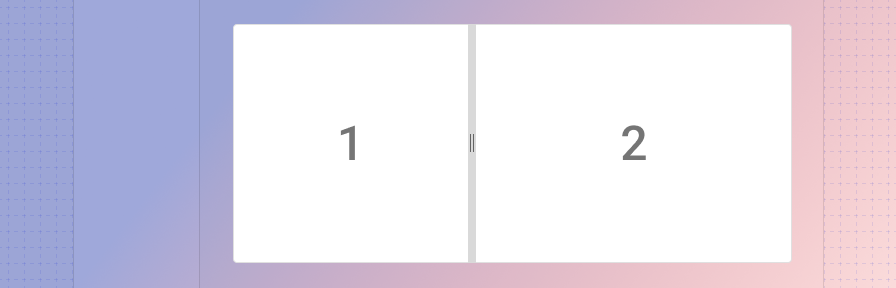
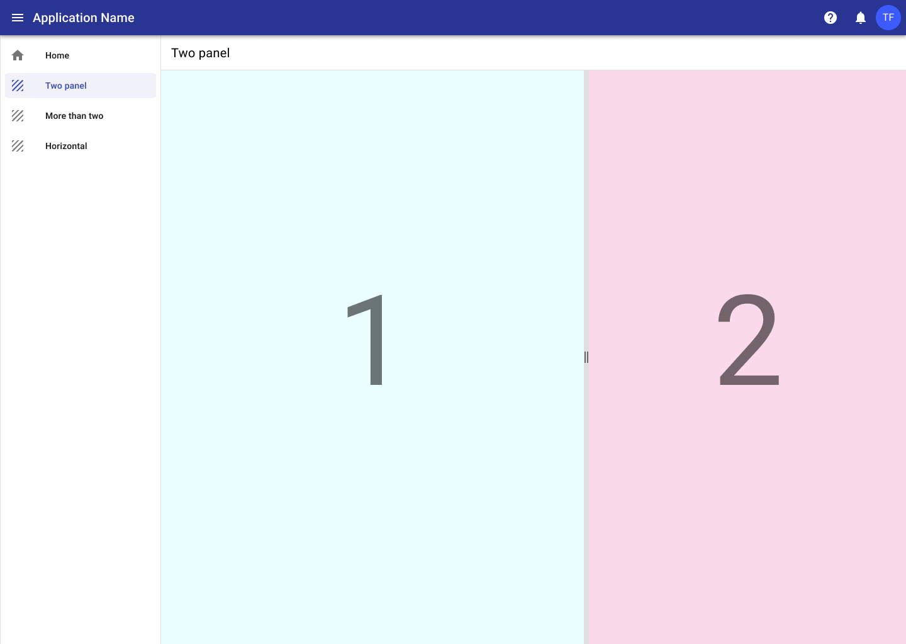
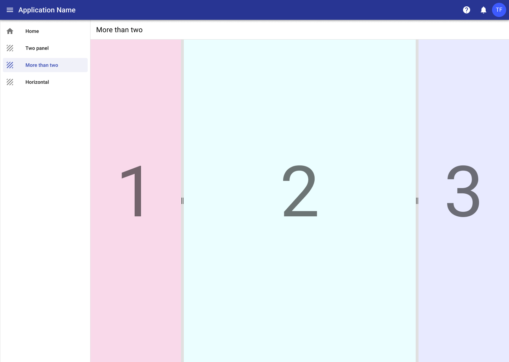
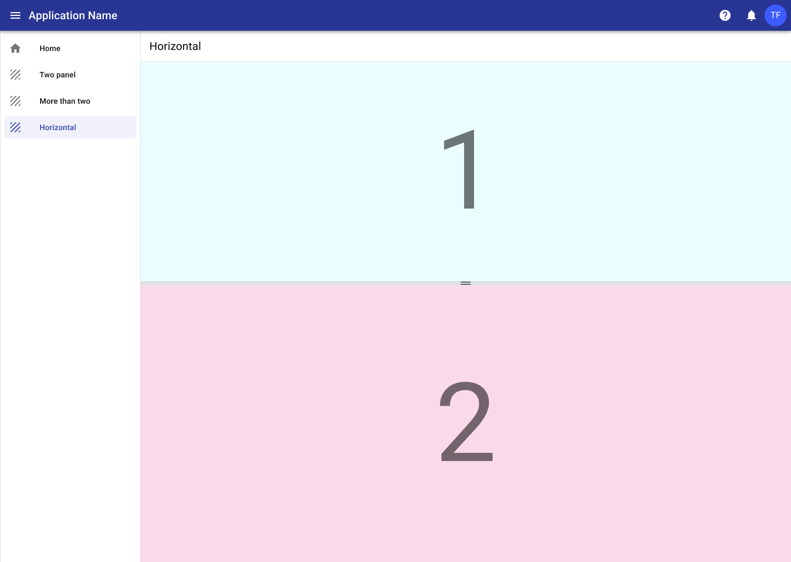

---
sidebar_custom_props:
  shortDescription: Split view is used to show elements side-by-side in resizable panels.
  thumbnail: ./img/all-components/split-view-mini.png
---

# Split view

<ComponentVisual storybookUrl="https://forge.tylerdev.io/main/?path=/docs/components-split-view--docs">

</ComponentVisual>

# Overview

The split view component presents page elements side-by-side as resizable panels and typically consists of one or more resizable panels as well as at least one non-resizable panel. This is useful in situations where a user may want to adjust how much screen space is devoted to part of the interface. For example, you could consider displaying a map or image viewer within a split view.

## Examples 

### 1. Standard two panel
The most common usage is two panels, one with the main content of a page and the second with supplementary content. An example of this would be a large data set in one panel with a corresponding map in the second panel.

---

### 2. More than two panels
More than one panel can be used with the split view component, for example having left and right panels surrounding one main panel.

:::info
While it's possible to add any number of panels, keep in mind the screen sizes you are designing for. More than three panels can become unweidly quickly, especially on smaller devices.
:::

---

### 3. Horizontal split
Panels can also be organized horizontally if needed.

