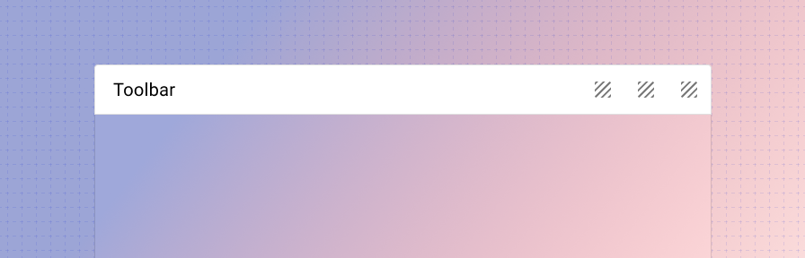

---
sidebar_custom_props:
  shortDescription: The toolbar is a container used to place titles and actions and align them with consistent spacing and positioning.
  thumbnail: ./img/all-components/toolbar-mini.png
---

# Toolbar

<ComponentVisual storybookUrl="https://forge.tylerdev.io/main/?path=/docs/components-toolbar--docs">

</ComponentVisual>

## Overview

The toolbar spans 100% width, uses a border to separate the toolbar from the content area, and has slots for placing any content at the start, center, and end. It can be used below the app bar to display a page title and actions, within a nav drawer as a section, as a footer, or as header & footer in dialogs.

:::info
To see various common examples of the toolbar in action with code snippets, see the [toolbar recipes page](/recipes/toolbar/secondary).
:::

---

## Related 

### Components

The toolbar can be used as:
- headers and footers in the [scaffold](/components/layouts/scaffold) for page [layout](/patterns/layout/introduction).
- headers and footers in [dialogs](/components/notifications-and-messages/dialog).
- as sections within a [navigation drawer](/components/navigation/drawer).

:::info
We've also built a responsive toolbar utility component that helps manage how a toolbar is rendered on large and small devices. For more information, check out the [responsive toolbar](https://tyler-technologies-oss.github.io/forge-extended/v1/?path=/docs/components-responsive-toolbar--docs) component in the Forge Extended library.
:::

### Recipes

- [Dialog](/recipes/dialog/generic)
- [Navigation drawer](/recipes/navigation-drawer/backoffice)
- [Page layout](/recipes/page-layout/generic)
- [Toolbar](/recipes/toolbar/secondary)

### Patterns

Coming soon!
