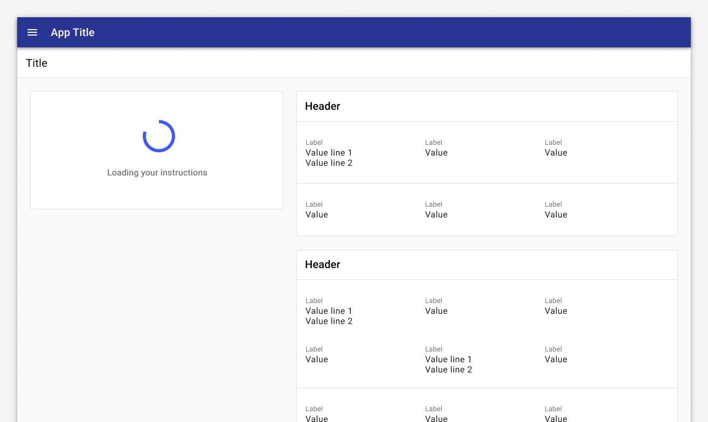

---
sidebar_custom_props:
  shortDescription: Circular progress spinners are used to indicate that a particular element is loading within an interface.
  thumbnail: ./img/all-components/circular-progress-mini.png
---

# Circular progress

<ComponentVisual storybookUrl="https://forge.tylerdev.io/main/?path=/story/components-circular-progress--default">

</ComponentVisual>

## Overview: Progress indicators

Progress indicators inform users about the status of ongoing processes, such as loading an app, submitting a form, or saving updates. They communicate an app’s state and indicate available actions, such as whether users can navigate away from the current screen. Use a progress indicator for operations that take more than 1 second.

Progress indicators are used to:

- Assure the user that the system is working.
- Provide operational transparency.
- Communicate progress made vs progress pending.
- Reduce users perception of time elapsed.

### Types of progress indicators

| Context           | Component          | Guidance
| :-----------------| :----------------- | :----------------
| Initial page load |  [Skeleton + progressive loading](/components/skeleton)  | Use skeleton loading when content size/shape is known. Load skeleton components, then fade in components as they become available.
| Initial page load | Linear page progress | Use when the content to be loaded is of unknown or variable size or quantity. Display a description of the process with a linear progress bar (see pattern below).
| Full page load or change | [Full page busy indicator](/components/busy-indicator) | Use an overlay to prevent users from interacting with content on a page due to a change, server error, or form submission.
| Multiple components | [Skeleton + progressive loading](/components/skeleton) | Load skeleton components, then fade in components as they become available.
| Single component within a page | Inline circular progress spinner | Use a contextual circular progress indicator to communicate that either a component's state or data is changing.

---

## Overview: Circular progress

Use **circular progress indicators** to identify when a specific area of the page is loading (ie, content within a card). In general, place loading animations close to the content that is being loaded or is changing. If only a portion of the interface is displaying new content or being updated, place the loading animation in that specific part of the interface.

---

## When to use: Linear vs circular progress indicators

Forge offers two visually distinct types of progress indicators: [linear](/components/linear-progress) and circular progress indicators. Only one type should represent each kind of activity in an app. For example, if a refresh action displays a circular indicator on one screen, that same action shouldn’t use a linear indicator elsewhere in the app.Researchers Gronier and Lallemend conducted an experiment to determine what the best metaphor to display during waiting time is. They measured a number of components (progress bar, countdown, text, etc) against perceived waiting time and satisfaction. They found that while a countdown yields the highest satisfaction level because it informs the user exactly how long they have to wait, **linear progress bars** were actually associated with the shortest perceived waiting time and a high satisfaction score (5.8 out of 7). [Read more](http://www.guillaumegronier.com/cv/resources/Articles/2013_WorkshopHCI_Gronier.pdf). For this reason, we recommend a heavier use of **linear progress indicators**. 

Because **circular progress indicators** fit better inside components, use them to communicate the state of a component or its data is changing. Use circular progress indicators for inline components; use linear progress indicators for other scenarios.

---

## Types 

### Buttons

When buttons trigger an event, use a 24px circular progress indicator inside of the button to indicate change. 

Click the button to see it in action.

### Input elements

When data loads inside an input field, place a 24px circular progress indicator inside the element. Loading may be needed in cases of validation or Ajax data calls. 

### List elements

Place a 24px circular progress indicator next to elements in a list or table to indicate change or loading when a single element is changing or loading.  

List with trailing spinner.

List with leading spinner.

### Components

Loading content into a list.

Loading a card.

---

## Best practices 

<DoDontGrid>
  <DoDontTextSection>
    <DoDontText type="do">Only show a progress indicator if the expected wait time is more than a second; for example, whenever making a request to the server.</DoDontText>
    <DoDontText type="do">Use animations to soften transitions between states. Motion focuses attention on what's important without creating unnecessary distraction. Check out the Material guidance on motion.</DoDontText>
  </DoDontTextSection>
</DoDontGrid>

---

<DoDontGrid>
  <DoDontRow>
  <DoDontImage>

  </DoDontImage>
  <DoDontImage>

  </DoDontImage>
  </DoDontRow> 
  <DoDontRow>
    <DoDont type="do">If only a portion of a page is displaying new content or being updated, place the spinner in that part of the page. If you are unsure where to place the spinner, place it where you want the user's attention to be when loading is finished.</DoDont>
    <DoDont type="dont">Don't use multiple spinners on a single page. Consider using a busy page state or placing a progress indicator on the parent component instead. </DoDont>
  </DoDontRow>
</DoDontGrid>

---

## Related

### Components

- Use [skeleton loading](/components/skeleton) when content size/shape is known.
- Use a [busy indicator](/components/busy-indicator) to to prevent users from interacting with content on a page due to a change, server error, or form submission.
- Use a [linear progress indicator](/components/linear-progress) to communicate that a specific component is loading. Linear progress indicators may be used at the bottom of text fields, in dropdowns, and in expansion panels.

### Patterns

- [Progress and loading](#) (Coming soon!)

---

## Resources

- [Wait Wait... Tell Me!](https://99percentinvisible.org/episode/wait-wait-tell-me/transcript/) (99% Invisible)
- [Everything you need to know about skeleton screens](https://uxdesign.cc/what-you-should-know-about-skeleton-screens-a820c45a571a) (Medium)
- [Progressive Loading](https://developer.mozilla.org/en-US/docs/Web/Progressive_web_apps/Loading) (MDN Web Docs)
- [Improving the UX of Progress Indicators and Feedback Notifications](https://usersnap.com/blog/progress-indicators/) (Usersnap)
- [Mobile Design Details: Avoid The Spinner](https://www.lukew.com/ff/entry.asp?1797) (LukeW)
- [How to Improve Perceived Waiting Time in HCI: A Psychological Approach](http://www.guillaumegronier.com/cv/resources/Articles/2013_WorkshopHCI_Gronier.pdf) (Study)
- [The Illusion of Time](https://medium.com/swlh/the-illusion-of-time-8f321fa2f191) (Medium)
