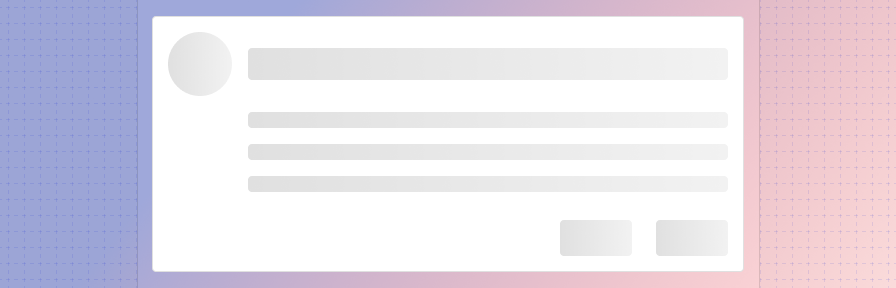

---
sidebar_custom_props:
  shortDescription: A skeleton screen provides a visual cue that content is being loaded.
  thumbnail: ./img/all-components/skeleton-mini.png
---

# Skeleton

<ComponentVisual storybookUrl="https://forge.tylerdev.io/main/?path=/story/components-skeleton--app">

</ComponentVisual>

## Overview: Progress indicators

Progress indicators inform users about the status of ongoing processes, such as loading an app, submitting a form, or saving updates. They communicate an app’s state and indicate available actions, such as whether users can navigate away from the current screen. Use a progress indicator for operations that take more than 1 second.

Progress indicators are used to:

- Assure the user that the system is working.
- Provide operational transparency.
- Communicate progress made vs progress pending.
- Reduce users perception of time elapsed.

### Types of progress indicators

| Context          | Component          | Guidance
| :-----------------| :----------------- | :----------------
| Initial page load |  Skeleton + progressive loading  | Use skeleton loading when content size/shape is known. Load skeleton components, then fade in components as they become available.
| Initial page load | Linear page progress | Use when the content to be loaded is of unknown or variable size or quantity. Display a description of the process with a linear progress bar (see pattern below).
| Full page load or change | Full page [busy indicator](/components/busy-indicator) | Use an overlay to prevent users from interacting with content on a page due to a change, server error, or form submission.
| Multiple components | Skeleton + progressive loading | Load skeleton components, then fade in components as they become available.
| Single component within a page | [Inline circular progress spinner](/components/progress-and-loading/circular-progress) | Use a contextual circular progress spinner to communicate that either a component's state or data is changing.

---

## Overview: Skeleton

A skeleton screen is a low fidelity UI into which information is gradually loaded. It gives users a visual cue that the content is being loaded into each UI element and can create perceptions of faster load times (check out a sample UX [study](https://uxdesign.cc/what-you-should-know-about-skeleton-screens-a820c45a571a)). Because of this, it is Forge’s recommended method for loading in new content. **Use when content size/shape is known.**

Skeleton patterns can be used to load a page initially or to load specific components after an initial load while still allowing users to interact with the rest of the page. 

Benefits of skeleton loading:

- Puts the focus on progress, rather than wait time.
- Is associated with faster perceived loads times
- Eliminates surprise.
- Provides a clear indication of progress.

---

<DoDontGrid>
  <DoDontTextSection>
    <DoDontText type="do">Use Use skeleton loading when content size/shape is known and the wait time is longer than 1 second.</DoDontText>
    <DoDontText type="do">Ensure that performance is optimized within the application to minimize load times overall.</DoDontText>
    <DoDontText type="do">When loading a list, displaying two to three "list items" in the skeleton should suffice; the skeleton items don't need to match the final number of elements loaded in.</DoDontText>
  </DoDontTextSection>
  <DoDontTextSection>
    <DoDontText type="dont">Build complex UIs with a skeleton. Rectangles and circles work well to represent most UI elements.</DoDontText>
    <DoDontText type="dont">Don't use a skeleton for pages that should take under a second to load.</DoDontText>
  </DoDontTextSection>
</DoDontGrid>

---

## Related 

### Components

- Use a [linear progress indicator](/components/progress-and-loading/linear-progress) to communicate that a specific component is loading. Linear progress indicators may be used at the bottom of text fields, in dropdowns, and in expansion panels.
- Use a [full page busy indicator](/components/notifications-and-messages/busy-indicator) to to prevent users from interacting with content on a page due to a change, server error, or form submission.
- Use a [circular progress spinner](/components/progress-and-loading/circular-progress) inside a component to communicate that either a component's state or data is changing.

### Patterns

- [Progress and loading](/patterns/progress-and-loading)

---

## Resources

- [What you should know about skeleton screens](https://uxdesign.cc/what-you-should-know-about-skeleton-screens-a820c45a571a) (UXDesign.cc)
- [Wait Wait... Tell Me!](https://99percentinvisible.org/episode/wait-wait-tell-me/transcript/) (99% Invisible)
- [Everything you need to know about skeleton screens](https://uxdesign.cc/what-you-should-know-about-skeleton-screens-a820c45a571a) (Medium)
- [Progressive Loading](https://developer.mozilla.org/en-US/docs/Web/Progressive_web_apps/Loading) (MDN Web Docs)
- [Improving the UX of Progress Indicators and Feedback Notifications](https://usersnap.com/blog/progress-indicators/) (Usersnap)
- [Mobile Design Details: Avoid The Spinner](https://www.lukew.com/ff/entry.asp?1797) (LukeW)
- [How to Improve Perceived Waiting Time in HCI: A Psychological Approach](http://www.guillaumegronier.com/cv/resources/Articles/2013_WorkshopHCI_Gronier.pdf) (Study)
- [The Illusion of Time](https://medium.com/swlh/the-illusion-of-time-8f321fa2f191) (Medium)
