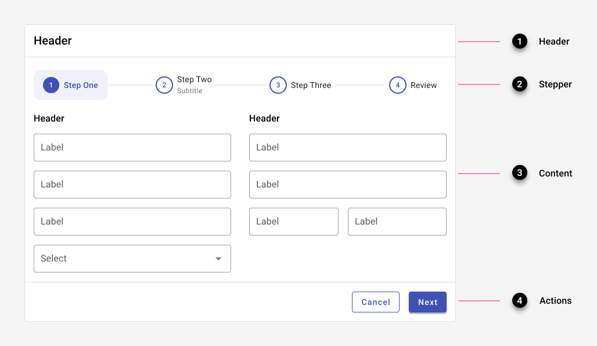

---
sidebar_custom_props:
  shortDescription: Steppers display progress through a sequence by breaking it up into multiple logical and numbered steps.
  thumbnail: ./img/all-components/stepper-mini.png
---

# Stepper

<ComponentVisual storybookUrl="https://forge.tylerdev.io/main/?path=/story/components-stepper--default">

</ComponentVisual>

## Overview 

Guided steppers provide a clear path to completion. Offering users a clear idea of how many steps it takes to get to the final target can significantly reduce abandonment. Additionally, presenting information in meaningful chunks can facilitate completion. 

### Use when

- Use for processes that may be unfamiliar or may be used only occasionally.
- Use for complex processes that are completed by a new user.
- Use for processes that could be customized for a user based on previous answers submitted.  
- Use for processes that may need to combine data inputs from multiple apps in the Tyler ecosystem.  
- Use for complex processes where tracking progress is important. 
- Steppers may be used in a dialog or standalone in a single card. 
- Examples: Multi step forms, online ordering / shopping cart, onboarding

### Don't use when

- Don't use steppers for familiar or repetitive tasks; use a form instead.  

### Examples

- See steppers in action in the [Resident Access](/get-started/other/case-studies/resident-access) and [TCP Manager Apps case study](/get-started/other/case-studies/manager-apps) case studies.

---

## Types 

### 1. Horizontal mode

Horizontal steppers are better suited for desktop layouts.

### 2. Vertical mode 

Vertical steppers are better suited for mobile layouts.

### 3. Complex stepper

Complex steppers may be used in desktop settings when a process has more than five steps or when it contains sub-steps. 

<ImageBlock padded={false}>

</ImageBlock>

---

## Parts

Steppers consist of three main parts: 1. Header 2. Content and 3. Actions. 

<ImageBlock padded={false}>

</ImageBlock>

### 1. Header

The header contains the steps and an optional title. 

Completed steps are indicated with a check. If previous steps may be edited, an edit icon may be used to draw additional attention to the fact. Steps with missing information are indicated with an error state. 

<ImageBlock caption="Progress shown through a standard Forge stepper. Completed steps are indicated with a check." padded={false}>

</ImageBlock>

<ImageBlock padded={false} caption="Progress shown through a stepper where users can edit previous steps. Completed steps are indicated with an edit icon.">

</ImageBlock>

<ImageBlock padded={false} caption="Indicate errored steps with an error state.">

</ImageBlock>

When a stepper is used in a smaller container, text may be placed below the step instead of inline.

<ImageBlock padded={false}>

</ImageBlock>

### 2. Content

<DoDontGrid>
  <DoDontTextSection>
    <DoDontText type="do">Break up content into manageable chunks.</DoDontText>
    <DoDontText type="do">Use a container that matches the approximate size of the content.</DoDontText>
    <DoDontText type="do"> Keep the overall container size fixed to allow for consistent placement of controls.</DoDontText>
    <DoDontText type="do">Center content within the overall container.</DoDontText>
    <DoDontText type="do">A single column of content is preferable, but two columns may be used if needed.</DoDontText>
  </DoDontTextSection>
</DoDontGrid>

<ImageBlock padded={false} caption="Stepper content is displayed either in a single or double columns.">

</ImageBlock>

### 3. Actions

If users will need more than a single session to complete the process, allow them to save their work in draft mode. Otherwise, provide options for "Next," "Previous," and "Cancel" by default. 

<ImageBlock padded={false} caption="By default, a stepper includes Next, Previous, and Cancel in its action footer."> 

</ImageBlock>

<ImageBlock padded={false} caption="When users may save changes, the stepper includes an X in the top right corner, as well as actions for Next, Previous, and Save and quit in its action footer."> 

</ImageBlock>

When a user exits a stepper, confirm the action with a dialog.

<ImageBlock maxWidth="300px"> 

</ImageBlock>

---

## Responsive

Guidance coming soon!

---

## Best practices 

<DoDontGrid>
  <DoDontTextSection>
    <DoDontText type="do">Place steppers on a single piece of material - either on a card or in a dialog.</DoDontText>
    <DoDontText type="do">Small steps are preferable - it makes the experience less overwhelming, requires less cognitive effort, and results in fewer mistakes.</DoDontText>
    <DoDontText type="do">If possible, allow users to exit the process midway and save their progress.</DoDontText>
    <DoDontText type="do">Ensure that a stepper is self sufficient - ensure that users can access the information they need from within the stepper.</DoDontText>
    <DoDontText type="do">Focus on the shortest path for each user - if necessary, use branching logic to customize questions based on previous responses.</DoDontText>
    <DoDontText type="do">Mark optional steps as such.</DoDontText>
    <DoDontText type="do">Provide users the ability to return to a previous step or use the steps to navigate back in the process, if possible.</DoDontText>
    <DoDontText type="do">Use a casual, conversational tone.</DoDontText>
  </DoDontTextSection>
  <DoDontTextSection>
    <DoDontText type="dont">Don't use a stepper for processes that are familiar or have to be used over and again - they can become overly controlling.</DoDontText>
    <DoDontText type="dont">Avoid requiring information from another part of the app, causing the user to leave and restart the stepper.</DoDontText>
    <DoDontText type="dont">Don't create a separate step for "Submit." A final step may be "Review"; if there is no review in the process, the last step should display a button for "Submit."</DoDontText>
    
  </DoDontTextSection>
</DoDontGrid>

---

## Related

### Components

Steppers are comprised of:

- [Buttons](/components/buttons/button)
- [Toolbar](/components/page/toolbar)
- [Dialog](/components/notifications-and-messages/dialog)

### Examples

- See steppers in action in the [Resident Access](/get-started/other/case-studies/resident-access) and [TCP Manager Apps case study](/get-started/other/case-studies/manager-apps) case studies.
