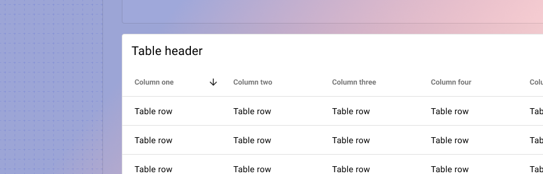

---
sidebar_custom_props:
  shortDescription: The table displays information in a grid-like format of rows and columns.
---

# Table

<ComponentVisual storybookUrl="https://forge.tylerdev.io/main/?path=/story/components-table--default">

</ComponentVisual>

## Overview

:::note
The `<forge-table>` provides **basic data display and functionality** such as sorting, filtering, and selecting rows. It is not intended to be comprehensive or fully featured. 

If your team needs extensive data manipulation or editing capability, **a third-party table extension may be more appropriate.** See our guidance on [advanced tables](/patterns/external-libraries#advanced-tables) under External library guidance. 
:::

Tables display information in a way that's easy to scan, so that users can look for patterns and insights. They can be embedded in primary content, such as cards.

Data tables can include:

- A corresponding visualization
- Navigation
- Tools to query and manipulate data

### Use when

- Displaying content with three or more well-defined dimensions that users might sort on
- Users need to compare data across rows.
- Users are likely to filter by a single attribute.

### Don't use when

- Users primarily scan and identify data. 
- Users search and filter across multiple attributes. 
- Displaying data primarily on mobile. 

### Examples

- See the table in action in the [Asset Registry case study](/case-studies/asset-registry).

---

## Parts

Tables are comprised of the following parts:

- Header
- Rows & columns
- Cells
- Pagination

### Header

The table header consists of the following parts:

- Title (required)
- Secondary info (optional)
- Custom actions (optional)

**Custom actions** include any additional actions performed to the table as a whole that aren’t included in the `<forge-table>` component. These may consist of options like export, share, or table settings. Display up to two icons and tuck the rest into an overflow menu.

<ImageBlock padded={false}>

</ImageBlock>

### Rows & columns 

Arrange columns in order of importance left to right; put your most important information first. This facilitates eye tracking down the table and also minimizes the amount of horizontal scrolling needed on mobile or smaller browser sizes.

**Column headers**

Use sentence case on column headers (“Bill number” instead of “Bill Number”).

**Fixed headers**

Use fixed headers to persist the context for your data. [See the recipe](/recipes/table#httpsstackblitzcomeditforgetablerecipewithfixedheaders).

**Table density**

By default, the `<forge-table>` has a row height of 48px. For data dense applications, use the `dense` version of the table, which has a row height of 40px. [See the recipe](/recipes/table#httpsstackblitzcomeditforgetablerecipedense)

<ImageBlock maxWidth="700px">

</ImageBlock>

**Resizable columns**

By default, the `<forge-table>` has resizable columns. Resizable columns allows users to see abbreviated data in full.

### Cells

Formatting cells

<DoDontGrid>
  <DoDontRow>
  <DoDontImage>

  </DoDontImage>
  <DoDontImage>

  </DoDontImage>
  <DoDontImage>

  </DoDontImage>
  </DoDontRow>
  <DoDontRow>
    <DoDont type="do">In general, left align text. Column header text alignment should match cell alignment.</DoDont>
    <DoDont type="do">Right align numbers that might be mentally summed (often, currency). Column header text alignment should match cell alignment. Read more at <a href="https://alistapart.com/article/web-typography-tables/" target="_blank" rel="noreferrer noopener">A List Apart.</a></DoDont>
    <DoDont type="dont">Don’t use ALL CAPS in table data as it is harder to read. Use sentence casing instead.</DoDont>
  </DoDontRow>
</DoDontGrid>

**Displaying overflow content**

Text that is longer than the column width should be truncated with an ellipsis. On hover, a tooltip displays the full cell content.

If your table has a large amount of overflow text, consider using a list or alternate view for your data. In general, tables should be avoided for records with long free text – consider a list or cards instead.

Alternatively, if overflow text is long, teams can display overflow text in a dialog.

**Displaying actions**

Display actions at the end of a row.

**Icon actions:** Display up to three actions and tuck the rest into an overflow menu. See guidance on [icon buttons](/components/buttons/icon-button).

**Text actions:** Display up to two text actions with the rest tucked into an overflow menu. When using text actions, increase the table row height to 56px. See guidance on [buttons](/components/buttons/button).

**Actions on hover:** Displaying actions on hover can be a good way to focus actions for a single row, but this should only be used on desktop apps. Display actions persistently on mobile. 

[See the recipes](/recipes/table#httpsstackblitzcomeditforgedatatablerecipewithiconactions)

<ImageBlock caption="Table with icon actions and overflow menu.">

</ImageBlock>

<ImageBlock caption="Table with text actions.">

</ImageBlock>

<ImageBlock maxWidth="600px" caption="Table with icon actions on hover.">

</ImageBlock>

<ImageBlock maxWidth="500px" caption="Hyperlinks to open a record may be used on a primary identifier in the table only. Don't use hyperlinks in other columns as they can create ambiguity.">

</ImageBlock>

### Pagination

Use **pagination** when records are sorted in a logical way (ie, chronologically or alphabetically). Pagination allows users to mentally bookmark or orient where they are in an ordered result set. Pagination should be used in the majority of workforce Tyler apps. Align pagination to the right. 

**Infinite scroll** is best used to encourage discovery or exploration when users are casually browsing content.** Infinite scroll may also be a better option for mobile contexts. 

:::caution
Don’t combine pagination and infinite scroll.
:::

<ImageBlock maxWidth="700px">

</ImageBlock>

---

## Behavior 

### Selection 

Users may select a subset of records in the table order to perform actions on them.  On selection, the table header transforms to a selection header.  By default, the select all control selects currently visible records on the page. 

The selection header provides a summary of total records selected, the ability to select all available records, and any actions that can be taken on the selected set.

Once actions have been taken, records revert to their unselected state. 

[See the recipe](/recipes/table#httpsstackblitzcomeditforgedatatablerecipewithmultiselect)

<ImageBlock maxWidth="700px">

</ImageBlock>

### Column sort 

Table columns that have been set to sortable in `<forge-table>` support ascending and descending sort. A user clicks once to sort ascending, a second time to sort descending, and third time to clear the sort. 

[See the recipe](/recipes/table#httpsstackblitzcomeditforgetablerecipewithcolumnsort)

### Column filters 

Enable column filters to allow users to pare down their record set in a table. Placeholder text is recommended in filters. 

<ImageBlock maxWidth="700px">

</ImageBlock>

### Resizable columns

Use resizable columns to accommodate text that may overflow a row width.

### Customizable columns

For tables with a large number of columns, display the number of columns that will comfortably fit within the viewport by default. Consider what columns will be most relevant to the highest number of users. Additional columns can be tucked into an overflow menu within the table, allowing users to toggle on and off columns.

<ImageBlock padded={false}>

</ImageBlock>

### Expandable rows

Use expandable rows to display additional data in context within a table. Expandable rows allow users to view related data in the same view. Use an **expandable row** when it’s necessary to see parent and child data at the same time. Navigate to a **detail page** when the information is complex and child data can be viewed separately from the parent data. 

**Don't nest tables within tables.** Consider a detail page or alternative organization for your data instead. 

[See the recipe](/recipes/table#httpsstackblitzcomeditforgedatatablerecipewithexpandablerowscomplex2fileindexjs)

<ImageBlock maxWidth="600px">

</ImageBlock>

### Navigational rows

Navigate to a **detail page** when the information is complex and child data can be viewed separately from the parent data.

Use a “chevron-right” icon to indicate navigating away to a separate page. The full row itself should be clickable, not just the chevron. 

<ImageBlock>

</ImageBlock>

---

## Responsive

Designing readable tables for smaller mobile screens presents a unique challenge. In general, tables aren’t well adapted for mobile and should be avoided when possible. 

:::info
**When converting table data for mobile, consider what would be most important to users in a mobile context.** If possible, table data can be displayed in a different component entirely on mobile devices - perhaps on a mobile phone, users just need some high level information on a record instead of a full row of complex details. Or perhaps a data visualization or chart could achieve the same goal. For more information on optimizing applications for different contexts, check out the guidance on [adaptive design](/core-patterns/adaptive-design).
:::

### Recommended approach 

Adapt the table for mobile by presenting rows as cards instead.

- Display values as two columns, with labels in the first, values in the second.
- Column width should match expected data input. Long values may wrap to a second line. 
- Display actions at the bottom of a card; actions may be left or right aligned.
- For tables using text actions: display a primary action and tuck the rest into a segmented overflow action. 
- For tables using icon actions: display up to three actions and tuck the rest into an overflow menu.
- For tables with content underneath, use a simplified paginator for mobile. Ensure that touch targets for the icon buttons are 48px by 48px. 
- For tables with no additional content underneath, infinite scroll may be used on mobile.

<!-- > Hit **Run project** below and choose **Preview** to view the demo, or either **Editor **or **Both** to view the HTML. -->

<!-- <RecipeDemo
  header="Basic mobile table"
  href="https://stackblitz.com/edit/forge-recipes-mobile-table"
  component-list=""
/> -->

**Content**

<ImageBlock padded={false} caption="On a desktop table gracefully scales to mobile by converting rows into cards. Column headers and cell text are placed in two columns. Ensure that headers and cell values stay close to each other by fitting the first column to fit header text.">

</ImageBlock>

For tables whose cell values are likely to span multiple lines (addresses, for example), column headers and cell text may be placed into a single column with [label values](/components/label-value).

<ImageBlock padded={false} caption="Tables may convert to a single column onmobile for column headers and cell text if the cell text is likely to span multiple lines.">

</ImageBlock>

**Actions**

<ImageBlock padded={false} caption="Actions may be displayed as icons or text actions. For text actions, display a primary action and tuck the rest into an overflow menu. Actions may be left or right algined.">

</ImageBlock>

**Paginator**

<ImageBlock padded={false} caption="The paginator is simplified for mobile. Ensure 48px touch targets.">

</ImageBlock>

<ImageBlock padded={false} caption="A paginator may include options to navigate to the first or last record. When including these options, set the paginator to span the full width of the table.">

</ImageBlock>

**Selection**

On selection, the table header transforms to a selection header. The selection header provides a summary of total records selected, the ability to select all available records, and any actions that can be taken on the selected set.

Ideally, the selection header persists at the top of the screen as the user scrolls - example coming soon!

<ImageBlock padded={false} caption="A selection header displays actions that can be taken on multiple records at a time. The header may display icons or buttons.">

</ImageBlock>

### Other approaches 

1. Display as list with expansion or navigation to detail screen. Best for tables with a high number of columns.

<ImageBlock padded={false}>

</ImageBlock>

2. Present the table with horizontal scroll. Use as a last resort only.

<ImageBlock maxWidth="400px" caption="Displaying a table to resemble a list on mobile. Read more about this example in the 'A List Apart' article in the Resources section.">

</ImageBlock>

See more options in this [Medium article](https://medium.com/appnroll-publication/5-practical-solutions-to-make-responsive-data-tables-ff031c48b122). 

---

## Additional features

The `<forge-table>` intends to cover features that are common to most Tyler products, including sorting, filtering, and selecting rows. It is intended to be a relatively simple UI component that displays data. For this reason, it is not intended to be comprehensive or fully featured.

If your app requires more intensive data manipulation, the app team may add additional features to the table to fit the use case.

If the team requires a table with even more extensive manipulation (something closer to Excel or Google Sheets) a third-party table extension may be more appropriate. For more information, submit a [ticket](https://tylerjira.tylertech.com/servicedesk/customer/portal/21/create/609) for UX Consulting. 

<Columns columns="two" type="equal">

### Supported features

The following options are included with `<forge-table>` by default:

- Selection / multi selection
- Dense / default spacing
- Column filters
- Column sort / multi column sort (coming soon)
- Fixed headers
- Resizable columns
- Expandable rows
- Left / right / center cell align
- Drag & drop columns (coming soon)

### Custom features

The following features are considered “custom” and would need to be added to `<forge-table>` by an app team. In general, additional functionality may be added to an overflow menu in the table’s header. 

- Customizable columns
- Remove all applied filters 
- Export to Excel 
- Export as HTML
- Sum columns
- Table layouts: save layout, save as default layout, load layout, refresh layout
- Create reports from a table

</Columns>

<ImageBlock padded={false} caption="An overflow menu may be used to contain additional functionality for the table. Although the header and overflow menu aren’t included in <forge-table> by default, they can be added with a `<forge-toolbar>` just above the table.">

</ImageBlock>

---

## Best practices 

**Remove everything unnecessary.**

To learn more, check out Edward Tufte’s concept of the data-ink ratio ([Data-Ink Ratio, As used in tables](https://infovis-wiki.net/wiki/Data-Ink_Ratio)).

- Avoid needless separators.
- Avoid row striping. (This effect can distort the meaning of the data by highlighting every other row to the detriment of neighboring rows (A List Apart ).
- Avoid shadows, 3d effects, glow, etc…

<ImageBlock padded={false}>

</ImageBlock>

<ImageBlock padded={false}>

</ImageBlock>

---

## Related

### Components

Tables may contain

- [Icon buttons](/components/buttons/icon-button)
- [Buttons](/components/buttons/button)
- [Checkboxes](/components/controls/checkbox)
- [Radio buttons](/components/controls/radio-button)
- [Switches](/components/controls/switch)

Use instead of a table

- Use a [list](/components/lists/lists/list) when displaying groups of related items that are primarily textual.
- Use [cards](/components/cards/card) when displaying content that has images or that contains non homogenous data. 

### Recipes

- [Table](/recipes/table)

### Examples

- See a table with filtering and customizable columns in action in the [Asset Registry case study](/case-studies/asset-registry).

---

## Resources

- [Designing Tables](https://www.nngroup.com/videos/designing-tables-desktop-apps/) (Nielsen Norman)
- [Web Typography: Designing Tables to be Read, Not Looked At](https://alistapart.com/article/web-typography-tables/) (A List Apart)
- [Designing Better Tables For Enterprise Applications](https://uxdesign.cc/designing-better-tables-for-enterprise-applications-f9ef545e9fbd) (UXDesign.cc)
- [Designing Tables for Reusability](https://uxdesign.cc/designing-tables-for-reusability-490a3760533) (UXDesign.cc)
- [Intro to Data Table Design](https://design-nation.icons8.com/intro-to-data-tables-design-349f55861803) (Design Nation)
