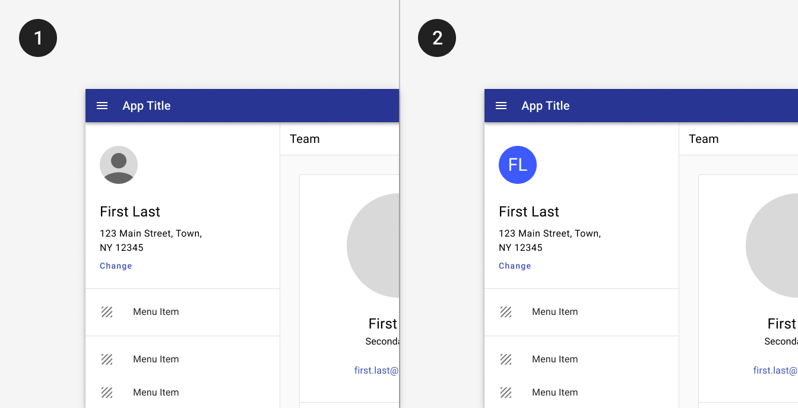
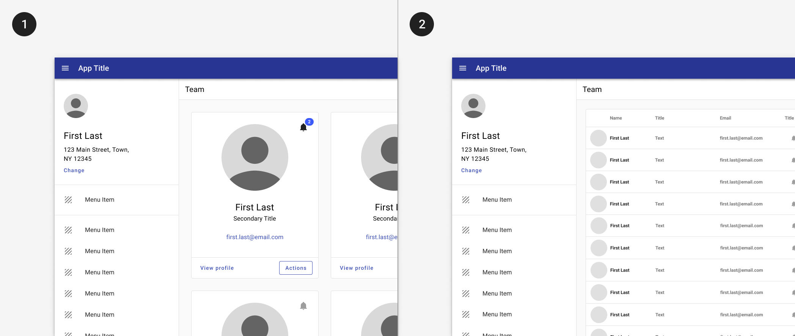

---
sidebar_custom_props:
  shortDescription: The Avatar allows you to provide text (default), or an image, to represent an entity.
  thumbnail: ./img/all-components/avatar-mini.png
---

# Avatar

<ComponentVisual storybookUrl="https://forge.tylerdev.io/main/?path=/docs/components-avatar--docs">

</ComponentVisual>

## Overview

Avatars can be used in lists, tables, cards or navigation headers.  When no image is available for a user avatar, user initials are used in place of an image. 

Avatars are not interactive.

Avatars are available in default and larger sizes.  

<ImageBlock padded={false} caption="1. An image avatar can customize a profile header in a navigation drawer. 2. When no image is available, initials are used instead.">

</ImageBlock>

<ImageBlock padded={false} caption="1. Larger avatars may be used in cards. Use images when they are likely to be available and the profiles are likely to be familiar. 2. Smaller avatars may be used in lists and tables.">

</ImageBlock>

### Use when 

- Displaying lists of people.
- Displaying data with images.
- Records may be identified by image or by description.
- Displaying account information in a navigation drawer for a community app. 

### Don't use when 

- Images or avatars don't provide additional information to users, such as a list of businesses with avatars pulling in the letters from the business name. 

---

## Best practices 

<DoDontGrid>
  <DoDontRow>
  <DoDontImage>

  </DoDontImage>
  </DoDontRow>
  <DoDontRow>
    <DoDont type="dont">
      Don’t use avatars for category names. The avatars in this list don’t provide additional information and could be better represented by icons or omitted altogether.
    </DoDont>
  </DoDontRow>
</DoDontGrid>

---

## Related

### Components

Avatars may be used in:

- [Lists](/components/lists/list)
- [Table](/components/table/table)
- [Navigation drawer](/components/navigation/drawer)
