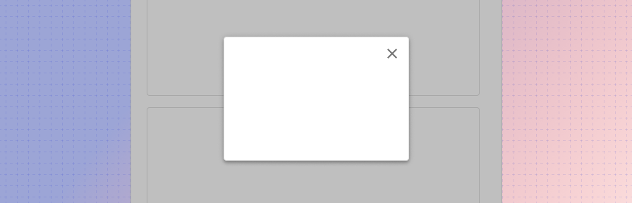

---
sidebar_custom_props:
  shortDescription: The backdrop component is a utility component to darken the background of an application when opening a dialog.
---

# Backdrop

<ComponentVisual storybookUrl="https://forge.tylerdev.io/main/?path=/story/components-backdrop--default">

</ComponentVisual>

## Overview

Documentation coming soon
