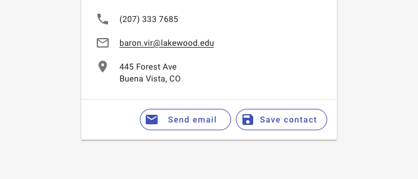

---
sidebar_custom_props:
  shortDescription: Chips are compact elements that represent an input, attribute, or action.
  thumbnail: ./img/all-components/chips-mini.png
---

# Chips

<ComponentVisual storybookUrl="https://forge.tylerdev.io/main/?path=/story/components-chips--default">

</ComponentVisual>

## Overview

Chips allow users to enter information, make selections, filter content, or trigger actions. Chips should appear dynamically as a group of
multiple interactive elements, unlike buttons, which should be a consistent and familiar call to action.

### Use when

- Displaying interactive options
- Displaying simple filters 
- Displaying removable input options such as contacts

### Don't use when

- Displaying static attributes. Use [badges](/components/notifications-and-messages/badge) instead.

---

## Types 

There are three types of chips: 1. Input chips, 2. Choice chips, 3. Action chips, 4. Filter chips.

### 1. Input chips

Input chips represent information used in fields, such as an entity or different attributes. An input chip's text is editable until the user
takes an action with the chip, such as sending an email. To edit an input chip's text, tap the chip.

Input chips can be integrated with other components. They can appear:

- Inline with the text input cursor in a field
- In a stacked list
- In a horizontally scrollable list

### 2. Choice chips

Choice chips allow users to make a selection from a set of choices. Choice chips clearly delineate and display options in a compact area. 

Use a [button toggle](/components/controls/button-toggle) or [radio buttons](/components/controls/radio-button) when users can only select a single option.

Use a [select](/components/fields/select) or [autocomplete](/components/autocomplete) when there are too many  options for the screen real estate provided. 

Most commonly used in onboarding flows or mobile contexts. 

### 3. Action chips 

Action chips offer actions related to primary content. They should appear dynamically and contextually in a UI.

An alternative to action chips are buttons, which should appear persistently and consistently.

Action chips can trigger an action or show progress and confirmation.

<ImageBlock padded={false} max-width="500px">

</ImageBlock>

### 4. Filter chips

Filter chips use tags or descriptive words to filter content. Filter chips delineate and display options in a compact area.

Chips are tapped to be selected. Multiple chips can be selected or unselected. A check icon is added to indicate when a filter chip is selected.

For datasets with more than seven filters or for sets that have categories and sub-filters, use a faceted filtering (coming soon!) pattern. 

<ImageBlock padded={false} max-width="500px">

</ImageBlock>

---

## Best practices 

<DoDontGrid>
  <DoDontTextSection>
    <DoDontText type="do">Chips may contain a leading or trailing icon.</DoDontText>
    <DoDontText type="do">Chips are interactive. </DoDontText>
    <DoDontText type="do">Chips may scroll horizontally, especially on mobile. </DoDontText>
  </DoDontTextSection>
    <DoDontTextSection>
    <DoDontText type="dont">Don't display non interactive data with a chip. Use a text badge instead.</DoDontText>
    <DoDontText type="dont">Don't use filter chips or choice chips to display a single option only.</DoDontText>
  </DoDontTextSection>
</DoDontGrid>

---

## Related 

### Components

- Use a [badge](/components/badge) for non-interactive data.
- Chips may be used with [lists](/components/lists/list), [tables](/components/lists/list), or [cards](/components/cards/card).
- Choices may also be represented by [radio buttons](/components/controls/radio-button), [checkboxes](/components/controls/checkbox), or [button toggles](/components/controls/button-toggle).

### Patterns

- Faceted filtering (Coming soon!)
- Collections (Coming soon!)
