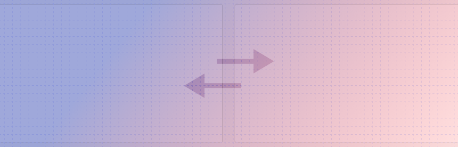

---
sidebar_custom_props:
  shortDescription: The view switcher component is used for displaying a single view at a time out of a set of available views.
---

# View switcher

<ComponentVisual storybookUrl="https://forge.tylerdev.io/main/?path=/story/components-view-switcher--default">

</ComponentVisual>

## Overview

The view-switcher is used in combination with other TCW components to allow users to switch between related views or content containers. It uses a [shared axis pattern](https://material.io/design/motion/the-motion-system.html#shared-axis)
to display a transitions between UI elements that have a spatial or navigational relationship. This pattern uses a shared transformation on the x axis to reinforce the relationship between elements.

For example, when tapping a new tab in a card, both the outgoing and incoming elements transform horizontally in unison. By moving in the same direction, elements are perceived to be related to each other.

---

## Related

### Components

- [Tabs](/components/navigation/tabs)
- [Stepper](/components/stepper)

### Patterns

Coming soon...
