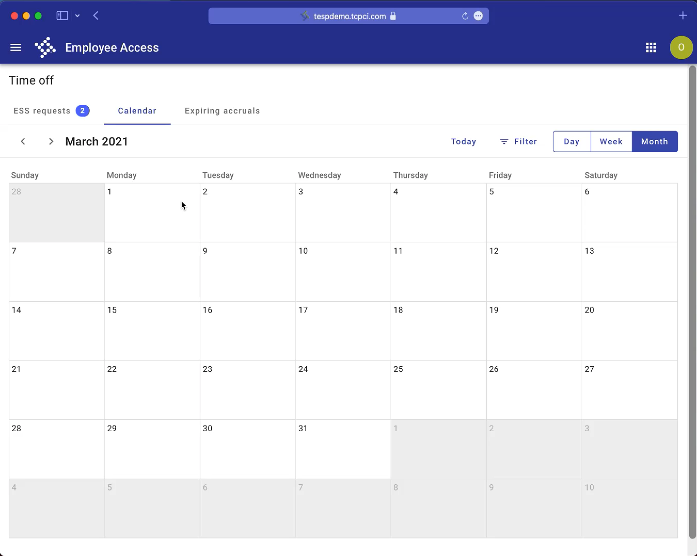
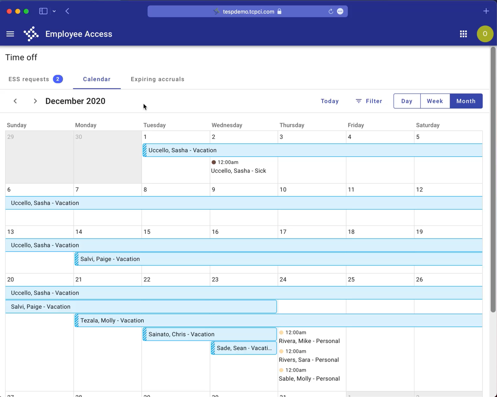
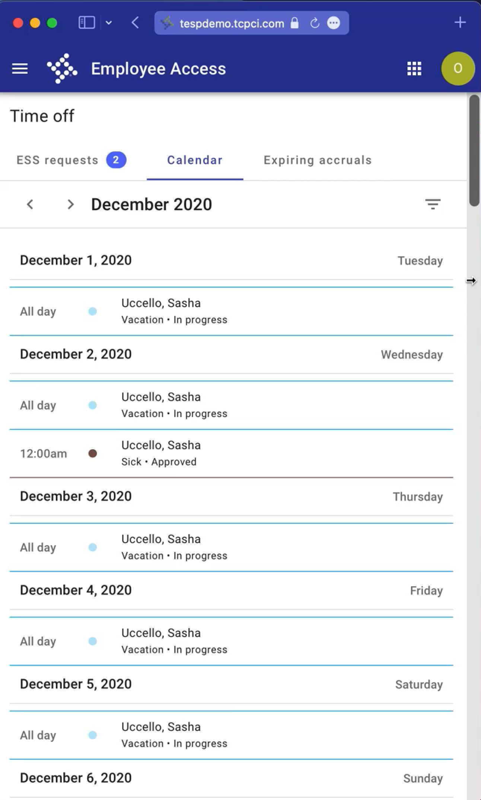
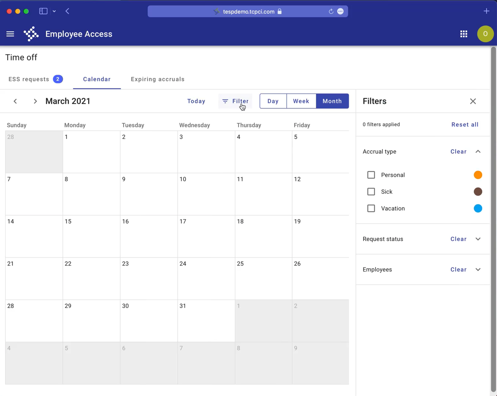

# Employee Access Calendar

_"We used a third party library called Full Calendar. Even though Full Calendar doesn't originate from Forge, we were able to style and extend it to look a little more like it belongs in our design system."_

\- Sam Richardson, developer

<iframe width="100%" height="500" src="https://web.microsoftstream.com/embed/video/a2f40289-db72-4ae4-902e-adae97e9f056?autoplay=false&showinfo=true" allowFullScreen style={{border: 'none'}}></iframe>

---

## Overview & design decisions 

Meet the Team Time Off Calendar in the new Employee Access App! Team Time Off enables managers to keep track of time that their employees have requested off. 

<ImageBlock maxWidth="700px">

</ImageBlock>

### Full calendar

The app relies heavily on a full featured, responsive calendar to facilitate time off requests and team schedules. The team opted to use
<a href="https://fullcalendar.io/" target="_blank" rel="noopener noreferrer">FullCalendar</a> to get the functionality they needed out of the box, and skin the calendar
with Forge [typography](/core-components/typography/guidance) and [colors](/core-components/color/guidance). The team customized the calendar header with a
[toolbar](/components/toolbar) and Forge header. 

To learn more about styling Full Calendar with Forge styles, reach out to <a href="mailto:sam.richardson@tylertech.com">Sam Richardson</a> for more information. 

### Accessibility 

The calendar includes specific features to ensure that it can be read by screen readers and used by users with visual impairments. Rich tooltips provide additional
context, both for sighted users and screen readers. 

Time off requests are indicated visually. To meet accessibity requirements, a border differentiates the event from the calendar itself. Additionally, the team tested
to ensure that the text meets sufficient contrast requirements against its event background color. (Note: WCAG 2.0 level AA requires a contrast ratio of at least 4.5:1
for normal text and 3:1 for large text. WCAG 2.1 requires a contrast ratio of at least 3:1 for graphics and user interface components (such as form input borders). WCAG
Level AAA requires a contrast ratio of at least 7:1 for normal text and 4.5:1 for large text.)

Status is indicated with texture - striped for pending, solid for approved. Using texture ensures that status isn't communicated by color alone, to ensure that users
with visual impairments can still differentiate status. This pattern meets the
<a href="https://www.w3.org/TR/UNDERSTANDING-WCAG20/visual-audio-contrast-without-color.html" target="_blank" rel="noopener noreferrer">WCAG Success criterion 1.4.1</a>
"Use of Color: Color is not used as the only visual means of conveying information, indicating an action, prompting a response, or distinguishing a visual element. (Level A)". 

<ImageBlock maxWidth="700px">

</ImageBlock>

### Responsive by design 

By default, Full Calendar becomes too cramped to be usable at small screen sizes. The team opted to show the calendar as a list at small screen sizes instead, allowing
users to see their upcoming requests, even at small screen sizes. 

<ImageBlock maxWidth="350px">

</ImageBlock>

### Filtering 

A dismissible filter sidesheet allows users narrow down the requests they see by data down by type, status, or employee. Once filters are applied, users can close the
sidesheet to see the calendar again in its full width view. 

<ImageBlock maxWidth="700px">

</ImageBlock>

### Progressive disclosure

Day, week, and month views allow users to select which level of detail they want to view information in. A full month view allows users to see all their upcoming
requests for the upcoming month, but without much detail. The day view offers a much more focused, yet detailed view. 

---

<Columns columns="two" type="equal">

## Featured patterns & components

- <a href="https://fullcalendar.io/" target="_blank" rel="noopener noreferrer">FullCalendar</a>
- [filter sidesheet](/components/filter-sidesheet)
- [calendar](/patterns/calendar)
- [empty state](/components/page-state)
- [tooltip](/components/tooltip)
- [scaffold](/components/layouts/scaffold)
- [drawer](/components/drawer)
- [responsive design](/core-patterns/adaptive-design/#2-desktops--monitors)
- [external libraries](/patterns/external-libraries)

## Contacts & resources

- <a href="mailto:sam.richardson@tylertech.com">Sam Richardson</a>, Developer
- <a href="https://tespdemo.tcpci.com/tesp/employee-selfservice/team-time-off/calendar">Time off calendar</a>, demo site   (<b>username:</b> olivia.williams-tess@tylerdev.io  <b>password:</b> Ollies!world1)
 

</Columns>
