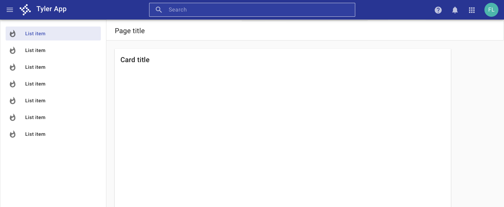
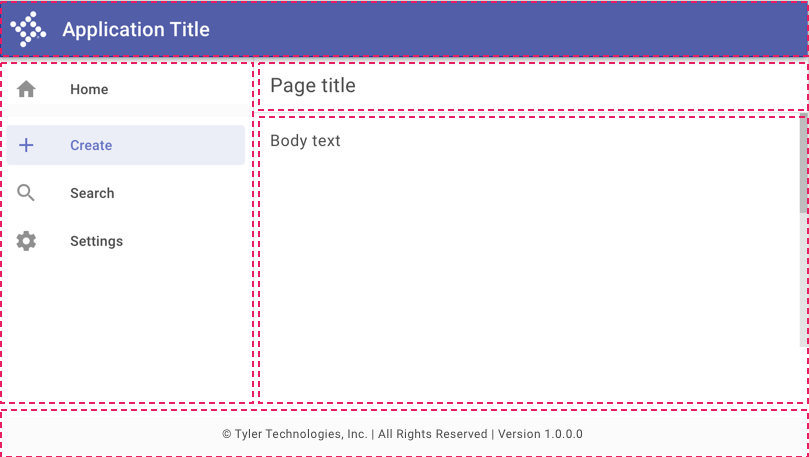

# Scaffold

<ImageBlock caption="Use the default page layouts to create consistent app pages." padded={false}>

</ImageBlock>

## Overview

The scaffold is used to create common page and component layouts with a header, scrollable body, and footer. 

Tyler Forge provides default page layouts to ensure consistency between apps. 

- Desktop layouts: <a href="https://www.figma.com/file/bAV4CXDQnGe6xznxjdjzgx/Forge---Layouts" target="_blank" rel="noopener">Figma file</a>
- Adaptive layouts: [Forge guidance](/core-patterns/layout/page-layouts)

<ImageBlock>

</ImageBlock>

The scaffold is the foundation of layout in Forge apps. The scaffold places the main content of the page:

- [Omnibar](/components/omni/omnibar) (required)
- [Navigation drawer](/components/navigation/navigation-drawer) (optional)
- Page title (required)
- Footer (optional): [workforce apps](/core-patterns/branding/workforce#3-footer-optional), [community apps](/core-patterns/branding/community#4-footer-optional)

To learn more about using and implementing the scaffold, check out the component page [here](/components/layouts/scaffold).
