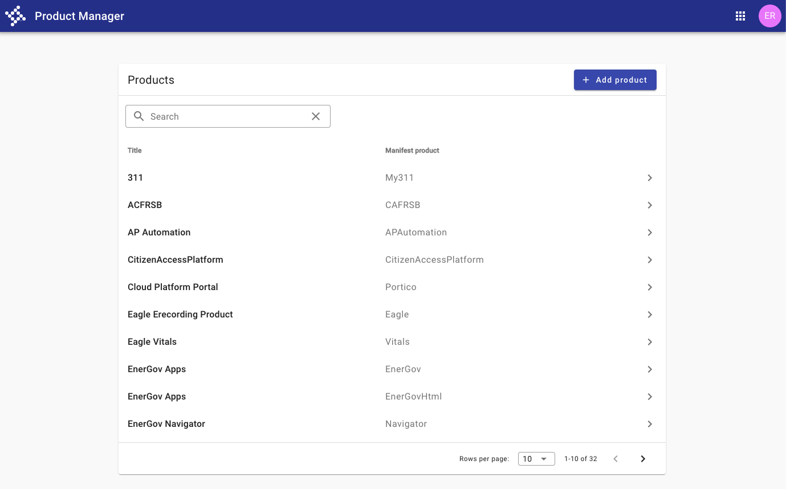
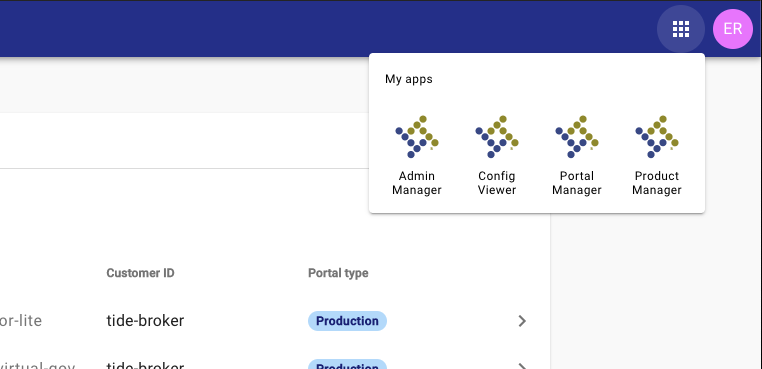
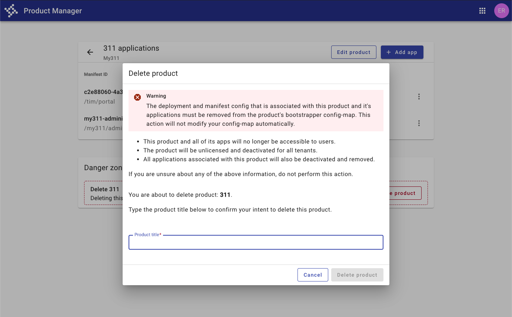
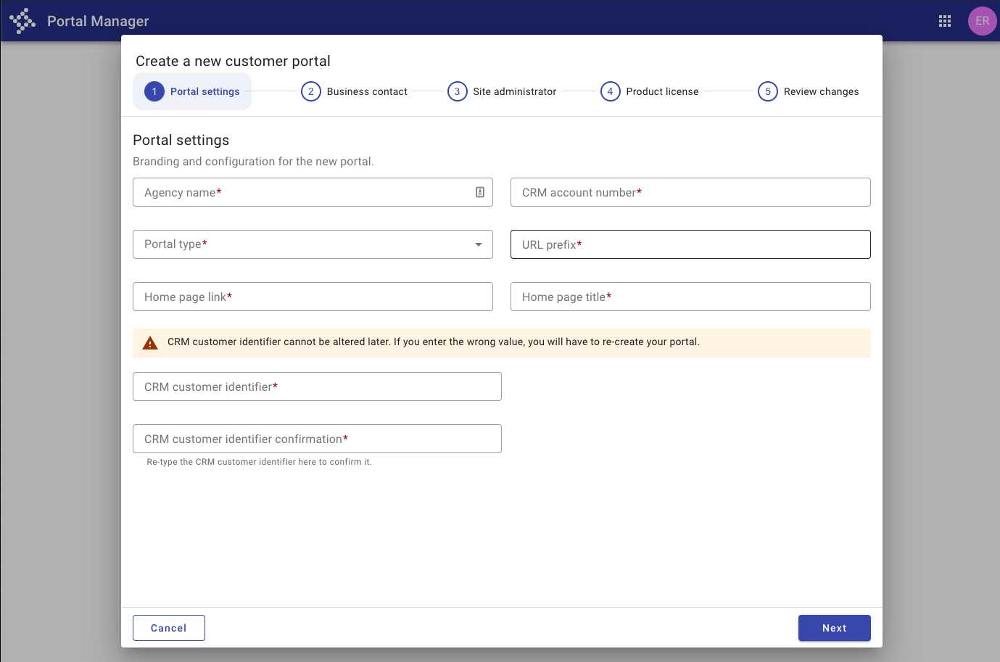

# Manager apps

_"We kept Forge open in a tab for constant reference. Between design recipes, and technical documentation for Forge, it was referenced every step of the way. In any
situation where we did not find a clear cut answer to a questions we had quick responses from the tyler-forge and ask-ux Slack channels. Using Forge as a whole
package - the documentation site as well as communication channels with the design and technical experts - made the development process much easier."_

\- Ross Blakeney, developer

<iframe width="100%" height="500" src="https://web.microsoftstream.com/embed/video/5d1bb149-942d-4c65-86dc-ff984ad12b9b?autoplay=false&showinfo=true" allowFullScreen style={{border: 'none'}}></iframe>

---

## Overview & design decisions

Meet the new manager suite for Tyler Cloud Platform, a single hub for configuring and deploying new Tyler apps.

### Consistency across apps

Since the apps will be used together and serve similar functions, the team wanted to ensure that the experience would be consistent from app to app. They achieved this
by ensuring a consistent [page layout](/styles/layout/page-layouts) and [max width](/styles/layout/grid#content-max-width) as well as a consistent type
hierarchy across apps, using the Forge [typography](/styles/typography) styles. Controls such as primary actions, a
[local search](/patterns/search-and-filter#1-initiate-search), and [pagination](/components/paginator) were all placed in consistent locations across apps. 

To keep the apps clean, the team used the concept of <a href="https://www.nngroup.com/articles/progressive-disclosure/">progressive disclosure</a>. A top level list
with key identifiers is displayed in each of the apps, with an option to drill into each item for more detail. A consistent approach was used for navigating to detail
pages. A "chevron_left" icon button navigates to a child page;  the [upward navigation](/patterns/navigation/hierarchical#2-upward-navigation) pattern navigates
back up to the parent list.

<ImageBlock padded={false}>

</ImageBlock>

### Navigating between apps 

Since the apps are meant to be a suite, the team used the [app launcher](/components/omni/app-launcher) to allow for navigation between apps. 

<ImageBlock>

</ImageBlock>

### Handling destructive actions 

The Product Manager app shows an option to delete a product or an entire application. Though rare, the functionality needs to be included in the app. The action,
however, is destructive, high impact, and can't be undone. The team wanted to adequately communicate the destructiveness of this action as well as ensure that the
action would never been taken by mistake - as a result of a misclick, for example. 

The team opted to give the section a red border, using the Forge danger theme, as well as a title of "Danger Zone" to communicate that these settings are destructive.
Once a user hits "delete," they're prompted with a dialog informing them of the dangers. As an additional precaution, they must type in the product name exactly, in
order to delete and in order to prevent the action from ocurring by mistake. 

Although not a Forge pattern, the team used concepts from Forge, such as Forge [colors](/styles/color#4-informational-colors) and principles from the
[system communication](/patterns/other/system-communication/#2-user-goal-ask-me) pattern to develop a pattern to meet their needs. 

<ImageBlock padded={false}>

</ImageBlock>

### Simplying complex processes 

To simplify the process of creating a new customer portal, the team opted for a [stepper](/components/stepper), breaking up the process into smaller manageable steps.
The stepper is displayed in its own focused dialog, using concepts from [modality](/patterns/other/modality) to indicate a closed process with beginning an end. A
review step at the end allows users to confirm their data and correct any errors. 

<ImageBlock padded={false}>

</ImageBlock>

---

<Columns columns="two" type="equal">

## Featured patterns & components

- [page layout](/styles/layout/page-layouts)
- [max width](/styles/layout/grid#content-max-width)
- [system communication](/patterns/other/system-communication)
- [local search](/patterns/search-and-filter#1-initiate-search)
- [typography](/styles/typography)
- [upward navigation](/patterns/navigation/hierarchical#2-upward-navigation)
- [app launcher](/components/omni/app-launcher)
- [list](/components/lists/list)
- [badge](/components/badge)
- [paginator](/components/paginator/)
- [inline message](/components/inline-message/)
- [stepper](/components/stepper)
- [modality](/patterns/other/modality) 
- <a href="https://www.nngroup.com/articles/progressive-disclosure/" target="_blank" rel="noopener noreferer">progressive disclosure</a>

## Contacts & resources

- <a href="mailto:ross.blakeney@tylertech.com">Ross Blakeney</a>, Developer
- <a href="https://coffeecup.tcpci.com/portal/administration/portal-settings#general">TCP Manager suite</a>, live site
 

</Columns>
