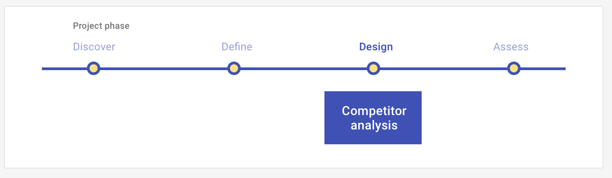

# Competitor analysis: Design

A competitor analysis involves researching competitor approaches including UI layouts, differentiators/competitive advantage, revenue model, content types, tone and copy, etc. A competitor analysis may be conducted at the discover or design phase, with different goals for each.

## Overview 

Begin your design process by researching how your direct competitors, ie the brands in the market-place that offer a similar solution, are solving the problem. Your goal is to gain an understanding of what your persona may be using currently, and therefore may expect from your product, as well as draw inspiration from and create differentiation for your own solution. 

<ImageBlock>

</ImageBlock>

## Use when

Before running this play:

- You have completed Define stage UX Plays, such as creating your [Episode](/core/other/ux-plays/episode-model).
- You have identified the key tasks associated with your Episode.
- You now want to design the experience.

After you run this play:

- You will define how your solution better aligns with your user's goals than your competitors by identifying your differentiators.
- You will conduct additional Design UX Plays, such as a [Design Studio] to generate and align on your design.
 
---

## What you need

- Research tool of choice (internet, books, etc).
- Analysis tool of choice (Excel).
- Presentation tool of choice (Powerpoint or Word).

---

## How to do it

1. Identify your competitors.
2. Review the heuristics you will use to evaluate your competitors. We recommend the heuristics outlined in the [Heuristic Evaluation](/core/other/ux-plays/heuristic-evaluation) play.
3. Complete a competitive analysis matrix for all competitors based off the heuristics.
4. Scan, skim, or color code each column.
5. Creative logical groupings for comparison.
6. Analyze each competitor through benchmarking using a SWOT one paragraph analysis.
     a) Strengths - characteristics of the business or product that give it an advantage over others.
     b) Weaknesses - characteristics that place the business or product at a disadvantage relative to others.
     c) Opportunities - elements that the product could exploit to it's advantage.
     d) Threats - elements in the environment that could cause trouble for the business or product.
7. Create competitive anlaysis findings brief that reveals your findings.

---

## Resources 

- [How to do a UX Competitor Analysis](https://usabilitygeek.com/how-to-do-ux-competitor-analysis/) (Usability Geek)

---

<PlayHelp />
