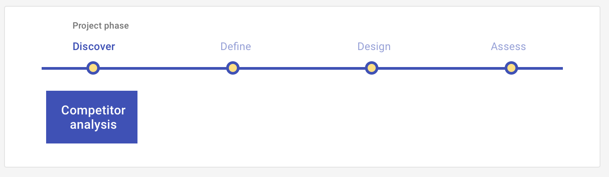

# Competitor analysis: Discover

A competitor analysis involves researching competitor approaches including UI layouts, differentiators/competitive advantage, revenue model, content types, tone and copy, etc. A competitor analysis may be conducted at the discover or design phase, with different goals for each.

## Overview 

Discover your product strategy by researching how the problem you are solving is currently being resolved by your target user. This could be indirect, or hidden competitors, such as users' current work-arounds and solutions, or this could be direct competitors, such as established brands in the market-place that offer a similar solution. 

<ImageBlock>

</ImageBlock>

## Use when 

Before running this play:

- You have identified a problem worth solving and your target user.
- You have initial hypotheses about how to best solve this problem and have defined your value proposition.
- You are unsure of the existing solutions, both indirect and direct, that your target user may have adopted.

After running this play:

- You will define how your solution better aligns with your user's goals than your competitors by identifying your differentiators.
- You may conduct additional Discover UX Plays, such as [Interviews](/core/other/ux-plays/interview/discover) and [Surveys](/core/other/ux-plays/survey/discover) to validate your hypotheses.
- You are defining the experience by building a [Journey map](/core/other/ux-plays/journey-mapping/define).
- You are defining the experience by building an [Episode](/core/other/ux-plays/episode-model).
 
---

## What you need

- Research tool of choice (internet, books, etc).
- Analysis tool of choice (Excel).
- Presentation tool of choice (Powerpoint or Word).

---

## How to do it

1. Identify your competitors, both direct and indirect.
2. Define the key attributes you are most interested in collecting about competitors. Example: features, UI layouts, differentiators/competitive advantage, revenue model, content types, tone and copy, user reviews, wait/load times, customer service.
3. Complete a competitive analysis matrix for all competitors.
4. Scan, skim, or color code each column.
5. Creative logical groupings for comparison.
6. Analyze each competitor through benchmarking using a SWOT one paragraph analysis.
     - Strengths - characteristics of the business or product that give it an advantage over others.
     - Weaknesses - characteristics that place the business or product at a disadvantage relative to others.
     - Opportunities - elements that the product could exploit to it's advantage.
     - Threats - elements in the environment that could cause trouble for the business or product.
7. Create competitive anlaysis findings brief that reveals your findings.

---

## Resources 

- [Conducting Competitive Research](https://www.oreilly.com/library/view/ux-strategy/9781449372972/ch04.html) (UX Strategy, Levy, 2015)

---

<PlayHelp />
