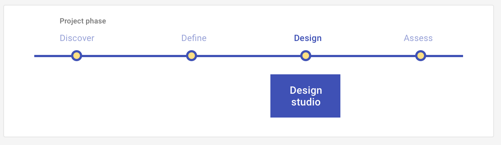

# Design studio

Design the UI (user interface) that represents the experience outlined in your define plays by using a collaborative method that combines divergent and convergent thinking.

<ImageBlock>

</ImageBlock>

## Use when 

Before running this play:

- You have completed Define stage UX Plays, such as creating your [Episode](/plays/episode-model).
- You have identified the key tasks associated with your Episode.
- You now want to design the experience.

After running this play:

- You will create a prototype of your design.
- You will assess the new experience by conducting a [heuristics evaluation](/plays/heuristic-evaluation) or [usability test](/plays/usability-test) with target users using your prototype.

---

## What you need

- Your defined [Episode](/plays/episode-model): a persona, an outcome that persona is trying to accomplish, and a scenario.
- A shared understanding of the key tasks associated with your Episode.
- Paper and pen, or pencil.
- Participants to partake in the activity. This can be your teammates on dev, product, or UX.

---

## How to do it

1. Decide as a group which task you will start with.
2. Diverge: each participant sketches their interpretion of potential solutions for that task. Take 5-10 minutes to do this, or as long as the group needs. Participants should prioritize quantity over quality in these sketches.
3. Present: participants come together to present their sketches to the group to receive feedback and faciliate discussion.
4. Converge: use a dot-voting system to identify the strongest designs.
5. As a unit sketch a solution for each of the tasks combining the strongest designs from the group.
6. Repeat steps 1 through 4 until you have a designs for each of the tasks, or flows within your episode.

---

## Resources 

- [Facilitating a design studio workshop](https://www.nngroup.com/articles/facilitating-design-studio-workshop/) (NN Group)

---

<PlayHelp />
