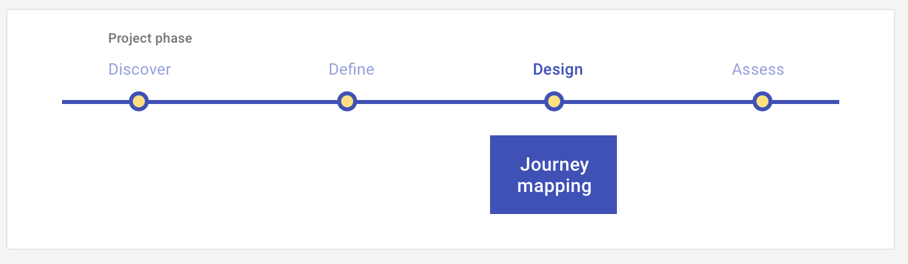

# Journey mapping: Design

Discover users' needs or assess their perceptions of your conceptual-level solutions during a structured, hypothesis-driven conversation, conducted in-person or remotely.

<ImageBlock>

</ImageBlock>

## Use when 

Before running this play:

- You have data gathered on the experience of using a product or service for specific users.
- You have **defined** a journey map for the current experience of using a product that shows its affective and cognitive aspects in a chronological order as they arise during a task.

After running this play:

- You want to **assess** a prototype of the new journey for your product to evaluate how well it meets your focal users' needs.
 
---

## What you need

- A focal experience, product, and user persona
- Data gathered on the emotions and thinking that people who match your persona experience while using the product
- A journey map of the current experience

---

## How to do it

1. Starting with journey map of the current experience, indicate at what steps or stages of the journey your new product will improve a focal persona's experience of completing a task using your product.
2. Describe how your future product will change the experience at the steps or stages you have selected.
3. Add hypothetical quotes you would expect users to provide during this future journey.
4. Add experiments or predictions for the key assumptions in your future journey.

---

<PlayHelp />
