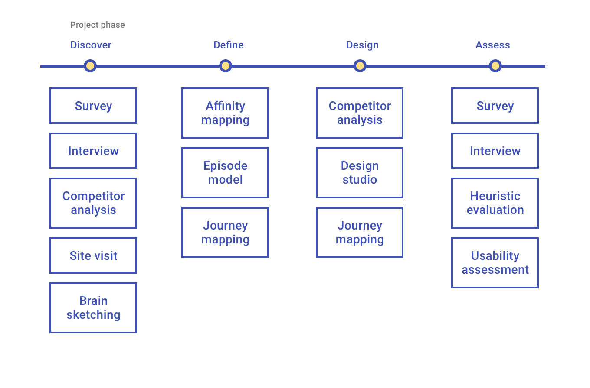

# Plays

Plays are a set of research activities to help you make and test design decisions in your domain. 

## Overview 

Research activities are important at each phase of the <a href="https://www.interaction-design.org/literature/topics/user-centered-design" target="_blank" rel="noopener noreferrer">user centered design process</a>. If your team hasn't used this process before, request a virtual <a href="https://tylerjira.tylertech.com/servicedesk/customer/portal/21/create/609" target="_blank" rel="noreferrer noopener">Jump Start</a>, a two day, hands-on workshop to introduce your team to the User Centered Design process.

<ImageBlock padded={false}>

</ImageBlock>

---

## Picking plays

Plays can be done by product teams, developers, and UX-ers. They are meant for anyone involved in the design and development of a Tyler product. They may be done independently of the TUX team, or you may enlist TUX to aid in your engagement with plays. To do so, check out our [Consulting](/consulting) page.

Plays can be utilized throughout the design and development cycle. Determining what stage of the UCD process your product development is in will help determine which Play may be most appropriate.

Not sure where to start? Which question are you trying to answer?

### Discover phase

<ExpansionPanel caption="How does our persona solve this problem currently?">

[Competitor analysis](competitor-analysis/discover)

Discover your product strategy by researching how the problem you are solving is currently being resolved by your persona. 

</ExpansionPanel>

<ExpansionPanel caption="What does the experience look like today when our persona solves this problem?">

[Site visit](site-visit)

Discover users' context of work – where they work, how they work, what software or other technology or tools they work with, and whom they work with.

</ExpansionPanel>

<ExpansionPanel caption="What should we make? How do personas say they solve this problem now?">

[Survey](survey/discover)

Discover users' wants, needs, and behaviors through an online form.

---

[Interview](interview/discover)

Discover users' needs during a structured, hypothesis-driven conversation, conducted in-person or remotely.

</ExpansionPanel>

<ExpansionPanel caption="How do we come up with new ideas and solutions?">

[Brainsketching](brain-sketch)

Generate ideas about a topic: Who are our users? What problems could we solve? How could we solve them? 

</ExpansionPanel>

---

### Define

<ExpansionPanel caption="How do we organize and analyze our findings and insights from our research?">

[Affinity mapping](affinity-mapping)

Define what you have found in the discover stage by organizing your findings into distinct clusters that represent one similar idea or concept. Affinity mapping allows you to see trends in the data and build consensus with your team.

</ExpansionPanel>

<ExpansionPanel caption="Who uses this solution, in what context, and for what purpose?">

[Episode model](episode-model)

Define what you have found in the discover stage by identifying your target persona, their scenario, and their desired outcome. 

</ExpansionPanel>

<ExpansionPanel caption="What does the holistic experience encompass, and feel like, for our persona today?">

[Journey mapping](journey-mapping/define)

Show what a user does and how she feels before, during, and after using your product.

</ExpansionPanel>

---

### Design

<ExpansionPanel caption="What experiences or solutions is our persona familiar with that exist in the market place?">

[Competitor analysis](competitor-analysis/design)

Begin your design process by researching how your direct competitors are solving the problem. Your goal is to gain an understanding of what your persona may be using currently, and therefore may expect from your product.

</ExpansionPanel>

<ExpansionPanel caption="How do we begin designing the UI of our solution?">

[Design studio](design-studio)

How do we begin designing the UI of our solution? 

</ExpansionPanel>

<ExpansionPanel caption="What will the holistic experience encompass, and feel like, for our persona tomorrow?">

[Journey mapping](journey-mapping/design)

Show a new hypothetical journey a user could take to complete a task using your product. Indicate what is different in the future product and its affect on the journey the user takes. 

</ExpansionPanel>

---

### Assess 

<ExpansionPanel caption="What does our persona think about our potential solution?">

[Survey](survey/assess)

Assess user's perceptions of your conceptual-level solutions through an online form.

</ExpansionPanel>

<ExpansionPanel caption="What does our persona think about our potential solution?">

[Interview](interview/assess)

Assess users' perceptions of your conceptual-level solutions during a structured, hypothesis-driven conversation, conducted in-person or remotely.

</ExpansionPanel>

<ExpansionPanel caption="Does our design conform to UX best practices?">

[Heuristic evaluation](heuristic-evaluation)

Assess a prototype using a list of standard UX rules of thumbs called heuristics.

</ExpansionPanel>

<ExpansionPanel caption="Does our design solve the problem(s) for our persona?">

[Usability assessment](usability-test)

Assess the usability of a prototype by observing a facilitated session of your persona’s use of the design. 

</ExpansionPanel>

---

<PlayHelp />
