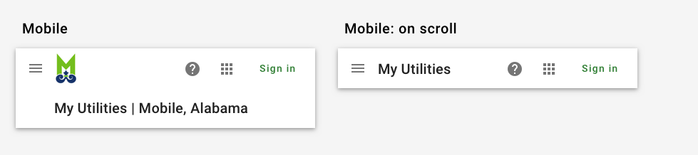
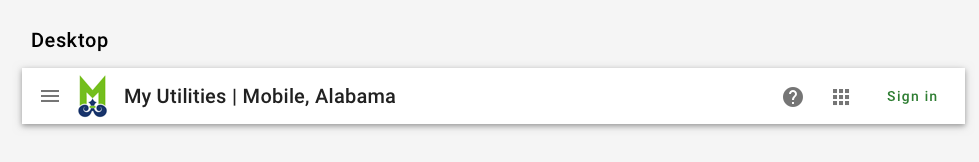
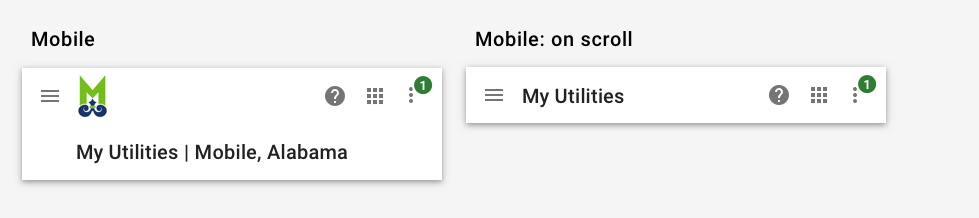
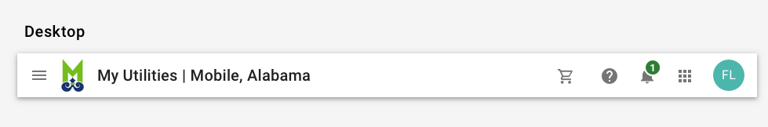
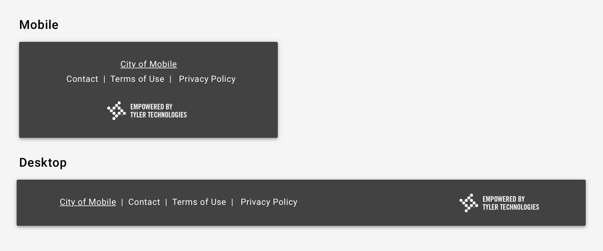
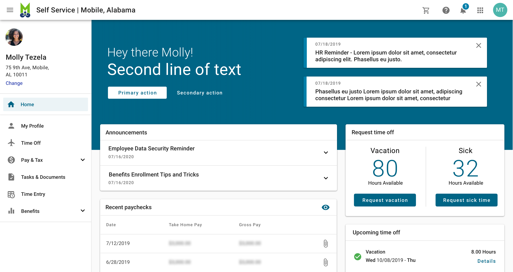
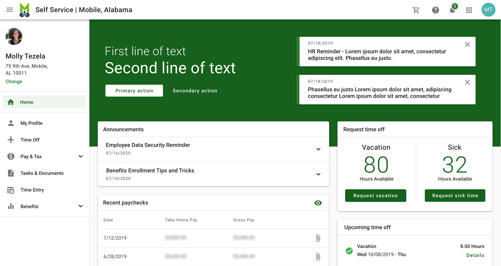
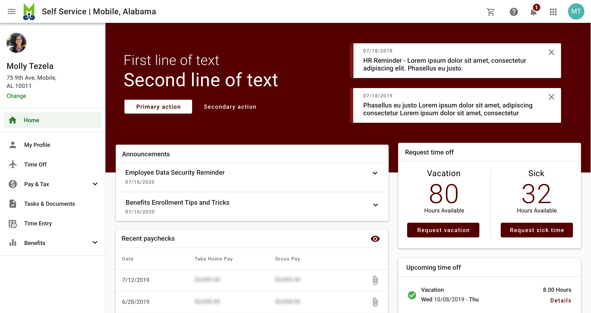
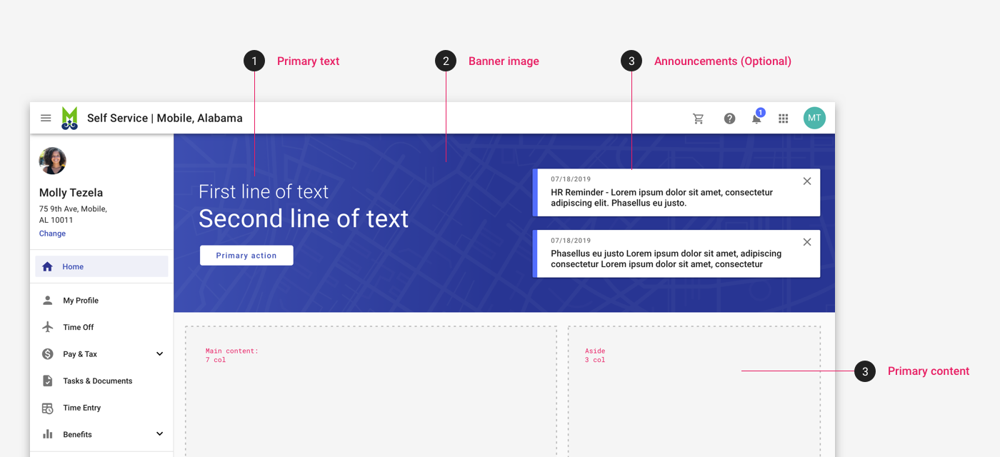

# Branding: Community

Our brand is what we stand for, a promise we make, and the personality we convey as a business. It represents the entire experience someone has with our company. 

## Overview 

Community apps are defined as apps that are licensed to a specific municipality (city of Mobile, Alabama, for example) and reflect that municipality's branding in addition to reflecting Tyler's core values. 

---

## Parts 

Community branding is comprised of six parts: 1. Browser favicon and page title 2. Omnibar styling 3. Municipality logo and name 4. Footer (optional) 5. App theme 6. Standard landing pages. 

### 1. Browser favicon and page title

Community apps use the municipality logo as the favicon, which displays in the browser tab. The page title displays as following in the browser tab:

``` 
{Logo} <Page name> | <Town name> <App name>
```

### 2. Omnibar styling

Community apps use a white omnibar.

For unauthenticated (not yet signed in) or guest users, the [omnibar](/components/omni/omnibar) contains the hamburger menu (if the app has a lefthand navigation), municipality name and logo, shopping cart (if applicable to unauthenticated users), [help icon](/components/omni/omnibar#1-help-required), [app launcher](/components/omni/app-launcher), and a link to "Sign in."

<ImageBlock padded={false} caption="On mobile, community apps use the extended omnibar by default. On scroll, the omnibar collapses to display just the app name; logo and city name disappear.">



</ImageBlock>

<ImageBlock padded={false}>



</ImageBlock>

For authenticated users, the omnibar contains the hamburger menu (if the app has a lefthand navigation), municipality name and logo, shopping cart, [help icon](/components/omni/omnibar/#1-help-required), [notifications icon](/components/omni/omnibar/#2-notifications-optional), [app launcher](/components/omni/omnibar/#3-app-launcher-required), and [user avatar](/components/omni/omnibar/#4-avatar-and-profile-card).

<ImageBlock padded={false} caption="On mobile, community apps use the extended omnibar by default. On scroll, the omnibar collapses to display just the app name; logo and city name disappear.">



</ImageBlock>

<ImageBlock padded={false}>



</ImageBlock>

### 3. Municipality logo and name

For community apps, the omnibar displays the municipality logo and name, using the following format:

```
<App name> | <Municipality name>
```

The app name uses title case (all words start with a capital letter). 

<ImageBlock padded={false}>


</ImageBlock>

### 4. Footer (optional)

Community apps use a footer that refers to the client / municipality. The footer is used on landing pages only. Read more about the [footer component](/components/page/footer). Footers should not be fixed; they should move as the page scrolls.

<ImageBlock caption="Community apps may use a standard footer on landing pages by default.">



</ImageBlock>

### 5. App theme 

Municipalities may choose from three ADA compliant themes to complement their existing branding. 

<ImageBlock>



</ImageBlock>

<ImageBlock>



</ImageBlock>

<ImageBlock>



</ImageBlock>


### 6. Standard landing pages

Community apps include standard landing pages. A landing page serves a starting point for authenticated or unauthenticated users and may include summary content such as an account overview, a listing of accounts, announcements, pending time off requests, etc. 

Standard landing pages help to ensure consistency across the experience for different community apps. 

App teams may choose from the layouts provided to structure the main content, but all landing pages will include the following:

1. **Primary text.** This may be a welcome message or an announcement. 
2. **A banner image,** customizable by the municipality. 
    - The Cloud Platform will provide defaults that municipalities may choose from if they don't have an appropriate image. 
    - Recommended resolution / aspect ratio
    - Clients will provide mobile and desktop optimized images.
3. **Contextual announcements** (optional), such as, upcoming HR announcements, new utility rebates, bill reminders etc. 
4. **Main content,** which is displayed using one of the standard layouts. 

<ImageBlock padded={false}>



</ImageBlock>
