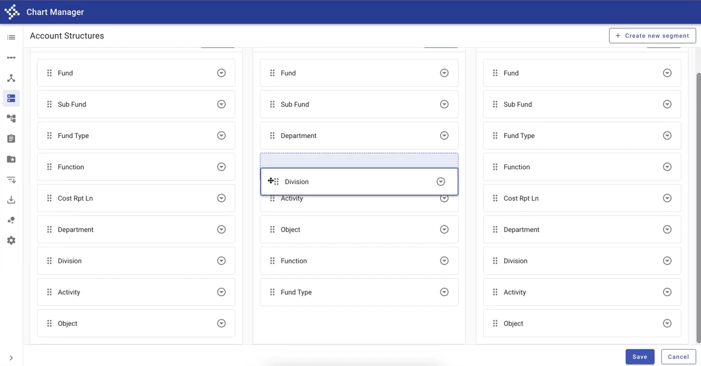
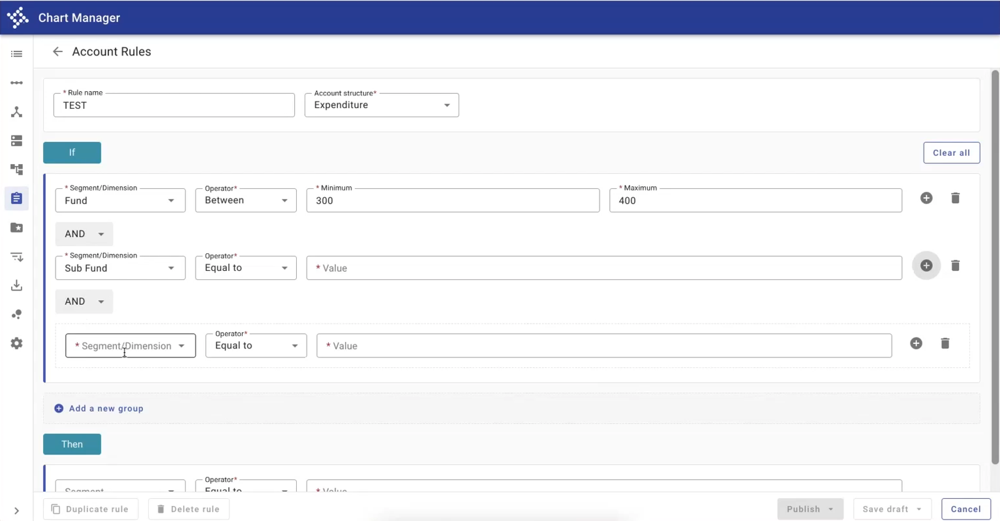

# Next Gen GL

_"This is the face of our product and it's the little things that make the difference for the user - spacing, margins, padding, interactions. It sounds trivial, but you notice it right away."_

\- Rob Jacobs, developer

<iframe width="100%" height="500" src="https://web.microsoftstream.com/embed/video/a2f40289-db72-4ae4-902e-adae97e9f056?autoplay=false&showinfo=true" allowFullScreen style={{border: 'none'}}></iframe>

---

## Overview & design decisions 

Meet the Next Generation General Ledger, which allows clients to create a flexible chart of accounts. The app features Forge styled patterns for drag and drop as well as a
Forge skinned logic / query builder. 

This demo was recorded in early 2021, as part of a relatively informal product demo by product designer Katie Spofford.

### Account Structures: Drag & drop

To allow clients to set up their account structures, the team opted for a drag & drop approach approach. The challenge was to determine how to allow clients to add potentially
the same segements to each account structure. This was solved by including an option to "Add" a new segment from each account structure itself, with the ability to move segments
within that account structure. 

The team included visual affordances for each part of the drag and drop interaction:

- Draggable elements are indicated by a "drag-indicator" icon to the left of the segment name.
- On hover, the user's cursor changes to a "move" cursor.
- On grab, the element displays an indigo border. The originating slot is indicated with a background color and dashed border. 
- The destination spot is indicated with a background color and dashed border. 
- Once the element is released, it snaps into place into its final destination. 

The team used Angular Material's <a href="https://material.angular.io/cdk/drag-drop/overview" target="_blank" rel="noopener noreferrer">Drag and Drop CDK</a>, styled with
Forge colors. For more information, reach out to <a href="mailto:rob.jacobs@tylertech.com">Rob Jacobs</a>.

<ImageBlock maxWidth="700px">

</ImageBlock>

### Account Rules: Logic Builder 

In order to allow users to build out complex account rules, Katie designed a complex query builder. The pattern allows users to build out nested conditions that allow
for "AND" or "OR" logic. 

Within the "IF" statement itself, users can define multiple conditions on multiple types of segments and dimensions. Conditions can include operators such as
"between,"" "equal to," "less than," etc. The team differentiated between "conditions" and "inner conditions," where inner conditions act almost like parenthetical
expressions in a complex math statement. Parent conditions are indicated by a card with a border left while inner conditions are indicated with a dashed border outline.

The new pattern tested well with clients; they found it easy to use and repeat once they'd build out an initial structure. 

<ImageBlock maxWidth="700px">

</ImageBlock>

### Reusing components 

The team was able to reuse the same pattern within a dialog to set up conditional rules on individual account structures. The pattern was built as a component so that
it could be reused exactly in a different format. 

---

<Columns columns="two" type="equal">

## Featured patterns & components

- [drag & drop](/patterns/other/drag-and-drop/overview)
- [scaffold](/components/layouts/scaffold)
- [dialog](/components/notifications-and-messages/dialog)
- [empty state](/components/page/page-state)
- [menu](/components/navigation/menu)
- [drawer](/components/navigation/drawer)

## Contacts & resources

- <a href="mailto:rob.jacobs@tylertech.com">Rob Jacobs</a>, Developer
- [Chart Manager](https://webappsnxtdev.tylertech.com/nxt_dev/dev/erpportal/dev/Apps/GeneralLedger/ChartManager/), demo site 
- Angular Material's <a href="https://material.angular.io/cdk/drag-drop/overview" target="_blank" rel="noopener noreferrer">Drag and Drop CDK</a>
 

</Columns>
