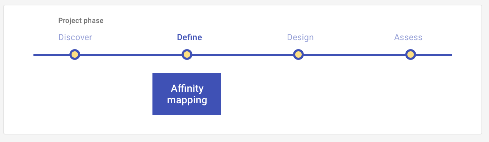

# Affinity mapping

Define what you have found in the discover stage by organizing your findings into distinct clusters that represent one similar idea or concept. Affinity mapping allows you to see trends in the data and build consensus with your team. 

<ImageBlock>

</ImageBlock>

## Use when 

Before running this play:

- You have completed discover-stage UX Plays, such as [Interviews](/core/other/ux-plays/interview/discover), [Site visits](/core/other/ux-plays/site-visit), and [Surveys](/core/other/ux-plays/survey/discover).
- You now want to define what you learned. 

After you run this play:

- You will design a product or service that will deliver the experience you mapped.

---

## What you need

- Insights from your discover plays. 
- Sticky notes and a white board. You may use an online tool to facilitate a remote session, such as [Miro.com](https://miro.com).
- Participants to partake in the activity. This can be your teammates on dev, product, or UX. 

---

## How to do it

1. Generate your sticky notes. Each sticky note should represent one distinct idea, concept, or fact. TIP: If you are mapping insights from interviews, utilize different color sticky notes for each participant interviewed.
2. Place the sticky notes on the wall (or Miro board) for all participants engaging in the mapping experience to view and digest.
3. Without discussing as a group, all participants begin organizing the sticky notes into clusters that represent the same concept or idea.
4. Continue sorting until the group decides the clusters are set, typically ~15-30 minutes depending on the volume of your findings.
5. As a group, name each cluster to identify the key trends in your data
6. As a group, prioritize your design work, or next steps in the UX project phase, based on your findings.

---

<PlayHelp />
