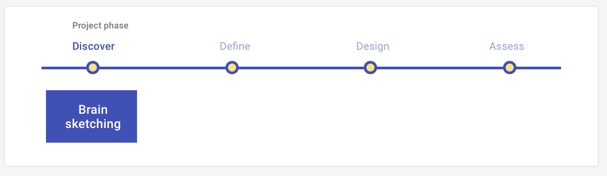

# Brainsketching

Generate ideas about a topic - who are our users? What problems could we solve? How could we solve them?

<ImageBlock>

</ImageBlock>

## Use when 

Before running this play:

- Have a general sense of the topic for a group to consider.
- Invite participants, keeping in mind that more diversity in backgrounds leads to more originality in ideas.

After running this play:

- Define the outcome. What did the group create that will focus its next activity? More specifically, you should have a list of ideas generated and elaborated on by every person in the group, ranked by originality and feasibility. 
- Define which outcomes to design for: will your team design prototypes to combine the ideas? Experiments to further assess them?

---

## What you need

- A group of people
- An initial topic
- A medium - like paper or a digitial tool - for individuals to develop ideas in
- A space to share ideas that each group member develops individually

---

## How to do it

Brainsketching begins with a group stage, then moves to an individual stage, and concludes with a group stage.

**Group stage 1**

1. Share the topic for the group to generate ideas for. 
2. Explain the basic format: working individually, each person will generate verbal and pictorial ideas for the topic without group feedback. Then, each person will review every other person's ideas and add questions or connections to it. Finally, the group will review all ideas and rate them for **originality** and **feasibility**.

**Individual stage 1**

1. Connect the topic to your knowledge and experiences.
2. Find new connections in the topic-relevant knowledge you produced. Can you combine, extend, or develop new associations to your ideas?
3. Represent your ideas in picture and words. Some ideas might be just words, others just pictures, and some a combination. Because representations shape thinking - yours and the group members who will review your ideas - using pictorial and verbal representations broadens your and the group's thinking.

**Individual stage 2**

1. Trade your idea representations with someone else in the group. This can be in the form of a gallery view, during which everyone views everyone else's ideas in a central place. Alternatively, group members can trade with each other until everyone has seen everyone else's ideas.
2. Respond to the ideas you are reviewing: directly add questions or suggestions - in the form of words or pictures - to the ideas you are reviewing.

**Group stage 2**

1. The group can review all ideas and rate them for **originality** and **feasibility**. 
2. Decide the next topic for the next iteration of your brainsketching.

---

<PlayHelp />
