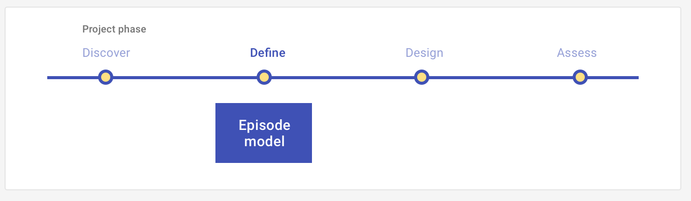

# Episode model

Define what you have found in the discover stage by identifying your target persona, their scenario, and their desired outcome. 

<ImageBlock>

</ImageBlock>

## Use when 

Before running this play:

- You have completed discover-stage UX Plays, such as [Interviews](/get-started/other/ux-plays/interview/discover), [Site visits](/get-started/other/ux-plays/site-visit), and [Surveys](/get-started/other/ux-plays/survey/discover).
- You have identified your findings from the discover plays using[ Affinity mapping](/get-started/other/ux-plays/affinity-mapping).
- You now want to define what you learned. 

After running this play:

- You will design a product or service that will deliver the experience. 
 
---

## What you need

- Insights from your discover and define plays. 
- Presentation tool of choice (Powerpoint, Word).

---

## How to do it

1. Define your persona. Your persona is an archetype of your target user based on their behavior patterns. You should include information such as goals, knowledge, responsibilities, skills, and expectations in your persona and avoid things like age and demographic. 
2. Specify the scenario. The scenario is the story, or the plot that your persona is the leading character in. The scenario should be specific and provide context.
3. Distinguish the outcome. The outcome is the desired result your persona expects from the experience.
4. Compile this information into an artifact or presentation to share with the team.

---

<PlayHelp />
