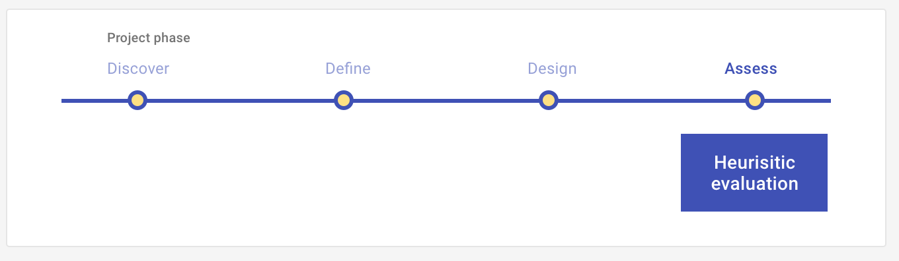

# Heuristic evaluation

Assess a prototype using a list of standard UX rules of thumb called heuristics.

<ImageBlock>

</ImageBlock>

## Use when 

Before:

- You have conducted **Discover, Define**, and **Design activities**.
- You have a working prototype. The prototype does not have to be complete or high-fidelity - even a one-screen wireframe is sufficient. But you cannot Assess what you have not Designed.
- You have a defined [Episode](/core/other/ux-plays/episode-model): a persona, an outcome that persona is trying to accomplish, and a scenario.

After:

- You will make changes to the design based on your findings.
- You will conduct further heuristic evaluations or other assess UX Plays on the iteration or other prototypes. 

---

## What you need

- <a href="https://tylertech-my.sharepoint.com/:x:/p/emma_walsh/EU1JDcAUH7ZMp1Z5Bzai6LIBR6nX7CL-EsnC7R6jNAAmFw?e=LQlQBP" target="_blank" rel="noreferrer noopener">Heuristic Analysis Workbook</a>
- <a href="https://tylertech-my.sharepoint.com/:p:/p/emma_walsh/EQdQtUdNZDNKi-6_SSvL5lgBRJS_PrHQ5DI76ANPS0EZfw?e=aIJhr1" target="_blank" rel="noreferrer noopener">Introduction to Heuristic Analyses</a>
- Prototype
- Hypotheses
- Episode: Person, Scenario, and Outcome
- Heuristics: Functional, Findable, Discoverable, Predictable, Learnable, Memorable 
- Tasks
- Script
- Target users

---

## How to do it

1. Make a copy of the workbook above.
2. Identify your ideal user - the one who would value your solution most. 
3. Write scenarios and tasks that address your hypotheses from multiple angles.
4. Identify your assumptions and develop a set of hypotheses based on your assumptions. Ask, "If this assumption is correct, what would have to be true?" 
5. Work on the tasks using the prototype, thinking from the perspective of the ideal user.
6. At each step or screen, assess how effective the key design features using the heuristics criteria.
7. Recommend changes or identify further questions for the design features that do not meet the heuristics criteria.
8. Prioritize design, development, and further research work.

---

## Examples

See how Heuristic Analyses have been used in apps at Tyler!

**Executime mobile app**

Executime allows employees to clock in & out, track weekly hours, view upcoming schedules, trade shifts, and request time off. 

- <a href="https://tylertech-my.sharepoint.com/:x:/r/personal/emma_walsh_tylertech_com/_layouts/15/doc2.aspx?sourcedoc=%7B41a3890d-8597-43b7-983a-f6940c05113c%7D&action=edit&activeCell=%27Heuristic%20Analysis%20-%20Emily%27!E61&wdinitialsession=e2f4a6a9-8f7a-47a1-9eb6-abecf7b2783f&wdrldsc=7&wdrldc=1&wdrldr=AccessTokenExpiredWarning%2CRefreshingExpiredAccessT" target="_blank" rel="noreferrer noopener">Heuristic analysis workbook</a>
- <a href="https://www.figma.com/proto/xTmpdynsNRiyHYrSqV4ALw/2021-Executime-Heuristic-Review-Findings?node-id=1%3A6707&scaling=contain&page-id=0%3A1&starting-point-node-id=1%3A6707" target="_blank" rel="noreferrer noopener">Findings presentation</a> (Figma)

**iG inspect**

iG Inspect is an iPad app that allows government field inspectors to quickly manage inspections for new construction permits, land management
projects, safety and compliance, and much more. iG Inspect is an ancillary field application which works in conjunction with the Energov product
suite, but is hyper focused for the daily field inspector to be able to manage their daily inspection process which includes: navigation and routing,
researching relevant cases, inspection checklists, as well as digital signature and printing capabilities.

- <a href="https://tylertech-my.sharepoint.com/:x:/p/emma_walsh/EfRLxQVzK4hHiSnfnn0qywoBelICidGjS7v1nVsdnSMFoQ?e=2oZe5x" target="_blank" rel="noreferrer noopener">Heuristic analysis workbook</a>

---

<PlayHelp />
