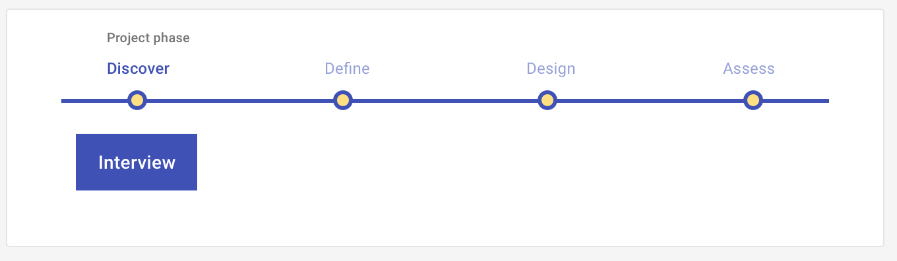

# Interview: Discover

Discover users' needs or assess their perceptions of your conceptual-level solutions during a structured, hypothesis-driven conversation, conducted in-person or remotely.

<ImageBlock>

</ImageBlock>

## Use when 

Before running this play:

- You have initial hypotheses about what problems are important to solve for your users. 
- You are not sure how users describe or experience those problems.
- You are not sure how users currently solve the problems you identified.

After running this play:

- You want to define the problems to solve or how your product will solve them.
- You are building a [Journey map](/get-started/other/ux-plays/journey-mapping/define).

---

## What you need

- Hypotheses
- Interview guide
- Target users
- Recording device
- Interview transcripts
- Analysis tool

---

## How to do it

1. Identify your assumptions.
2. Develop hypotheses based on your assumptions. Ask, "If this assumption is correct, what would have to be true?" 
3. Write open-ended questions that address your hypotheses from multiple angles. 
4. Organize your questions by topic or chronologically following a task or event.
5. Identify your ideal user – the one who would value your solution most. 
6. Recruit people who are similar to your ideal user to interview.
7. Interview your participants, asking them the open-ended questions you developed. Record each interview!
8. Analyze your findings. We recommend [Affinity mapping](/get-started/other/ux-plays/affinity-mapping).
9. Prioritize design, development, and further research work.

---

<PlayHelp />
