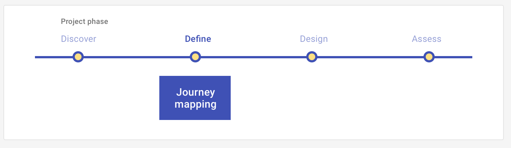

# Journey mapping: Define

Discover users' needs or assess their perceptions of your conceptual-level solutions during a structured, hypothesis-driven conversation, conducted in-person or remotely.

<ImageBlock>

</ImageBlock>

## Use when 

Before running this play:

- You have data gathered on the experience of using a product or service for specific users.
- You want to **define** the experience of using a product by showing its affective aspects in a chronological order as they arise during a task.

After running this play:

- You want to **design** your product so that the negative aspects of the experience of using it are neutral or positive.
 
---

## What you need

- A focal experience, product, and user persona
- Data gathered on the emotions and thinking that people who match your persona experience while using the product

---

## How to do it

1. Gather data using interviews, surveys, and secondary research on the experience a specific persona has when using a product for a specific task.
2. Describe the steps and affective and cognitive aspects of each step in a process the user follows to use the product for a specific task.
3. Starting with a horizontal curve, add the steps you discovered in your research data along with a point indicating the emotional aspect of the step. A point above the line is a positive emotion, and a point below the line is a negative emotion.
4. Add quotes - direct or composite - from your research participants to describe each step and the thinking and emotion users tend to experience at that step.

---

<PlayHelp />
