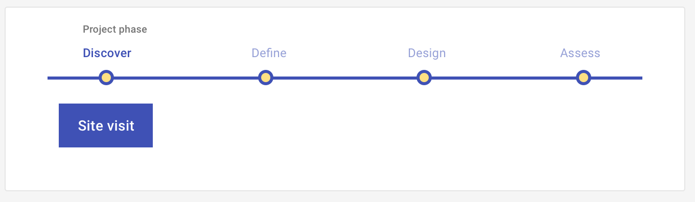

# Site visit

Discover users' context of work - where they work, how they work, what software or other technology or tools they work with, and whom they work with.

<ImageBlock>

</ImageBlock>

## Use when 

Before running this play:

- You have identified a context - people and the physical environments where they work on tasks you are developing a solution for.
- You have initial hypotheses about how the people you plan to observe will accomplish the tasks you are developing a solution for.
- You are unsure of the critical details of how users accomplish relevant tasks.

After running this play:

- You want to define how your solution will align with how your users complete a task.
- You are building a [Journey map](/get-started/other/ux-plays/journey-mapping/define).
- You are building an [Episode](/get-started/other/ux-plays/episode-model).
 
---

## What you need

- Hypotheses
- Observation guide
- Target users
- Recording device
- Camera
- Interview transcripts
- Analysis tool

---

## How to do it

1. Identify your assumptions.
2. Develop hypotheses based on your assumptions. Ask, "If this assumption is correct, what would have to be true?"
3. Write open-ended questions that address your hypotheses from multiple angles. 
4. Organize your questions by topic or chronologically following a task or event.
5. Identify your ideal user - the one who would value your solution most. 
6. Recruit people who are similar to your ideal user to interview.
7. Observe your participants completing the tasks you are studying, asking them the open-ended questions you developed. Record each interview!
8. Analyze your findings. We recommend [Affinity mapping](/get-started/other/ux-plays/affinity-mapping).
9. Prioritize design, development, and further research work.

---

<PlayHelp />
