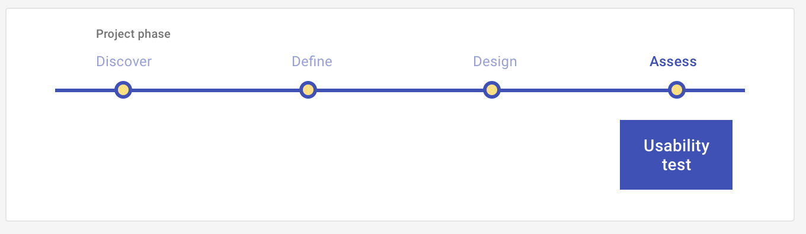

# Survey: Assess

Discover users' needs or assess their perceptions of your conceptual-level solutions during a structured, hypothesis-driven conversation, conducted in-person or remotely. 

<ImageBlock>

</ImageBlock>

## Use when 

Before running this play:

- You have initial hypotheses about what problems are important to solve for your users. 
- You have conceptual level solutions that you want users to react to and provide feedback on.

After running this play:

- You will translate your conceptual level solution to a tangible solution.
- You may conduct a [Design studio](/get-started/other/ux-plays/design-studio) to generate and align on your design.
- You may create a prototype of your design.
 
---

## What you need

- Hypotheses
- Conceptual level solutions
- Survey tool. We recommend Survey Monkey. (Reach out to <a href="mailto:kathy.wolf@tylertech.com">Kathy Wolf</a> for credentials to the Tyler account.)
- Target users
- Analysis tool. We recommend Survey Monkey's analysis tool for quantitative data and a Cluster analysis technique for quantitative data.  

---

## How to do it

1. Identify your assumptions.
2. Develop hypotheses based on your assumptions. Ask, "If this assumption is correct, what would have to be true?" 
3. Write open-ended questions that address your hypotheses from multiple angles. 4. Organize your questions by topic or chronologically following a task or event.
5. Identify your ideal user – the one who would value your solution most. 
6. Recruit people who are similar to your ideal user to interview.
7. Interview your participants, asking them the open-ended questions you developed. Record each interview!
8. Analyze your findings. We recommend [Affinity mapping](/get-started/other/ux-plays/affinity-mapping).
9. Prioritize design, development, and further research work.

---

<PlayHelp />
