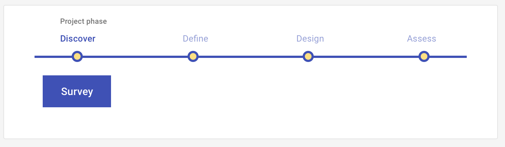

# Survey: Discover

Discover users' needs or assess their perceptions of your conceptual-level solutions during a structured, hypothesis-driven conversation, conducted in-person or remotely. 

<ImageBlock>

</ImageBlock>

## Use when 

Before running this play:

- You have initial hypotheses about what problems are important to solve for your users. 
- You are not sure how users describe or experience those problems.
- You are not sure how users currently solve the problems you identified.

After running this play:

- You want to define the problems to solve or how your product will solve them.
- You are building a [Journey map](/get-started/other/ux-plays/journey-mapping/define).
- You are building an [Episode model](/get-started/other/ux-plays/episode-model).

---

## What you need

- Hypotheses
- Survey tool. We recommend Survey Monkey. (Reach out to <a href="mailto:kathy.wolf@tylertech.com">Kathy Wolf</a> for credentials to the Tyler account.)
- Target users
- Analysis tool. We recommend Survey Monkey's analysis tool for quantitative data and a Cluster analysis technique for quantitative data. 

---

## How to do it

1. Identify your hypotheses and conceptual solutions.
2. Draft your questions **based on your research.** Assess phase surveys should focus more on closed questions that provide quantitative data.
   - Prioritize closed questions where there are a finite number of correct options. Closed questions provide a fixed number of answers for your respondents to choose from and therefore provide quantitative data, such as "how many?", "how much?", and "how often?". 
   - Include open questions to provide context and rational for your closed questions. Open questions allow your respondents to respond via short paragraph format. They provide qualitative data, and answer the question of "why?".      
   - Tips for question writing: write clear and simple questions, avoid double-barrelled questions, avoid leading questions, avoid biased questions.
3. Organize and prioritize your questions by topic or chronologically following a task or event. Tip: the fewer questions you include, the lower your drop-off rate will be.
4. Test your survey with a controlled group for feedback on question order, length, and clarity. Iterate based on their feedback. 
5. Transfer your questions to your survey software. We recommend Survey Monkey.
6. Send your ideal user the link to your survey. Tip: the more participants that complete your survey, the more statistically relevant your data will be.
7. Analyze your findings. We recommend [Affinity mapping](/get-started/other/ux-plays/affinity-mapping) for qualitative data and Survey Monkey's report tool for quantitative data.

---

## Resources

- [28 Tips for Creating Great Qualitative Surveys](https://www.nngroup.com/articles/qualitative-surveys/) (NN Group)
- [How to Create Effective User Surveys](https://uxplanet.org/how-to-create-effective-user-surveys-1cea4b06ff76)  (UX Planet)
- [The Ultimate UX Survey Design Guide](https://medium.com/@allisoncrady/designing-iterating-analyzing-user-surveys-for-product-impact-5771fc1cdd7a) (Medium)

---

<PlayHelp />
