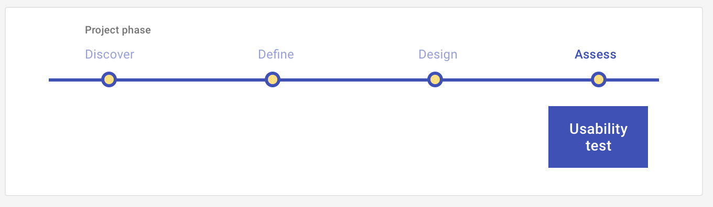

<ImageBlock>

</ImageBlock>

## Use when 

Before running this play:
- You have conducted Discover, Define, and Design activities.
- You have a defined [Episode](/get-started/other/ux-plays/episode-model): a persona, an outcome that persona is trying to accomplish, and a scenario.
- You have identified the key tasks associated with your Episode.
- You have a clickable prototype. This prototype renders the intent of your solution for how your persona might. accomplish the tasks associated with your Episode.

After running this this play:
- You will build consensus with your team on key usability issues and make changes to the design based on your findings.
- You may conduct further Assess UX Plays on the iteration of your prototype.
 

---

## What you need

- <a href="https://confl.tylertech.com/display/EUT/UXR+Templates" target="_blank" rel="noopener noreferrer">Usability testing resources</a>
- <a href="https://web.microsoftstream.com/video/6e49fe39-be89-4b33-b634-4a5bb0d4844f?channelId=e7adca05-592b-4956-9266-4ae129e0d4ba" target="_blank" rel="noopener noreferrer">Level up your User Research</a> (2020 Mesh Session)
- Prototype
- Hypotheses
- Episode: Persona, Scenario, and Outcome
- Tasks
- Script
- Target users representing your persona
- Analysis tools (GoToMeeting, Excel)

---

## How to do it

1. Make a copy of the workbook above to record findings & analysis. We recommend watching the Mesh session provided to take your usability test to the next level!
2. Identify your assumptions about how your persona would use the design.
3. Develop hypotheses based on your assumptions to prove or disprove through the usability session.  
4. Draft your script. Write scenarios and tasks that you want to observe your persona undertake by using the prototype. These tasks should address your hypotheses from multiple angles. 
5. Identify and recruit potential participants who represent your target persona.
6. Schedule 30-60 minute sessions with 3-5 participants in order to capture the majority of usability issues.
7. Conduct the sessions remotely via GoToMeeting or in person. Make sure you record the session after asking the participants consent. Always follow your script.
8. Analyze your results. Review your findings to identify patterns and trends in the data. Turn those findings into insights by inferring what the patterns might mean.
9. Recommend changes or identify further questions for the design features to consider.
10. Prioritize design, development, and further research work.

---

## Examples

See how Usability Tests have been used in apps at Tyler!

**ACFR Statement Builder**

Tyler ACFR Statement Builder enables users to build comprehensive financial reports. 

- <a href="https://tylertech-my.sharepoint.com/:x:/p/emma_walsh/Eay-O5q3ipFOvxU64HxANdUBtY-OKOTTA_BTznLlAAoW5g?e=3GQ6De" target="_blank" rel="noreferrer noopener">Heuristic analysis workbook</a>

---

## Resources

- [Usability Testing 101](https://www.nngroup.com/articles/usability-testing-101/) (NN Group)

---

<PlayHelp />

