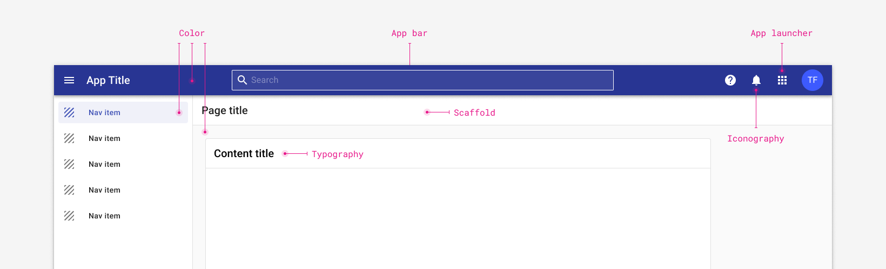

# Core features for all Forge applications

The core components serve as the visual foundation for consistency for Tyler products and are the components every app should include.

Use these key features for "out-of-the-box" consistency across applications.

<ImageBlock fullWidth={true} padded={false}>

</ImageBlock>

## Parts

All Tyler apps require the following visual elements. 

### [App bar](/components/app-bar/app-bar)

The app bar is a user’s personal navigation kit. It holds everything a user needs to navigate the app they’re currently in, apps they typically go to, and apps they might need, as well tools to customize their navigation experience through notifications, language options, and help resources.

---

### [App launcher](/components/app-bar/app-launcher)

App launcher is a persistent navigation component for users to switch context. It is a personal local map to navigate the Tyler ecosystem. It lives in the  user information section of app bar and is represented by the Apps icon. 

---

### Scaffold

The scaffold provides the basic page layout for Tyler apps.

<ImageBlock>

</ImageBlock>

The scaffold is the foundation of layout in Forge apps. The scaffold places the main content of the page:

- [App bar](/components/app-bar/app-bar) (required)
- [Navigation drawer](/components/navigation/navigation-drawer) (optional)
- Page title (required)

To learn more about using and implementing the scaffold, check out the component page [here](/components/layouts/scaffold).

---

### [Color](/styles/color)

The Material Design color system uses an organized approach to applying color to your UI. In this system, a primary and a secondary color are typically selected to represent your brand.

---

### [Typography](/styles/typography)

Forge provides a purposeful set of typographic styles. Consistently tying typographic styles to appropriate sections and functions in an interface creates clear visual patterns and expectations. 

---

### [Icons](/assets/icon-library/)

Forge provides a purposeful set of iconography. Consistent iconography is an expression of brand and creates clear visual patterns and expectations.
