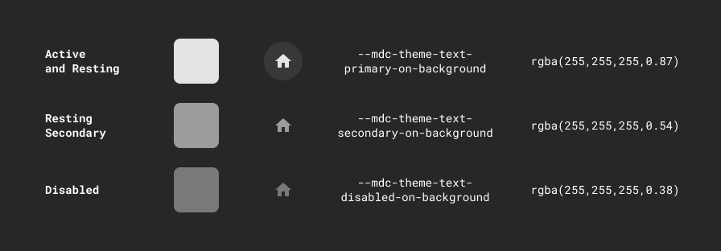

# Icons

## Overview

Tyler Forge provides a purposeful set of iconography. Consistent iconography is an expression of brand and creates clear visual patterns and expectations. Icons can be accessed as a library in Figma (designers), and as a font or SVG icon library (developers).

Tyler Forge uses icons from the Material set, the Material extended set, and small set of custom icons.

Icons are distributed via an npm package and static files hosted on our CDN. Check out the development tab for more information.

Icons may be used to represent information visually or  to represent an action (icon buttons).

---

## States

Icon colors are meant to provide consistent visual cues around interactivity. The Tyler Forge system provides colors for “active + focused” (user is currently interacting with the icon), “resting” (icon is interactive but isn’t currently being used), and “disabled” (icon isn’t interactive). 

On light:

On dark:

---

<DoDontGrid>
  <DoDontTextSection>
    <DoDontText type="do">Use a tooltip with icon buttons to communicate the action’s name.</DoDontText>
    <DoDontText type="do">Icons without text descriptor may be used to represent familiar actions (“Save,” “Cancel”, “Upload,” “Attach”).</DoDontText>
    <DoDontText type="do">For less familiar actions, use an icon plus text (“Add a photo,” “Start a new document”)</DoDontText>
  </DoDontTextSection>
  <DoDontTextSection>
    <DoDontText type="dont">Don’t use an icon alone to represent an unfamiliar action or concept. (“Add a new receipt.”)</DoDontText>
  </DoDontTextSection>
</DoDontGrid>

---

## Related

### Components

- Icons may be used as [icon buttons](/components/buttons/icon-button)
- Icons may be used in [lists](/components/lists/list)

### Patterns

Coming soon...
