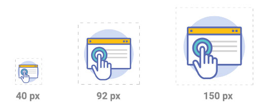
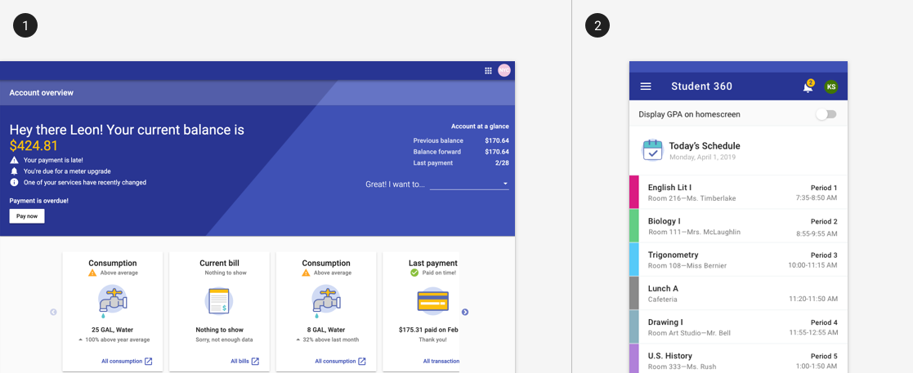
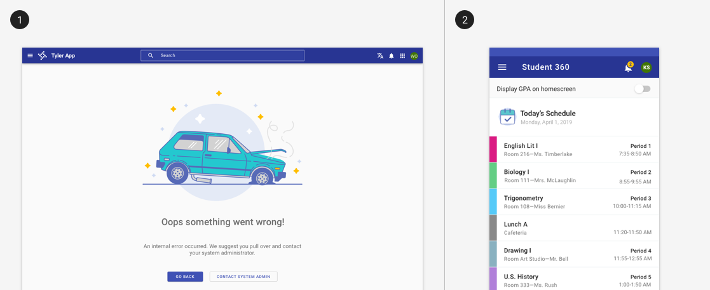
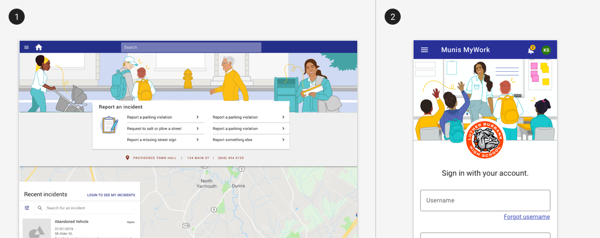

# Illustrations

Illustrations are a key element of our Tyler brand system. Illustrations provide a sense of personality and familiarity and can make complex ideas more accessible.  

## Overview

Illustrations exist to thoughtfully convey ideas - they should not be used for purely decorative purposes. 

---

## Parts 

Our illustrations system is broken up into 3 categories: Spot, Spot Hero and Hero.

### Spot illustrations 

Use these small simple illustrations to convey meaning within a component such as a card. They’re used to add meaning, clarity, and visual intrigue. 

### Recommended sizes 

<ImageBlock>

</ImageBlock>

## Best practices 

<DoDontGrid>
  <DoDontTextSection>
    <DoDontText type="do">Use them on a white background only.</DoDontText>
    <DoDontText type="do">Use them at a minimum size of 40px and max size of 150px.</DoDontText>
  </DoDontTextSection>
  <DoDontTextSection>
    <DoDontText type="dont">Spot illustrations are not actionable.</DoDontText>
    <DoDontText type="dont">Spot illustrations are not system icons.</DoDontText>
  </DoDontTextSection>
</DoDontGrid>

<ImageBlock padded={false}>

</ImageBlock>

---

## Spot hero illustrations

Use these larger and more complex illustrations to communicate literal or metaphorical ideas within a limited space. They’re used for empty states, error messages, page headers, and larger card graphics.

<ImageBlock padded={false}>

</ImageBlock>

---

## Hero illustrations

Hero illustrations are more complex and heavy on narrative. They are interesting, engaging and usually feature people in order to tell a full story. Use them for larger content containers such as full width headers.  

<ImageBlock padded={false}>

</ImageBlock>

---

## Related  

### Components
- Illustrations may be used in [cards](/components/cards/card).

### Patterns
- Banners may be used as part of branding in community apps
