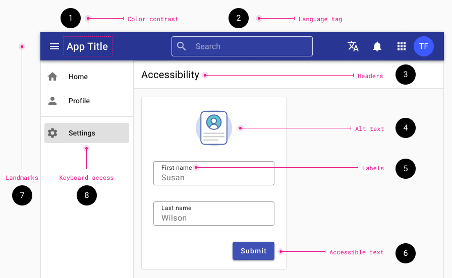
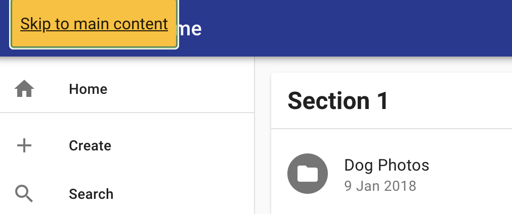

# Accessibility

Tyler Technologies strives to create products that are useful and usable for diverse audiences – including those who use assistive technology to access content. By designing for diverse needs, we can ensure that our products are open to all who need to use them. 

## Overview

Tyler Technologies is committed to the idea that web products should be accessible to everyone, including users with vision, hearing, cognitive or motor impairments. Impairments may be situational (ie, a user is holding a baby while interacting with a tablet), temporary (ie, a user has had their eyes dilated), or permanent (a user is visually impaired); using accessibility best practices helps create applications that have a better experience for all users, not just those with impairments.

Tyler Cloud Platform products are designed to comply with the Web Content Accessibility Guidelines (WCAG) 2.0 , which are a set of guidelines and best practices put together by accessibility experts to address what “accessibility" means in a methodical way.

The WCAG is organized around four key principles:

- **Perceivable:** Can users perceive the content? This helps us keep in mind that just because something is perceivable with one sense, such as sight, that doesn’t mean that all users can perceive it.
- **Operable:** Can users use UI components and navigate the content? For example, something that requires a hover interaction cannot be operated by someone who can’t use a mouse or touch screen.
- **Understandable:** Can users understand the content? Can users understand the interface and is it consistent enough to avoid confusion?
- **Robust:** Can the content be consumed by a wide variety of user agents (browsers)? Does it work with assistive technology?

For more information about the accessibility approach for Socrata products, check out their statement. For more information about the accessibility approach for Micropact products, check out their statement. 

<ImageBlock>

</ImageBlock>

Every improvement, even the tiniest one, counts.  The following list identifies some of the most common WCAG 2.1 web accessibility issues.   To view a complete list of the WCAG guidelines see [W3C’s Quick Reference.](https://www.w3.org/WAI/WCAG21/quickref/)

---

## 1. Color / contrast
- Small text: Ensure color contrast of at least 4.5:1
- Large text: Ensure color contrast of at least 3:1 
Large text is 18pt (24css pixels ) or 14pt (19css pixels) bold
- Color should not be used to convey meaning. Alternative options should also be provided to communicate the meaning

[WebAim’s Contrast checker](https://webaim.org/resources/contrastchecker/)

---

## 2. Language tag

- Identify a language in the opening `<html>` element.
- Example - if the primary language is English: `<html lang="en">`

[Language tag details and code examples](https://dequeuniversity.com/rules/axe/3.3/html-lang-valid)

---

## 3. Heading & site structure 

- Ensure headings and are marked with `<h1>` through `<h6>` elements and that these are ordered hierarchically. 
- Do not use heading mark up on text that isn't actually a heading.
- Titles - All pages should be given a logical and unique title
- Lists - Any bulleted or numbered list should be identified as such 

[Heading details and code examples](https://dequeuniversity.com/rules/axe/3.0/heading-order)

---

## 4. Labels
				
Programmatically associate labels with all form controls. The form `<input>` elements that should have labels:
- Text entry fields
- Radio buttons
-	Checkboxes
-	Drop-down menus

[Label details and code examples](https://dequeuniversity.com/rules/axe/3.2/label)

---

## 5. Accessible text

- Buttons must have an accessible name that clearly describes the destination, purpose, function, or action.
-	Links – When possible put the most meaningful piece of text into the link, rather than filler words like "Details", "More"

---

## 6. Alt text

Every image must have an alt attribute:

- Informative images: Use short descriptive alt text to convey their purpose and meaning. Avoid using words like “image" or "photo."
- Decorative images, or when the image is described by page content, provide null alt attributes. `alt=" "`

[Alt text details and examples](https://dequeuniversity.com/rules/axe/2.6/image-alt)

---

## 7. Landmarks

- Ensure all content is contained within a landmark region, designated with HTML5 landmark elements and/or ARIA landmark regions.

[Landmark details and examples](https://dequeuniversity.com/rules/axe/3.2/region)

---

## 8. Keyboard Access

- Ensure all interactive page elements are keyboard accessible.
- Provide a visual indicator of the element that currently has keyboard focus.
- Keyboard navigation order should follow the visual flow of the page.
- Dialogs – Maintain keyboard focus, when it closes, the focus should return to the trigger.

[WebAIM Keyboard accessibility](https://webaim.org/techniques/keyboard/)

---

## community facing apps 

## 9. Navigation skip link 

Method of meeting WCAG 2 Criteria 2.4.1: Bypass Blocks.

- Sighted keyboard users
- Users with visual impairment
- [Recipe](/recipes/accessibility/skip-to-main-content)

<ImageBlock maxWidth="600px">

</ImageBlock>
