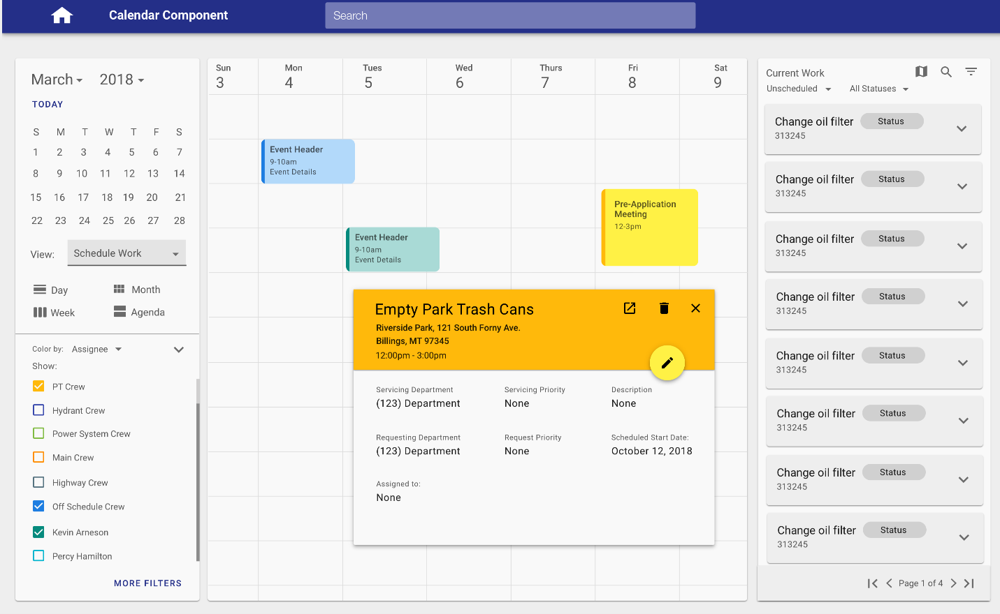

# Calendar

Calendars allow users to view, schedule, and modify events, work, or other records. 

## Overview

<ImageBlock padded={false}>

</ImageBlock>

Calendars allow users to view, schedule, and modify events, work, or other records. We recommend using a third party library, such as <a href="https://fullcalendar.io/" target="_blank" rel="noopener noreferrer">Full Calendar</a>, and skinning it to match our color palettes and our [typography styles](/styles/typography).

## Styles

For an overview of calendar styles, check out the following <a href="https://tylertech.invisionapp.com/share/5TIUM7BZFNV" target="_blank" rel="noreferrer noopener">Invision prototype</a>. For information on this prototype, reach out to designer <a href="mailto:morgan.keenan@tylertech.com">Morgan Keenan</a>.

For an overview of the color palette used in the calendar, check out the following <a href="https://www.figma.com/file/wF374tcYJHbFqKxvVx9fkV/Forge-Calendar-palettes?node-id=0%3A1" target="_blank" rel="noreferrer noopener"> Figma project</a>.

<iframe style={{border: '1px solid rgba(0, 0, 0, 0.1)'}} width="910" height="450" src="https://www.figma.com/embed?embed_host=share&url=https%3A%2F%2Fwww.figma.com%2Ffile%2FwF374tcYJHbFqKxvVx9fkV%2FForge-Calendar-palettes%3Fnode-id%3D0%253A1" allowFullScreen></iframe>

### Examples
- See a responsive, Forge-skinned Full Calendar example in action in the [Employee Access Calendar case study](/core/other/case-studies/ess-calendar).
- The calendar component is currently used in <a href="https://confl.tylertech.com/display/TMM/TMM" target="_blank" rel="noreferrer noopener">Tyler Meeting Manager</a>. For additional questions, reach out to designer <a href="mailto:morgan.keenan@tylertech.com">Morgan Keenan</a>.
