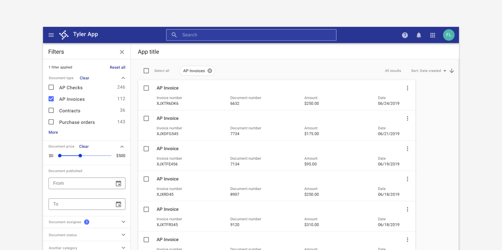
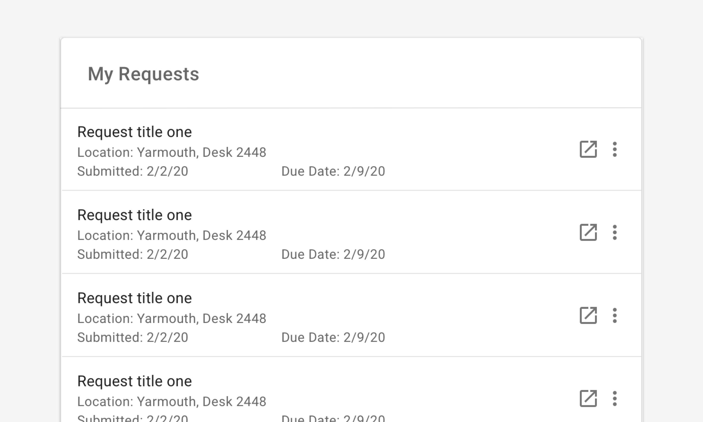
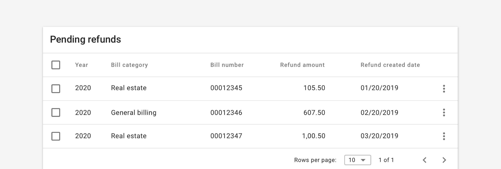

# Collections

Collections are used to display a group of related records. 

## Overview

Collections display related records, most commonly in a page of search results. They may provide for progressive disclosure by showing summary information and allowing users to view additional information via detail pages or expansion interactions. 

Collections may be displayed as:

1. Cards
2. Task cards
3. List
4. Table

---

## 1. Cards 
  
[Cards](/components/cards/card) are containers that group related information into a flexible-size container. They can be thought of as informational teasers that link users to additional content to be explored deeper within the system navigation.

<ImageBlock padded={false}>

</ImageBlock>

### Use when 

- Users are looking to browse data. 
- Displaying image heavy content. 
- Displying non homogenous data. 

### Don't use when

- Displaying data with paragraphs or long strings of text.

---

## 2. Task cards 

Task cards are cards with a title and supporting data displayed as label value pairs. 

<ImageBlock padded={false}>

</ImageBlock>

### Use when 

- Displaying search results.
- Displaying records that expand to display additional information. 

### Don't use when 

- Displaying data with paragraphs or long strings of text.

---

## 3. List

[Lists](/components/lists/list) are pages, or a component, that features and displays several entries or candidate item results meant to match the search criteria input by users.

<ImageBlock padded={false}>

</ImageBlock>

### Use when 

- Displaying search results.
- Displays records where details are important. 
- Displaying long blocks of text. 
- Displaying records where scanability is key. 
- Displaying records on smaller screen sizes. 

### Don't use when 

- Displaying content where images are important.

---

## 4. Table 

[Tables](/components/table/table) are meant for displaying data presented in columns or tables, also known as tabular tables. They are used to compare homogenous or ordered data. The primary purpose of a table is lend meaning to the data.

<ImageBlock padded={false}>

</ImageBlock>

### Use when 

- Displaying tabular data.
- Comparing homogenous or ordered data 

### Don't use when 

- Displaying content where images are important.

---

## Related 

### Components 
- [Cards](/components/cards/card)
- [Lists](/components/lists/list)
- [Tables](/components/table/table)

### Patterns 

- Use [hierarchical navigation](/patterns/navigation/hierarchical) to navigate between parent and child items. 
