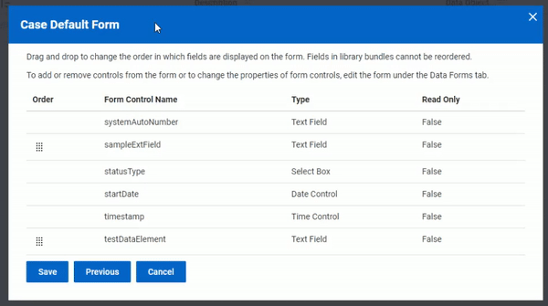

--- 
description: Users can reorder form controls as part of Entellitrak's admin interface.
keywords: ['form', 'drag', 'drop', 'GUI', 'builder', 'interface', 'low code', 'Entellitrak', 'Tyler Federal']
---

# Accessible list reorder

Users can reorder form controls as part of Entellitrak's admin interface.

<ImageBlock padded="false" max-width="750px">

</ImageBlock>

## Overview and design decisions

Within Entellitrak's admin app, users can reorder form controls within a list, either using drag and drop or keyboard controls.

The team ensured the interaction would be accessible by providing for keyboard support. Users may tab into the table, arrow up and down through rows and hit `ENTER` or `SPACEBAR` to select an item, then use the arrow keys to reorder it in the table. 

---

<Columns columns="two" type="equal">

## Project contacts 

- <a href="mailto:Michael.Marchio@tylerfederal.com">Michael Marchio</a> (Developer)
- <a href="mailto:Che.deBruin@tylertech.com">Che de Bruin</a> (Director of UX)

## Resources 

- <a href="#">Live demo site</a> (React app)

</Columns>
