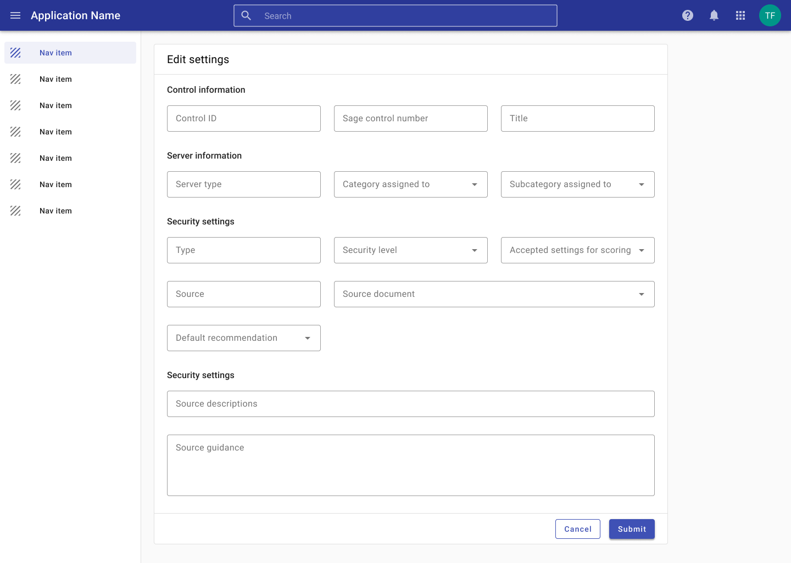
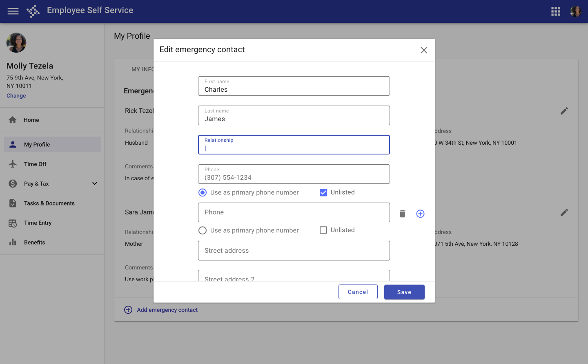
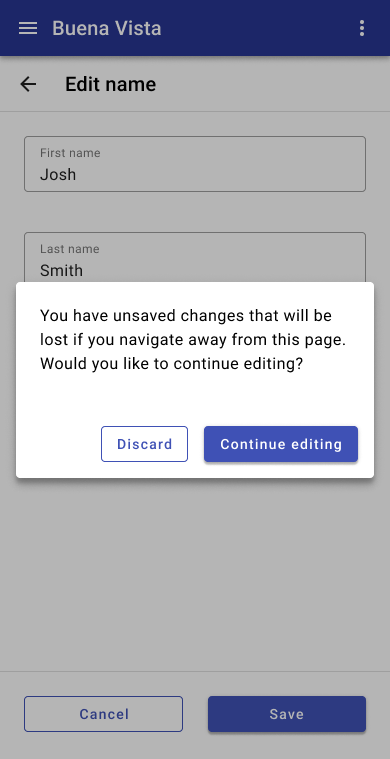
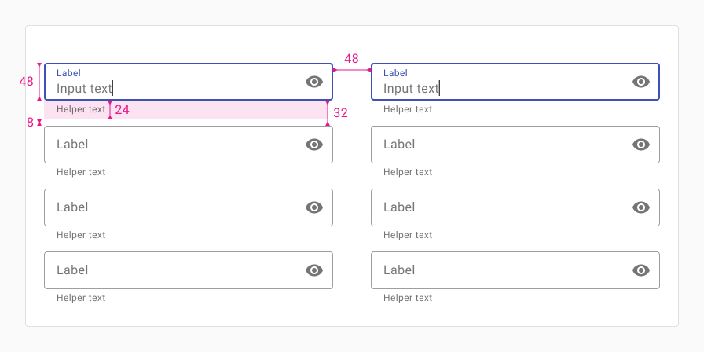
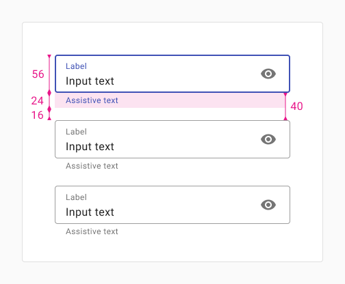

# Forms

Forms are used for entering and editing data. 

<ImageBlock padded={false}>

</ImageBlock>

## Overview

A form allows users to provide data or configure options. They can be simple or complex, and may be presented within dialogs or their own dedicated page depending on the use case and the situation.

---

## Parts

Forms are comprised of 4 parts: 1. Mode 2. Content 3. Actions 4. Submission, 5. Unsaved changes.

### 1. Mode

**Design principles**

- Indicate mode.
- Minimize layout differences.
- Provide noticeable differences when the mode changes.

Learn more about [Modality](/patterns/other/modality).

**Components to use**

| Component             | Intent                                       | Tradeoff
| --------------------- | -------------------------------------------- | --- 
| Full-screen dialog    | Use all available screen space.              | Lacks a contextual anchor.
| Partial-screen dialog | Use originating screen as contextual anchor. | Less information available.

<ImageBlock caption="Forms may be displayed in a full screen dialog with options to save and cancel. A full page offers more space for longer forms.">

</ImageBlock>

<ImageBlock caption="Shorter forms may be displayed in a dialog with a header and actions in the footer.">

</ImageBlock>

---

### 2. Content

**Design principles**

- Organize and group related information. 
- Use a predictable column grid to keep forms manageable. 
- Promote readability with a [max-width](/patterns/layout/grid#content-max-width) as needed. 
- Consider [adaptive design](/patterns/layout/page-layouts) when designing multi column forms (and see examples [below](#responsive).

<ImageBlock padded={false} caption="Group related content and use columns and section titles to organize content and improve readability.">

</ImageBlock>

---

### 3. Actions

**Design principles**

- Use visual weighting to highlight primary actions. 
- Present clear options.
- Allow users to save changes if appropriate. 

<DoDontGrid titleText=" ">
  <DoDontRow>
  <DoDontImage>

  </DoDontImage>
  <DoDontImage>

  </DoDontImage>
  </DoDontRow>
  <DoDontRow>
    <DoDont type="do">Do use a higher visual emphasis for primary actions.</DoDont>
    <DoDont type="caution">In general, provide users with the two most likely actions. Avoid potentially overlapping actions (“start over” and “cancel”).</DoDont>
  </DoDontRow>
</DoDontGrid>

<DoDontGrid titleText=" ">
  <DoDontRow>
  <DoDontImage>

  </DoDontImage>
  <DoDontImage>

  </DoDontImage>
  </DoDontRow>

  <DoDontRow>
    <DoDont type="dont">Don’t use two raised buttons next to each other in a form. It inappropriately communicates the same visual emphasis for actions that are unequally likely.</DoDont>
    <DoDont type="dont">Don’t use two raised buttons next to each other, even if only one has the primary background color.</DoDont>
  </DoDontRow>
</DoDontGrid>

---

### 4. Submission

**Design principles**

- Provide feedback that a submission was successful. 
- Use a conversational and friendly tone.

**Components to use**

| Component                | Intent                                                | Tradeoff
| ------------------------ | ----------------------------------------------------- | ---
| Full-screen confirmation | Uses all available screen space to verify submission. | Lacks a contextual anchor.
| Dialog confirmation      | Use originating screen as contextual anchor.          | Subsequent navigation less clear.
| Toast                    | Non interruptive and facilitates multi-record entry.  | Transient and may be missed.

<ImageBlock maxWidth="350px" caption="Confirmation displayed as a full page on mobile.">

</ImageBlock>

<ImageBlock caption="Confirmation displayed in a dialog.">

</ImageBlock>

---

### 5. Unsaved changes

**Design principles**

- Prevent data loss by prompting users to save their changes if they navigate away.

<ImageBlock padded={false} caption="1. Form submission may be confirmed with a toast.   2. Form submission may also be confirmed with a full page or dialog confirmation pattern.">

</ImageBlock>

<ImageBlock maxWidth="350px" caption="Warn losers they’ll lose their data if they attempt to navigate away without saving.">

</ImageBlock>

---

## Responsive

### Desktop

<ImageBlock max-width="500px">

</ImageBlock>

**Horizontal**

Use this layout when inputs are grouped in a way that encourages users to read or tab horizontally. 

When a screen is sized down, fields should wrap accordingly. 

Use dense inputs, 16px of vertical spacing between inputs (32px between inputs without helper text), and 24px of horizontal spacing between columns.)

<ImageBlock max-width="500px">

</ImageBlock>

**Vertical**

Use this layout when inputs are grouped in a way that encourages users to read or tab down vertically, one column at a time. 

When a screen is sized down, columns should stack on top of each other. 

Use dense inputs, 16px of vertical spacing between inputs (32px between inputs without helper text), and 48px of horizontal spacing between columns. 

---

### Mobile 

<ImageBlock max-width="400px">

</ImageBlock>

In portrait mobile mode, fields should be full width and stack vertically.

<ImageBlock max-width="500px">

</ImageBlock>

**Portrait**

Use this layout when inputs are grouped in a way that encourages users to read down vertically, one column at a time. Use this for tablet or portrait mobile sizes.

When tablet screens are rotated to portrait mode, fields should wrap accordingly. 

Use roomy inputs, and 24px of vertical space between inputs (40px between inputs without helper text) and 32px of horizontal spacing between columns. 

:::note
For traditional phone sizes in portrait mode (screen width between 350px and 480px) fields should be full width and stack vertically.
:::

<ImageBlock>

</ImageBlock>

**Landscape**

Use this layout when inputs are grouped in a way that encourages users to read across horizontally. Use this for tablet or portrait mobile sizes. 

When tablet screens are rotated to portrait mode, fields should wrap accordingly. 

Use roomy inputs, and 24px of vertical space between inputs (40px between inputs without helper text) and 16px of horizontal spacing between columns. 

:::note
For traditional phone sizes in portrait mode (screen width between 350px and 480px) fields should be full width and stack vertically.
:::

---

## Related 

Forms are composed of the following components:

- [Card](/components/cards/card)
- [Button](/components/buttons/button)
- [Text field](/components/fields/text-field)
- [Checkbox](/components/controls/checkbox)
- [Radio button](/components/controls/radio-button)
- [Switch](/components/controls/switch)
- [Toast](/components/notifications-and-messages/toast)

Forms are related to the following patterns:
- Edit, save, publish (Coming soon!)
- [Layout - max width](/patterns/layout/grid#content-max-width)
- [Progress & loading](/patterns/progress-and-loading)
- [System communication](/patterns/other/system-communication)
- [Modality](/patterns/other/modality)
