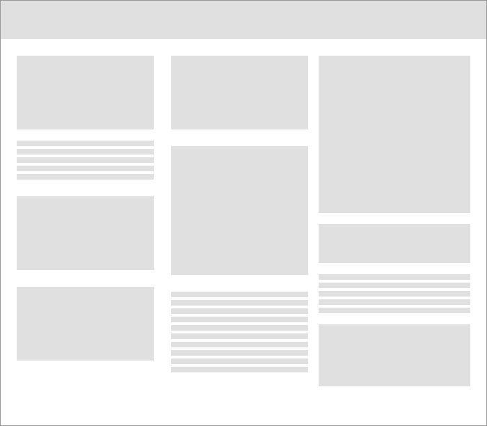
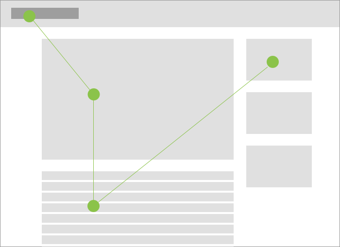
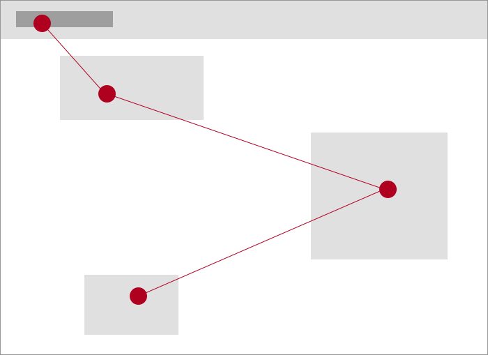
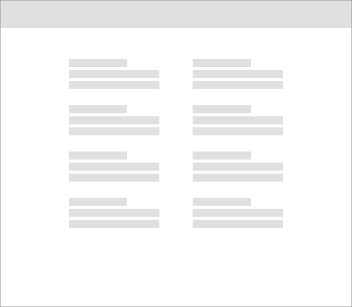
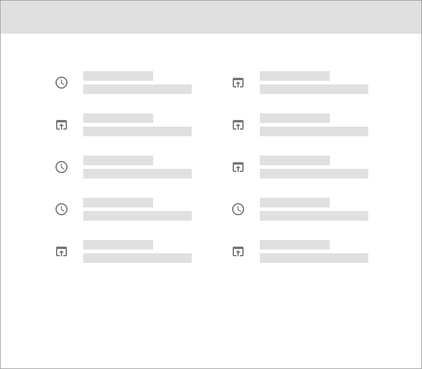
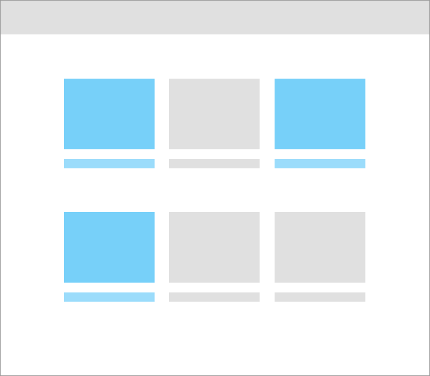

# Introduction

Clear layouts allow users to understand and navigate content quickly and easily. Use these guidelines to create intuitive web layouts. 

## Overview

Understanding some basic principles of web layout, informed by an understanding of human perception and cognitive processing, will help you create web pages that are intuitive and easy to use, regardless of domain or user task.

---

## Create hierarchy

Determine what’s most important to your users and make that content prominent. 

### Best practices 

<DoDontGrid>
  <DoDontRow>
  <DoDontImage>

  </DoDontImage>
  <DoDontImage>

  </DoDontImage>
  </DoDontRow>
  <DoDontRow>
    <DoDont type="do">Reduce elements on the screen and use spacing and size to create focus in your design.</DoDont>
    <DoDont type="dont">Avoid inconsistent spacing and visual clutter as it makes information difficult to process.</DoDont>
  </DoDontRow>
</DoDontGrid>

---

## Guide the eye 

Lay out your content in a way that guides the user through the content.

If your app will support additional languages, consider bi-directional text support. This is the ability to input and display text layout in either right to left (RTL; used in Arabic, Hebrew, and Farsi) or left to right order(LTR, used in English, Spanish, German). Learn more: [Bidirectionality](https://material.io/design/usability/bidirectionality.html) (Material), [UX Best Practices for Bidirectional Languages](https://medium.com/better-marketing/ux-best-practices-for-bi-directional-languages-9bd7b96dc8c2) (Medium).

### Best practices 

<DoDontGrid>
  <DoDontRow>
  <DoDontImage>

  </DoDontImage>
  <DoDontImage>

  </DoDontImage>
  </DoDontRow>
  <DoDontRow>
    <DoDont type="do">Reduce elements on the screen and use spacing and size to create focus in your design.</DoDont>
    <DoDont type="dont">Avoid inconsistent spacing and visual clutter as it makes information difficult to process.</DoDont>
  </DoDontRow>
</DoDontGrid>

---

## Use white space 

Allow your design to breathe with white space. 

### Best practices 

<DoDontGrid>
  <DoDontRow>
  <DoDontImage>

  </DoDontImage>
  <DoDontImage>

  </DoDontImage>
  </DoDontRow>
  <DoDontRow>
    <DoDont type="do">Use sufficient white space around elements for easier mental processing.</DoDont>
    <DoDont type="dont">Avoid tight designs as they increase the perceived cognitive load of information.</DoDont>
  </DoDontRow>
</DoDontGrid>

---

## Proximity 

According to laws of Gestalt, objects that are close to each other are perceived to be related.

### Best practices 

<DoDontGrid>
  <DoDontRow>
  <DoDontImage>

  </DoDontImage>
  <DoDontImage>

  </DoDontImage>
  </DoDontRow>
  <DoDontRow>
    <DoDont type="do">Placing lines of text close together creates relationships among elements. </DoDont>
    <DoDont type="do">Spacing creates relationships among elements. </DoDont>
  </DoDontRow>
</DoDontGrid>

---

## Similarity 

According to laws of Gestalt, elements that have visual similarities will be viewed as related. The principle can be applied to identify items that belong to categories while maintaining a consistent pattern across experiences.

### Best practices 

<DoDontGrid>
  <DoDontRow>
  <DoDontImage>

  </DoDontImage>
  <DoDontImage>

  </DoDontImage>
  </DoDontRow>
  <DoDontRow>
    <DoDont type="do">Elements may be grouped by consistent icons.</DoDont>
    <DoDont type="do">Elements may also be grouped by consistent coloring. </DoDont>
  </DoDontRow>
</DoDontGrid>
