# Page Layouts

Clear layouts allow users to understand and navigate content quickly and easily. Use these guidelines to create intuitive web layouts. 

## Overview 

Consistent page layouts across Tyler apps create consistency and predictability across applications and provide for standardized breakpoints. 

Tyler Forge provides default page layouts to ensure consistency between apps.

- Desktop layouts: <a href="https://www.figma.com/file/bAV4CXDQnGe6xznxjdjzgx/Forge---Layouts" target="_blank" rel="noopener noreferrer">Figma file</a> 

---

## Types

Pages should be be laid out in predictable ways depending on what kind of navigation they use. There are three main layouts:

1. With a lefthand drawer (navigation or filters)
2. With a lefthand drawer and right side sheet
3. With top tabs
4. With detail tabs
5. With no navigation 

### 1. Lefthand drawer 

Page layouts with a lefthand drawer (either navigation or filters on the left) should contain:

1. [Omnibar](/components/omni/omnibar/) with hamburger menu icon
2. Page title in a [toolbar](/components/page/toolbar/)
3. Main content 
4. Lefthand navigation [drawer](/components/navigation/navigation-drawer) filters
5. A background color of #fafafa

**Desktop**

<ImageBlock padded={false} caption="Desktop layout for an app with a lefthand navigation.">

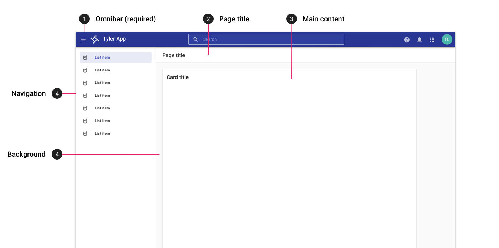

</ImageBlock>

<ImageBlock padded={false} caption="Desktop layout for an app with filters in a left drawer.">

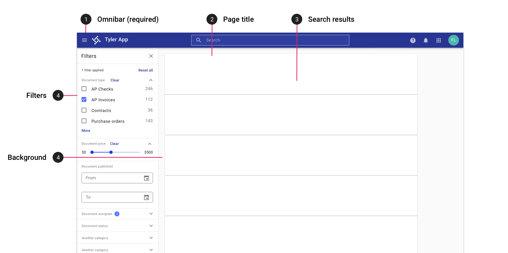

</ImageBlock>

**Tablet**

<ImageBlock padded={false} caption="On tablet portrait, the lefthand navigation is closed by default and may be accessed by tapping the hamburger icon in the omnibar. In landscape mode, the navigation is open by default; the hambuger menu may be tapped to dismiss the menu.">

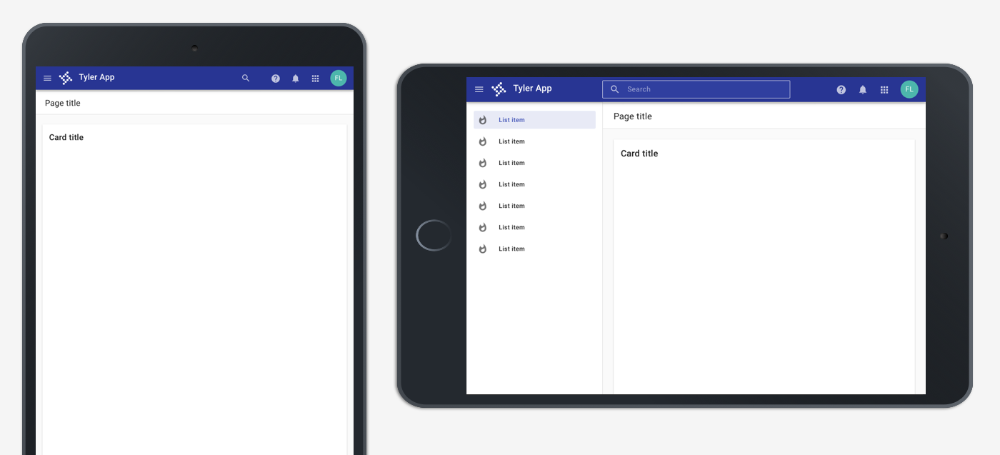

</ImageBlock>

**Mobile**

<ImageBlock padded={false} caption="On mobile, the lefthand is closed by default. It is accessed by tapping the hamburger menu and displays with a scrim behind the other app content.">

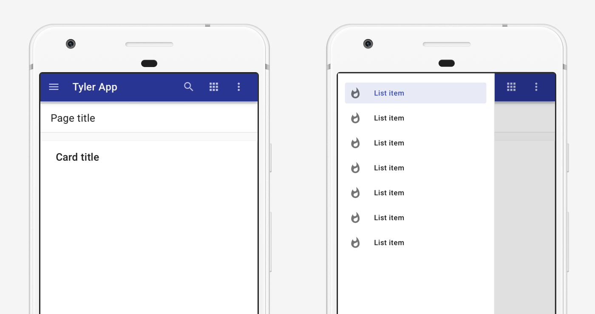

</ImageBlock>

---

### 2. Lefthand drawer and sidesheet

Layouts using a lefthand drawer may also use a righthand sidesheet for filters or detail information. If dismissible, the sidesheet is toggled by an icon (use 'filter' for filters or an appropriate icon for detail information).

1. [Omnibar](/components/omni/omnibar/) with hamburger menu icon
2. Page title in a [toolbar](/components/page/toolbar/)
3. Main content 
4. Lefthand navigation [drawer](/components/navigation/navigation-drawer) filters
5. Sidesheet toggle icon
6. Sidesheet 
7. Background color of #fafafa

**Desktop**

<ImageBlock padded={false} caption="On desktop, a right sidesheet may be displayed in addition to a lefthand navigation to display detail content or filters.">

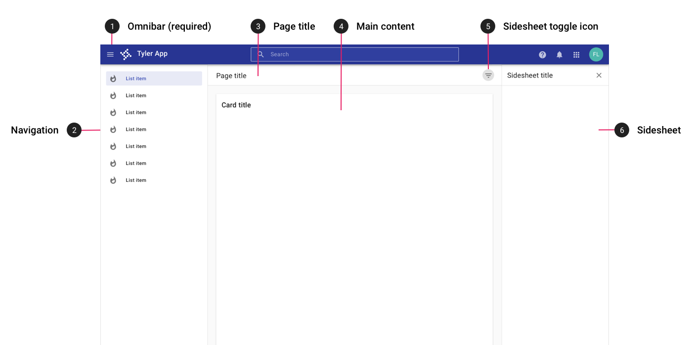

</ImageBlock>

**Tablet**

<ImageBlock padded={false} caption="On tablet, both the navigation and sidesheet are closed by default. The navigation may be accessed by tapping the hambugerge menu; the sidesheet may be accessed by tapping the sidesheet toggle icon.">

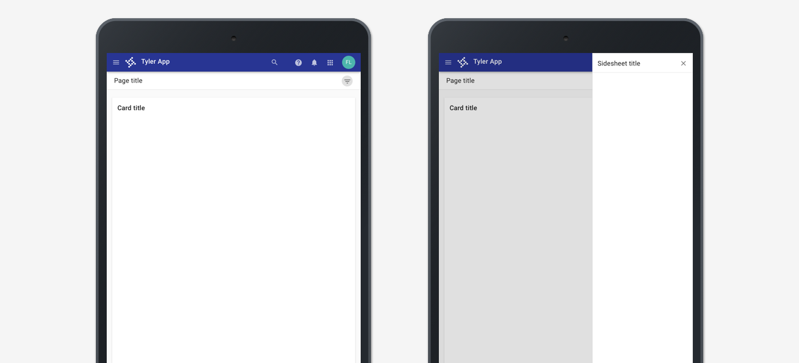

</ImageBlock>

**Mobile**

<ImageBlock padded={false} caption="On mobile, both the navigation and sidesheet are closed by default. The navigation may be accessed by tapping the hambugerge menu; the sidesheet may be accessed by tapping the sidesheet toggle icon. The sidesheet opens with a scrim over the page content.">

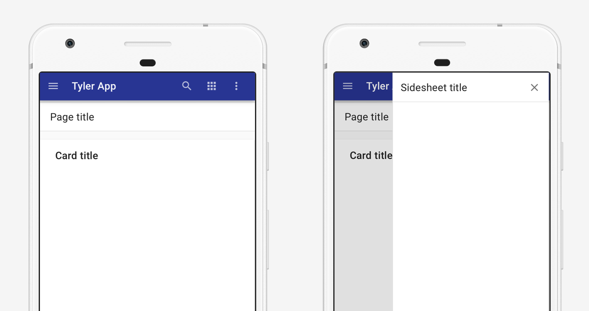

</ImageBlock> 

---

### 3. With top tabs

Apps with fewer than five primary destinations should use top tabs. [Learn more](/patterns/navigation/primary). These layouts should contain:

1. Omnibar 
2. Top navigation 
3. Main content with title
4. Background color of #fafafa

**Desktop**

<ImageBlock caption="On desktop, top tabs are used for apps with fewer than five primary destinations.">

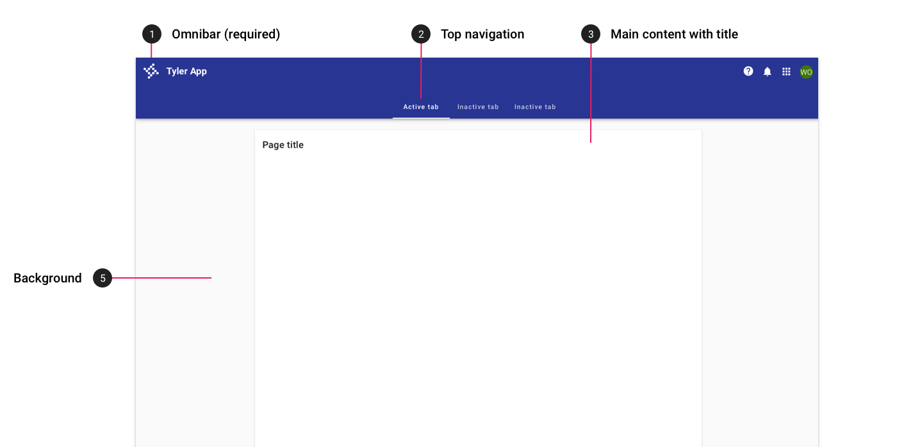

</ImageBlock> 

**Tablet**

<ImageBlock caption="On tablet, top tabs are displayed in the omnibar. Tabs may overflow horizontally, accessible by swiping left.">

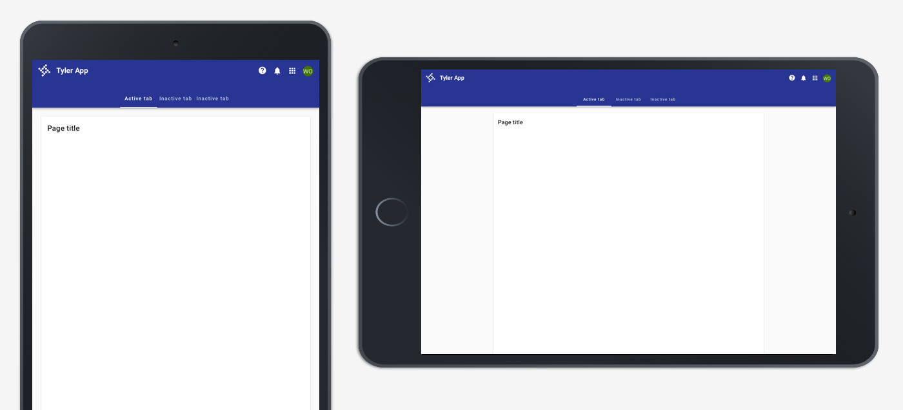

</ImageBlock> 

**Mobile**

<ImageBlock padded={false} caption="On mobile, top tabs are displayed in the omnibar. Tabs may overflow horizontally, accessible by swiping left.">

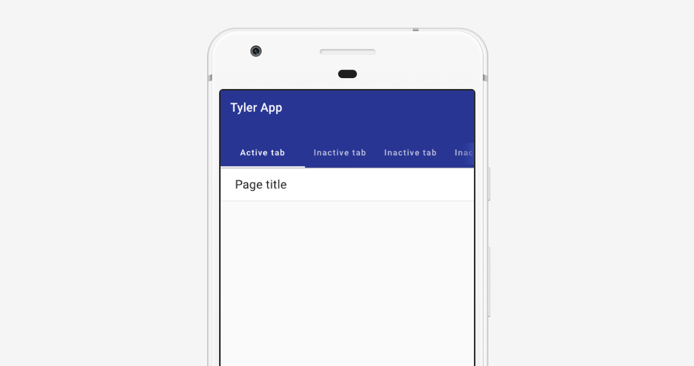

</ImageBlock> 

---

### 4. With detail tabs

Apps that navigate to a detail page with sub-tabs may use tabs within a toolbar.  These layouts should contain:

1. Omnibar 
2. Page title (aligned with main page content)
3. Detail tabs (aligned with main page content)
4. Background color of #fafafa

**Desktop**

<ImageBlock padded={false} caption="On desktop, apps with detail tabs display title and tab text that is left aligned with the main content.">

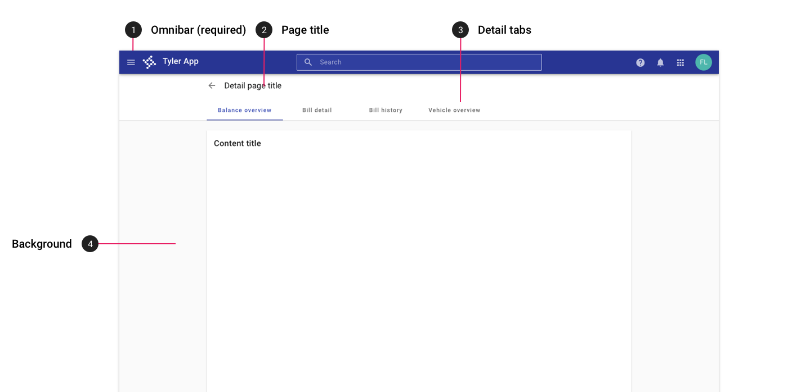

</ImageBlock> 

**Tablet**

<ImageBlock padded={false} caption="On tablet, apps with detail tabs display title and tab text that is left aligned with the main content.">

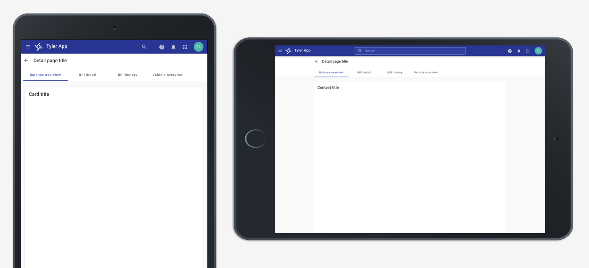

</ImageBlock> 

**Mobile**

<ImageBlock padded={false} caption="On mobile, apps with detail tabs display title and tab text that is left aligned the app title in the omnibar. Tabs may scroll horizontally off screen.">

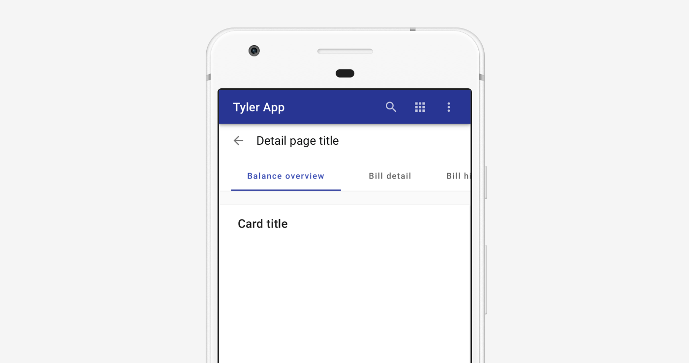

</ImageBlock> 

---

### 5. No navigation 

Single page apps with no navigation should use a centered card with a max width to display their content. 

These layouts contain:

1. Omnibar with no hamburger menu icon.
2. Main content on a card with a title, centered and using an appropriate max width.
3. A background color of #fafafa.

**Desktop**

<ImageBlock padded={false} caption="On desktop, apps with no navigation display content on a centered card.">

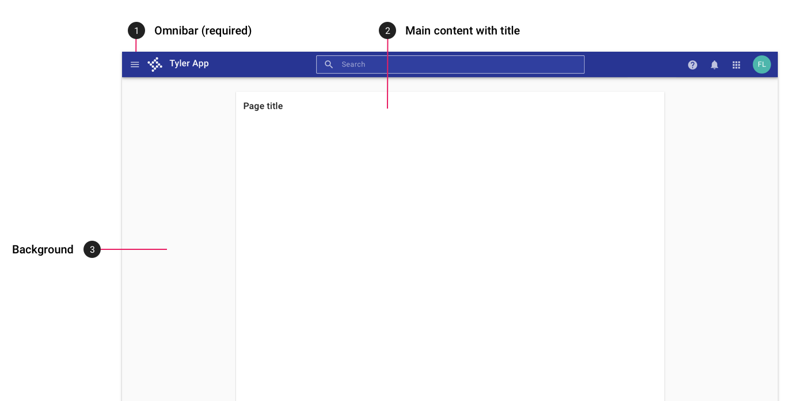

</ImageBlock> 

**Tablet**

<ImageBlock padded={false} caption="On tablet, apps with no navigation display content on a centered card.">

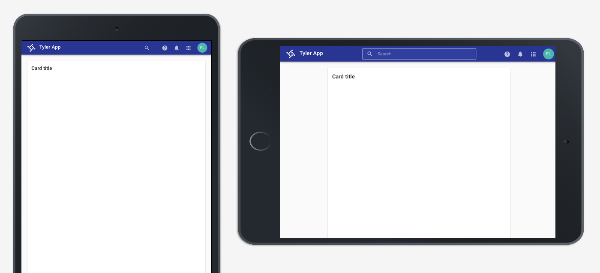

</ImageBlock> 

**Mobile**

<ImageBlock padded={false} caption="On mobile, apps with no navigation display content on a centered card.">

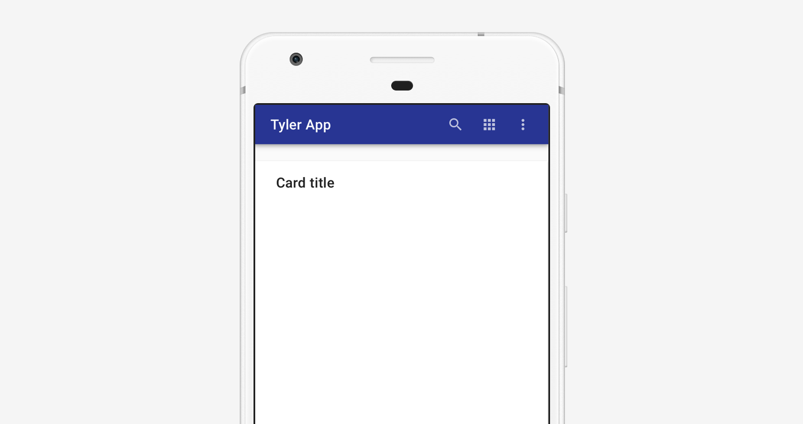

</ImageBlock>
