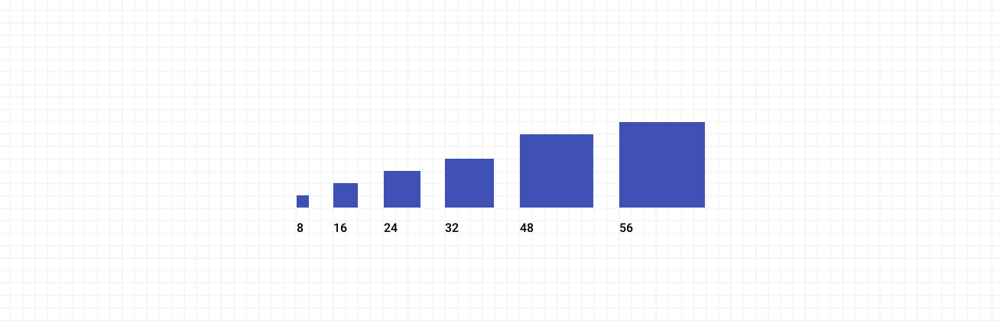
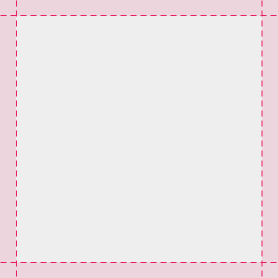
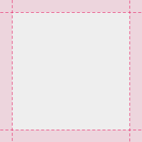
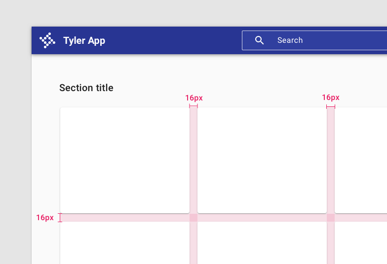
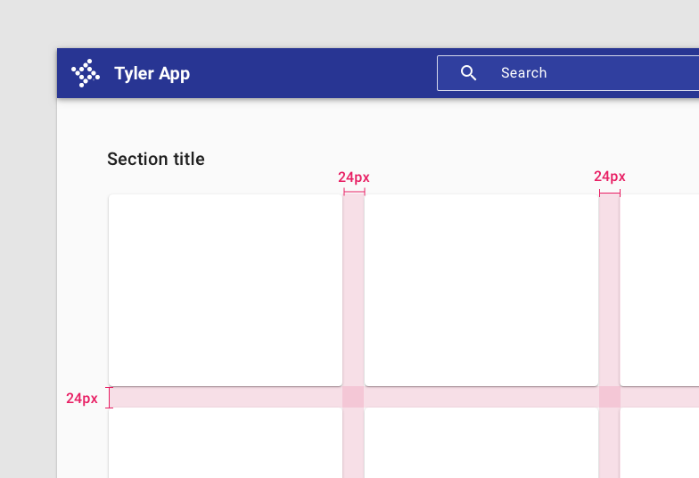

# Spacing

Clear layouts allow users to understand and navigate content quickly and easily. Use these guidelines to create intuitive web layouts. 

## Overview

The Forge spacing system is based on multiples of 8px. These are used for spacing inside of elements (padding) as well as spacing around elements (margin).

<ImageBlock padded={false}>

</ImageBlock>

### Spacing inside and between elements

| Spacing           | Padding            | Margin
| :-----------------| :----------------- | :----------------
| 8px               |                    | Default spacing between chips
| 16px              | workforce apps: Default padding for cards, dialogs  Dense spacing for cards, dialogs (community apps)               | Dense spacing between related elements
| 24px              | Roomy padding for cards, dialogs (workforce)   Default padding for cards, dialogs,  (community apps)          | Default spacing between related elements
| 32px              | n/a    | Default spacing between sections
| 48px              | n/a    | Default spacing between sections
| 56px              | n/a    | Ominbar height, roomy spacing between sections

---

## Examples

<ImageBlock caption="Use 16px padding for spacing inside an element in workforce apps, or for dense spacing in community apps.">

</ImageBlock>

<ImageBlock caption="Use 24px padding for spacing inside an element in community apps, or for roomy spacing in workforce apps.">

</ImageBlock>

<ImageBlock caption="Dense margin, using 16px between related elements.">

</ImageBlock>

<ImageBlock caption="Roomy margin, using 24px between related elements.">

</ImageBlock>

---

## Setting up your grid in Sketch or Figma

8px grids can be created in either Sketch or Figma.

[Create a grid in Sketch.](https://www.sketch.com/docs/the-interface/#how-to-create-grids)

[Create a grid in Figma.](https://help.figma.com/hc/en-us/articles/360040450513-Create-Layout-Grids-with-Grids-Columns-and-Rows) 
