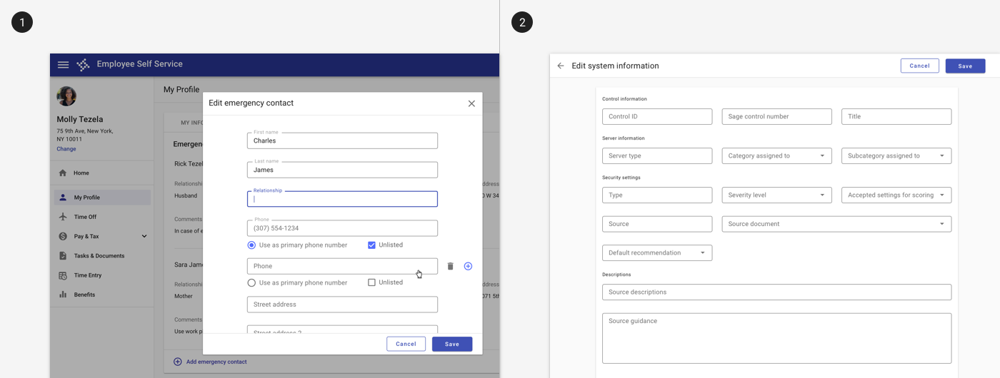
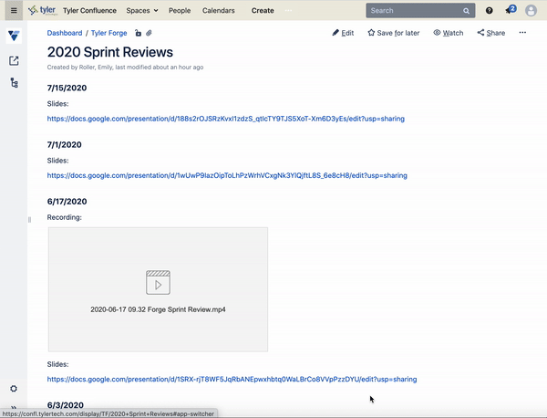
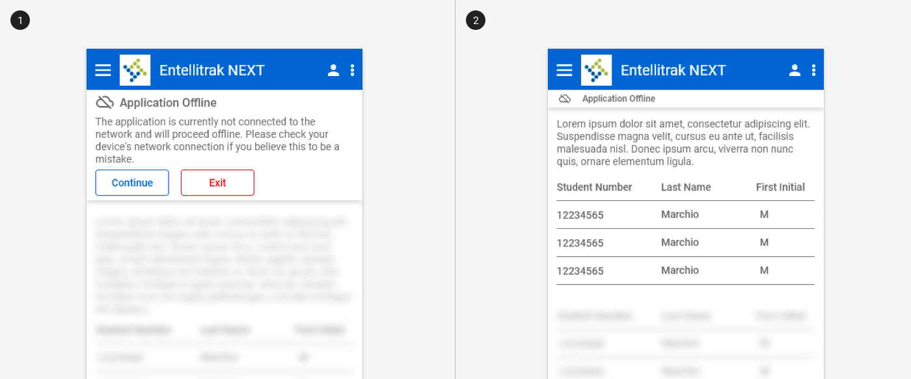

# Modality

A mode limits user actions to a specific task. For example, edit mode provides tools to edit information but does not provide tools to export information.

## Overview

Modes limit user actions to a specific task by limiting what the user sees and what tools the user has available.

When designing a mode:

1. **Indicate the mode** so users know how to access the tools for each action.
2. **Minimize layout differences** to minimize user effort to use a tool.
3. **Reduce mode errors** by providing feedback and confirming intent.

---

## 1. Indicating mode

1. Indicate the mode by clearly showing modes available, like *edit.*
2. Provide noticeable feedback when the mode changes, including changing headers and changing available tools. See also [System communication](/core-patterns/system-communication).

**Components to use**

| Component             | Intent                                          | Tradeoff
| --------------------- | ----------------------------------------------- | ----------
| Full-screen dialog    | Use all available screen space.                 | Lacks a contextual anchor.
| Partial-screen dialog | Use originating screen as contextual anchor.    | Less information available.
| State change          | Maintain layout consistency.                    | Scope of state change impacts efficiency and likelihood of errors.

<ImageBlock padded={false} caption="1. Edit mode is indicated by a dialog with a header and actions in the footer.   2. Edit mode can also be indicated by a full screen dialog with options to save and cancel. A full page offers more space for longer forms.">

</ImageBlock>

<ImageBlock maxWidth="700px" caption="Confluence uses a state change to indicate a change in mode with a new screen, editing tools available in the header, and options to update or close.">

</ImageBlock>

<ImageBlock padded={false} caption="An offline mode change is indicated by a banner and visual indicators of which content can be interacted with.">

</ImageBlock>

---

## 2. Minimizing layout differences

1. Minimize the layout differences between modes so transitioning between modes does not require the user to re-find information after changing mode.

<ImageBlock maxWidth="700px" caption="Confluence minimizes layout differences between modes so that content remains in a similar spot in edit mode.">

</ImageBlock>

---

## 3. Reducing mode errors

Reducing mode errors stars with indicating a change in mode change.

Additionally, provide feedback about actions the user is taking in the new mode by:

1. Using alerts and other change indicators like state indicators.
2. Confirming user intent when the user changes information that would be detrimental if unintended.

**Mode errors** occur when a user takes an action believing she is in one mode when she is actually in another. Pressing on the gas pedal in a car has one effect when in "drive" mode and the opposite effect in "reverse" mode.

<ImageBlock>

</ImageBlock>
