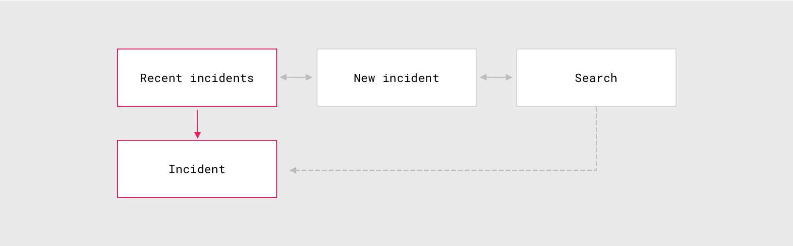
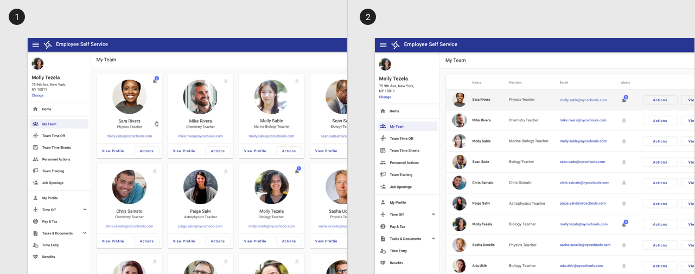
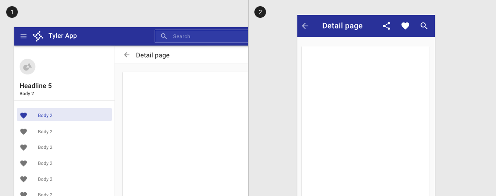
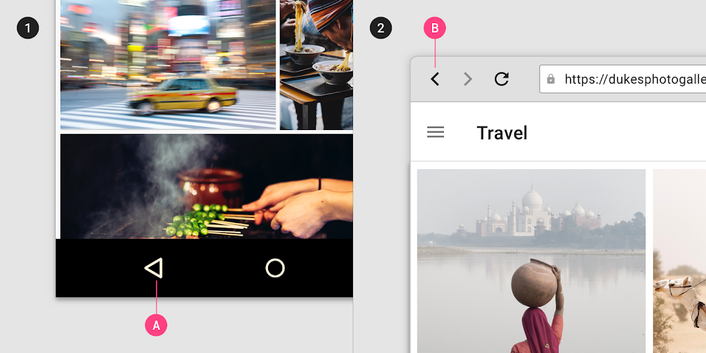

# Navigation: Hierarchical

Navigation enables users to move through an app.

<ImageBlock padded={false}>

</ImageBlock>

**Downward** or **upward movement** in app’s hierarchy to access deeper content, from a parent screen (higher level of hierarchy) to a child screen (lower level) or vice versa.

Hierarchical navigation can meet the following user needs:

1. Downward navigation (parent ➔ child) 
2. Upward navigation (child ➔ parent)
3. Reverse navigation (following a user's path back through the app)

---

## 1. Downward navigation 

Movement from a **parent** screen (higher level of hierarchy) to a **child** screen (lower level), such as a navigating from a list of records to a single detail screen. 

### Components to use 
- [Collections](/patterns/collections) such as [cards](/components/cards/card) or [lists](/components/lists/list).
- In-app search on one or more screens
- Links within content

<ImageBlock padded={false} caption="Cards or lists may be used to facilitate downward navigation.">

</ImageBlock>

---

## 2. Upward navigation

Movement from a **child** screen (lower level of hierarchy) to a **parent** screen (higher level).

### Components to use 
- For detail screens, use a [toolbar](/components/page/toolbar/) and back arrow to allow for upward navigation. 

See the upward navigation pattern in action in the [TCP Manager Apps case study](/get-started/other/case-studies/manager-apps).

:::info
The back arrow pattern should only be used for upward navigation within an app. Use native browser or mobile back functionality to allow users to move **chronologically** through their recent screen history.
:::

<ImageBlock padded={false} caption="Use a back arrow to indicate upward navigation. 
1. On desktop, use a toolbar and back arrow to indicate navigating up one level. 
2. On native mobile apps, use a back arrow in the omnibar to indicate navigating up one level.">

</ImageBlock>

---

## 3. Reverse navigation 

**Chronological** movement through recent screen history, specific to a single user. 

### Design principles

- Return users to their prior screen position and state, such as their vertical scroll position, to speed up information recall and task resumption.
- Provide clear messaging if a screen’s prior state is no longer available, such as when information from a form has been cleared for privacy.
- Clearly indicate child screens’ relationship with screens above them in the hierarchy. For example, if a user moves directly to a child screen in your app, they should be able to identify the parent screen to which they can navigate upward.

### Components to use:

- Native browser "back" functionality 
- Native Android or iOS "back" functionality

<ImageBlock padded={false} caption="The Back button allows users to navigate recently viewed screens in reverse chronological order. 
1. The Back button (A) in the Android navigation bar.  
2. The Back button (B) in a web browser.">

</ImageBlock>

---

## Related 

### Components

- Link to child items with [cards](/components/cards/card) or [lists](/components/lists/list)

### Patterns

- [Layout](/patterns/layout/introduction)
- [Collections](/patterns/collections)
