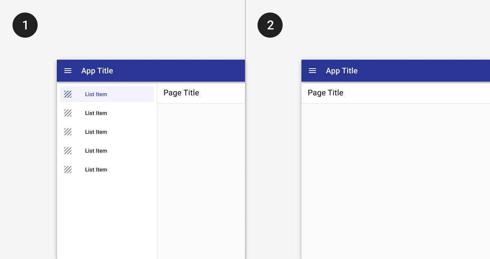
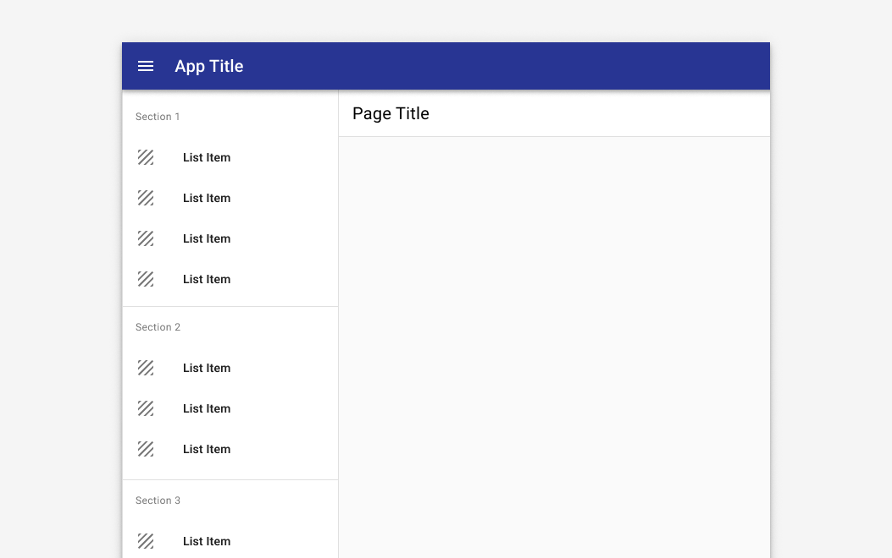

# Navigation: Primary

Navigation enables users to move through an app. When considering a navigation scheme, think about which of the following goals your app most aligns with.

Users will navigate an app with:

1. Fewer than 5 primary destinations.
2. More than 5 primary destinations.
3. A long list of primary destinations.
4. A deep hierarchy (parent, child, and grandchildren destinations).
5. An intent to maximize screen real estate for dashboards or complex displays.
6. Navigation on multiple device sizes.

---

## 1. Fewer than 5 primary destinations.

### Principle

- **Maximize available real estate and keep primary destinations visible.**

### Components to use

Use top [tabs](/components/omni/omnibar#variations) to display navigation for apps with fewer than 5 primary destinations.

Tabs take up less vertical space than a navigation drawer, but can easily overflow their container if too many destinations are displayed.

<ImageBlock padded={false} caption="Apps with fewer than 5 primary destinations use top tabs in the omnibar. No hamburger menu icon is displayed. On mobile, tabs scroll horizontally.">

</ImageBlock>

---

## 2. More than 5 primary destinations.

### Principle

- **Maximize available real estate and keep primary destinations visible.**

### Components to use

Use a [navigation drawer](/components/navigation/navigation-drawer) to display primary app destinations. The standard navigation drawer is used by default.

A standard navigation drawer stays open by default, and while it takes up additional horizontal screen real estate, it provides persistent access to primary destinations.

<ImageBlock caption="1. The standard drawer is open by default.  2. A dismissible drawer may be dismissed by tapping the menu icon in the omnibar. Content shifts left to fill the extra space. It may be accessed again from the hamburger menu icon button." padded={false}>

</ImageBlock>

---

## 3. A long list of primary destinations.

### Principle

- **Chunk related items to ease cognitive load.**

### Components to use

Use [sections](/components/navigation/navigation-drawer#long-navigation-lists) with titles and dividers to organize destinations into logical groups.

Sections allow for easier visual chunking of information, but only provide value when categories are grouped appropriately. Consider using [affinity mapping](/get-started/other/ux-plays/affinity-mapping/) to create logical groupings. 

<ImageBlock padded={false} maxWidth="500px">

</ImageBlock>

---

## 4. A deep hierarchy.

An app with deep hierarchy may have primary destinations and multiple levels of navigation underneath them. 

### Principles

- **Disclose child items progressively.**
- **Orient users in the system.** Use cues like breadcrumbs to orient users as to where they are in the overall system hierarchy.

### Components to use

| Component          | Usage          | Tradeoffs
| :----------------- | :----------------- | :----------------
| [Expanders](/components/page/expansion-panel)          | Use to maximize discoverability.            | Can add vertical height to the navigation drawer when items are expanded.
| [Tabs](/components/navigation/tabs)               | Use to display related grandchild items at the same level of hierarchy  | Not as discoverable; users must navigate to child page to view grandchild options.
| Breadcrumbs         | Use in addition to tabs or expanders to provide context for where users are in the app. | 

:::info
Breadcrumbs should reflect the site hierarchy, not the session history. Include the current page as the last item in the breadcrumb trail.
:::

<ImageBlock padded={false} caption="1. Expanders may be used to display pages at a second level of hierarchy.   2. Tabs may be used to show closely related content.">

</ImageBlock>

<ImageBlock padded={false} caption="1. Breadcrumbs display underneath the title bar on desktop. 2. On mobile, a horizontal ellipse may be used to show additional levels of hierarchy.">

</ImageBlock>

---

## 5. Maximize screen real estate.

For widescreen apps with dashboards or complex displays, maximizing screen real estate becomes imperative.

### Principle

- **Emphasize main content while providing access to other destinations in the app.**

### Components to use

| Component          | Usage          | Tradeoffs
| :----------------- | :----------------- | :----------------
| [Modal drawer](/components/navigation/navigation-drawer#2-modal)       | Maximize screen real estate, especially for tablet and mobile sizes.    | Less discoverable and doesn't provide persistent access to primary destinations in the app. 
| [Mini nav](/components/navigation/navigation-drawer#3-mini)         | Balance screen real estate with discoverability; optimized for desktop and tablet.   | Primary destinations are not labeled. 

<ImageBlock padded={false} caption="1. The modal drawer is closed by default. 2. The modal drawer may be opened by tapping the menu icon button in the omnibar. A scrim blocks interaction with the rest of the application.">

</ImageBlock>

<ImageBlock padded={false} caption="1. The mini nav is collapsed by default.  2. Tapping the chevron allows a user to expand the menu to its full width.">

</ImageBlock>

---

## 6. Navigate on multiple device sizes.

Navigation shouldn't remain static on all screen devices, but rather should adapt to best fit the available screen real estate. 

Check out the [page layouts](/patterns/layout/introduction) guidance for examples of how navigation patterns scale to different device widths. 
