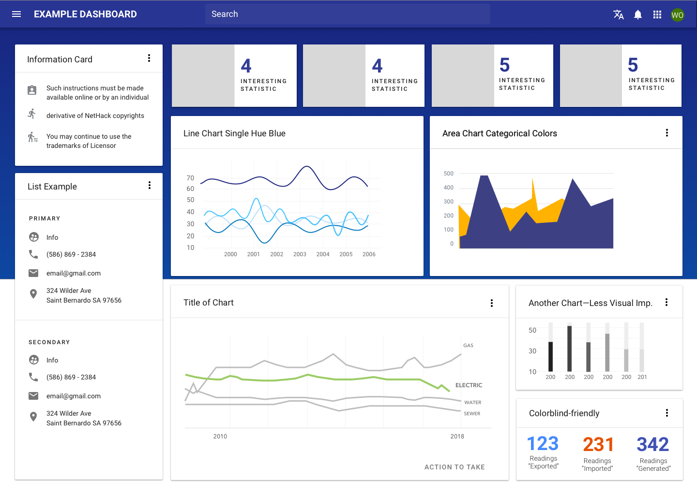

# Data visualization

Data visualizations tell a story through data. They are visual, often interactive representations of information to help people make sense of complex phenomena. Charts can improve people’s ability to identify average values and patterns over grids of numbers.

<ImageBlock caption="Concept for a sample dashboard." maxWidth="550px">

</ImageBlock>

## Overview

Data visualizations tell a story through data. They are visual, often interactive representations of information to help people make sense of complex phenomena. Charts can improve people’s ability to identify average values and patterns over grids of numbers.

Learn more about different types of visualizations and when to use them at Material Design: <a href="https://material.io/design/communication/data-visualization.html" rel="noreferrer noopener" target="_blank">Data visualization</a>.

Use the following steps to approach data visualizations.

**1. Determine the "why."**
  - If, after seeing this chart, a user could walk away with one piece of information, what would that be?
  - Talk to users and get their insight in order to answer these questions.

**2. Consider the larger context.**
  - Think about how the chart you are building fits into the entire ecosystem: the page that the user is on, the flow through the system they are in.

**3. Emphasize the story you've defined.**
  - Say everything you want to say—no more, no less—and don’t mislead.
  - Use or create the best method available to show your data.

**4. Edit your data visualization.**
  - Remove unnecessary text, flourishes, or lines within the graph in order to highlight the data itself. 

**5. Test with users.**
  -  Determine actionable success factors for visualizations –  faster, more insights, better decisions, increased accuracy, more confidence, etc. – and use these factors to test and compare with users.

**6. Refine your data visualization.**
  - Use elements such as a legend or axis labels to lend meaning to chart visuals. 
  - Think about key differences in the visualization that might draw the eye first (outliers, clusters, bright colors), and ensure these differences support the idea conveyed.
  - Be careful to ensure that outliers are still represented, either by breaking up datasets or calling them out explicitly. In general, smaller datasets are better at drawing attention to outliers, individual data points, and other more subtle patterns.

---

## Parts

If your team is starting with data viz, you may benefit from a Forge consulting session! [Request low or medium engagement consulting](/consulting) and mention "data viz" in your request. We can help you apply best practices to share a clear story around your data.

Forge does not provide a component for charts, but we recommend using one of the following libraries.

Although apps may choose different charting libraries to meet different needs, charts can be given a cohesive look and feel by using consistent color palettes and typography. Check out our <a href="https://www.figma.com/file/rP8Of8bjVJUMpJIBFUJqQ3/Data-Viz?node-id=0%3A1">Data Viz theming guidance</a> in Figma or reach out to <a href="mailto:eric.wayne@tylertech.com">Eric Wayne</a> or <a href="mailto:mariah.kim@tylertech.com">Mariah Kim</a> for more information around theming charts. 

| Tool              | Framework  | Description       | Use when          | Contact
| :-----------------| :--------- |:----------------- | :---------------- | :---------------
| <a target="_blank" rel="noopener noreferrer" href="https://www.chartjs.org/">ChartsJS</a> | Javascript | Simple yet flexible JavaScript charting for designers & developers | Overall recommended | Coming soon
| <a target="_blank" rel="noopener noreferrer" href="https://d3js.org/">D3 JS</a>  | Javascript | Robust libray with a steep learning curve  |  When custom, complex visualizations are needed | Coming soon
| <a target="_blank" rel="noopener noreferrer" href="https://www.highcharts.com/">High Charts</a> | Javascript | Robust libray with a steep learning curve  | When custom, complex visualizations are needed  | Coming soon

---

## Best practices 

<DoDontGrid>

**Structure** 

  <DoDontTextSection>
    <DoDontText type="do">Include a title and axis labels.</DoDontText>
    <DoDontText type="do">Use the full axis.</DoDontText>
    <DoDontText type="do">Use consistent intervals and avoid scale distortion on your axes. </DoDontText>
    <DoDontText type="do">Use direct labeling on elements where possible. Legends can be used as an alternative, if need be.</DoDontText>
  </DoDontTextSection>
    <DoDontTextSection>
    <DoDontText type="dont">Don’t use a legend when you have only one data category.</DoDontText>
    <DoDontText type="dont">Avoid stacked charts as they make it difficult to compare data.</DoDontText>
  </DoDontTextSection>

**Data**

  <DoDontTextSection>
    <DoDontText type="do">Sort your data for easier comparisons.</DoDontText>
    <DoDontText type="do">Adjust for inflation in long-time series.</DoDontText>
    <DoDontText type="do">Ensure that comparisons occur across like categories.</DoDontText>
  </DoDontTextSection>
  <DoDontTextSection>
    <DoDontText type="dont">Be careful about how “no data” or “missing data” is treated. Ensure that it doesn’t skew the overall data.</DoDontText>
  </DoDontTextSection>

**Style**

  <DoDontTextSection>
    <DoDontText type="do">Keep charts clean. Minimize the amount of non-essential labels, gridlines, and extras — so that users can focus on the core content. </DoDontText>
    <DoDontText type="do">Use clear language and avoid acronyms.</DoDontText>
    <DoDontText type="do">Tell the “why” and “how” of your data.</DoDontText>
    <DoDontText type="do">Highlight what’s important. Try to tell one story if you can.</DoDontText>
  </DoDontTextSection>
  <DoDontTextSection>
      <DoDontText type="dont">Don't use more than 5 - 7 colors.</DoDontText>
      <DoDontText type="dont">Don't use 3D effectsas the cognitive effort for interpretation outweighs any added value.</DoDontText>
      <DoDontText type="dont">Avoid pie and donut charts in general. See <a href="https://priceonomics.com/how-william-cleveland-turned-data-visualization/" target="_blank" rel="noreferrer noopener">Cleveland & McGill's research</a>.</DoDontText>
  </DoDontTextSection>
</DoDontGrid>

---

## Resources

- [People make unpredictable decisions... But we should design for their best interests anyway.
](https://medium.com/nyc-design/the-architecture-of-choice-and-how-it-impacts-behavior-dc9be2767e64) (Medium)
- [How William Cleveland Turned Data Visualization Into a Science](https://priceonomics.com/how-william-cleveland-turned-data-visualization/) (Priceonomics.com)
- [Data Visualization Presentation](https://docs.google.com/presentation/d/1O3lZJp6yVH1wcQyvJ2hIpniRn9oWtLqy3bWbWiF8xDk/edit#slide=id.p) (Tyler UX Summit, 2017, presented by Kaila Manca)
- [My process for designing dashboards and data visualizations] (https://blog.prototypr.io/how-to-design-data-visualizations-that-people-understand-d93624144c31) (Prototyper.io)
