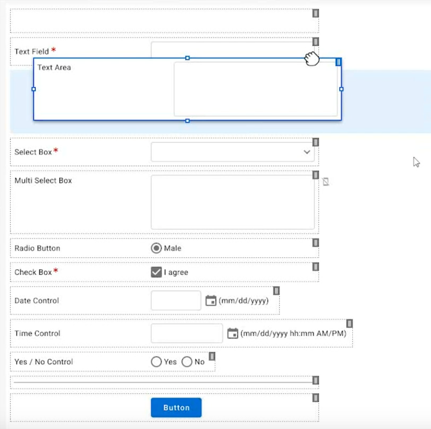

# Entellitrak form designer

The form designer allows users to drag elements into a page to create a form.

<ImageBlock max-width="400px">

</ImageBlock>

<a href="https://tylertech-my.sharepoint.com/:v:/p/emily_roller/EVC2x7u-C6tJjAk49fEy0YoBlEHScDySmdlwOrfEusuqFA?e=6Hv3Ch" style={{marginLeft: '46px'}}>View the full demo</a>

## Overview and design decisions

Entellitrak's form builder allows users to drop and reorder interface elements into a form. Drag and drop is indicated by an outline and drag handles on the element as well as a highlighted drop target. 

The team has provided for an accessible option for the form designer by allowing users to select an "Insert" option from the menu to select an element and insert into the end of the form. From there, focus is placed on the element and users can reorder it within the existing elements. 

---

<Columns columns="two" type="equal">

## Project contacts 

- <a href="mailto:Michael.Marchio@tylerfederal.com">Michael Marchio</a> (Developer)
- <a href="mailto:Che.deBruin@tylertech.com">Che de Bruin</a> (Director of UX)

## Resources 

- <a href="https://xd.adobe.com/view/b63e7701-cde3-42b2-5217-81e5803e364f-c00f/grid/">Form Designer</a> (Adobe XD prototype)
- Bitbucket repo / live demo coming soon.

</Columns>

