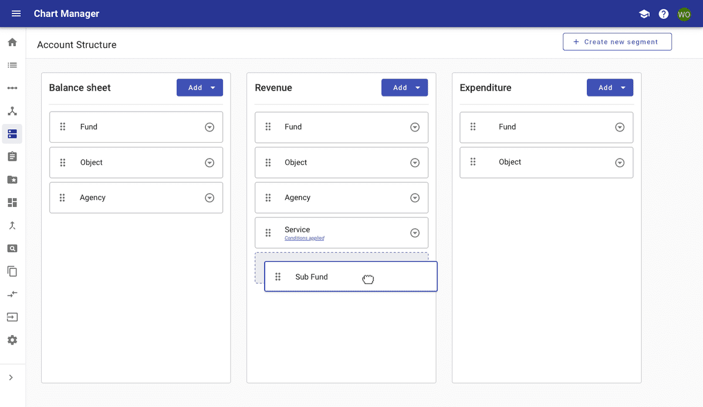

# Account structure

Account structures allows users to create custom account structures using drag and drop. 

<ImageBlock padded={false}>

</ImageBlock>

## Overview and design decisions

**Account Structures** are comprised of combinations of **segments** that make up the chart of accounts. The **Account Structure** setup provides a visual representation of what accounts will look like based on segment order, with the flexibility to be configured by account type (Balance Sheet, Revenue, Expenditure).

When setting up an **account structure,** the user needs to establish which segments will be used and the order that they will be represented in the full account structure for each account type. The user may not need the same level of account detail (aka the same number of segments) for Balance Sheet or Revenue account types as I do for Expenditure accounts.

Drag and drop functionality has been implemented so that a user can easily add and reorder segments within an account type.

---

<Columns columns="two" type="equal">

## Project contacts 

- <a href="mailto:katie.spofford@tylertech.com">Katie Spofford</a> (Designer)
- <a href="mailto:rob.jacobs@tylertech.com">Rob Jacobs</a> (Developer)

## Resources 

- <a href="http://fdvmdevmerapp1.corp.tylertechnologies.com/ChartManager/account-structure/home">Live demo site</a>
- <a href="https://tylertech.invisionapp.com/share/63VZKDHUGWH#/screens/405634795?browse">GL_Conditional Segment</a> (Invision prototype)
- <a href="https://bitbucket.tylertech.com/projects/FGL/repos/chart-manager/browse/src/app/modules/account-structure/views/home">Bitbucket repo</a> (Angular App)

</Columns>
