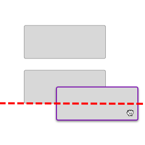

# Drag & Drop: Overview

Drag and drop allows users to group, reorder, move, or resize objects by direct manipulation. 

## Overview 

### Use when

- Arranging objects into logical groups. 
- Reordering objects in a list; provide an option to move items with up and down arrows as well.
- Moving design objects around on a canvas. 

### Don't use when

- The pattern involves dragging an object across a long distance.
- Moving a large number of collections at once. Consider an option that allows for multi select and a manual move.
- In tables. Use [table sorting](/components/table/table#column-sort) instead.

Forge does not provide a component for drag and drop, but we recommend using one of the following libraries.

| Tool              | Framework  | Description       | Use when          | Contact
| :-----------------| :--------- |:----------------- | :---------------- | :---------------
| <a target="_blank" rel="noopener noreferrer" href="https://material.angular.io/cdk/drag-drop/overview">Angular Material CDK</a>  | Angular | Angular CDK for drag & drop   |  Recommended for angular | <a href="mailto:robert.jacobs@tylertech.com">Rob Jacobs</a> (Architect)
| <a target="_blank" rel="noopener noreferrer" href="https://react-dnd.github.io/react-dnd/about">React DnD</a> | React | a set of React utilities to help you build complex drag and drop interfaces while keeping your components decoupled  | Recommended for React | <a href="mailto:michael.matuszak@tylertech.com">Michael Marchio</a> (UX Architect)

---

## Parts 

### 1. Clear signifiers

Use icons on draggable elements to indicate they can be dragged.  

<ImageBlock padded={false} caption="1. Use 'drag_indicator' to indicate elements that may be dragged in three dimensions (across columns, for example).   2. Use 'drag_handle' to indicate that elements may be dragged in two dimensions (up and down within a list, for example).">

</ImageBlock>

### 2. Feedback 

**Design principle**

- Use signifiers to indicate changes in objection manipulation.
- Provide clear feedback throughout the operation. 

**Components to use**

- **On hover:** Cursor changes to `grab`.
- **On grab:** Cursor changes to `grabbing`. 
- **On drag:** Cursor remains `grabbing`. Provide feedback that the element is being dragged by increasing its elevation and applying an overlay.
- **On drop:** Cursor changes to `grab`. Provide feedback where the element may be dropped by creating a placeholder drop target. 

<ImageBlock padded={false} caption="Use cursor changes to indicate changes in object manipulation.">

</ImageBlock>

<ImageBlock max-width="350px" caption="Dragged states occur after a pressed state and appear and disappear using a fade animation. The cursor changes to `grab` on hover, to `grabbed` once the object is grabbed and moved, and back to `grab` once the object has been dropped. Source: Material.io">

</ImageBlock>

<ImageBlock max-width="350px" caption="The user’s touch should directly control the movement of the dragged element. Source: Material.io">

</ImageBlock>

### 3. Magnetism and snapping into place 

**Design principle**

- Be forgiving of non-precise movements.

**Components to use**

-  Simulate magnetism by snapping objects into place when they get close to a drop target. Indicate when the drop zone is active by showing a visual signifier when the dragged object is within the dropzone.  

<ImageBlock max-width="500px" caption="The drop zone is indicated as active with a solid border and an indigo fill.">

</ImageBlock>

One of the most complex aspects of the animated preview is deciding when to trigger the motion: should an object start moving out of the way when the edge of the grabbed object overlaps it or when the position of the mouse cursor overlaps the other object? The most natural version of this interaction uses neither — instead, it begins the reshuffling animation once the center of the dragged object overlaps the edge of the other object. This solution prevents both a “mushy”-feeling interaction (where it is slow and unresponsive), or a “twitchy”-feeling interaction (where items begin to move unexpectedly and too quickly).

<ImageBlock max-width="450px" caption="Triggering items to reshuffle when the center of the dragged object reaches the edge of the underlying object will make the interface feel natural and responsive. Source: NN Group">

</ImageBlock>

---

## Responsive

Touch screen pose unique challenges for drag and drop:

- lack of hover states, which often indicate the availability of drag-and-drop
- the "fat finger problem"
- distinguishing from a tap, a swiping gesture, and an intentional "grab" and providing clear feedback that the object has been grabbed. 

Only use drag and drop on touchscreens when:

- You have clear evidence (from research such as usability testing) that your users expect drag–and–drop to be available, and
- There is no reasonable alternative with lower interaction cost (such as cut–and–paste or a menu-driven interaction).

### Best practices 

<DoDontGrid>
  <DoDontTextSection>
    <DoDontText type="do">Determine a "grab" by using a timing delay of a few milliseconds and providing clear feedback that the object has been grabbed.</DoDontText>
    <DoDontText type="do">Use haptics - a subtle haptic “bump” can indicate that an object has been grabbed, and another one can indicate that an object has been dragged over a drop zone. </DoDontText>
  </DoDontTextSection>
</DoDontGrid>

---

## Accessibility 

### Best practices 

<DoDontGrid>
  <DoDontTextSection>
    <DoDontText type="do">Ensure that the handle icon is keyboard accessible with the tab key.</DoDontText>
    <DoDontText type="do">Ensure the handle icon offers a message to screen readers that indicates what actions are available (typically using arrow keys to move the object), whether it is currently "grabbed" and its current position or size.</DoDontText>
  </DoDontTextSection>
</DoDontGrid>

See more information around accessible drag & drop patterns from Salesforce Design: <a href="https://medium.com/salesforce-ux/4-major-patterns-for-accessible-drag-and-drop-1d43f64ebf09" target="_blank" rel="noopener noreferrer">4 Major Patterns for Accessible Drag and Drop</a>.

---

## Resources 

- <a href="https://www.nngroup.com/articles/drag-drop/">Drag–and–Drop: How to Design for Ease of Use</a> (NN Group)
- <a href="https://medium.com/salesforce-ux/4-major-patterns-for-accessible-drag-and-drop-1d43f64ebf09" target="_blank" rel="noopener noreferrer">4 Major Patterns for Accessible Drag and Drop</a> (Medium)