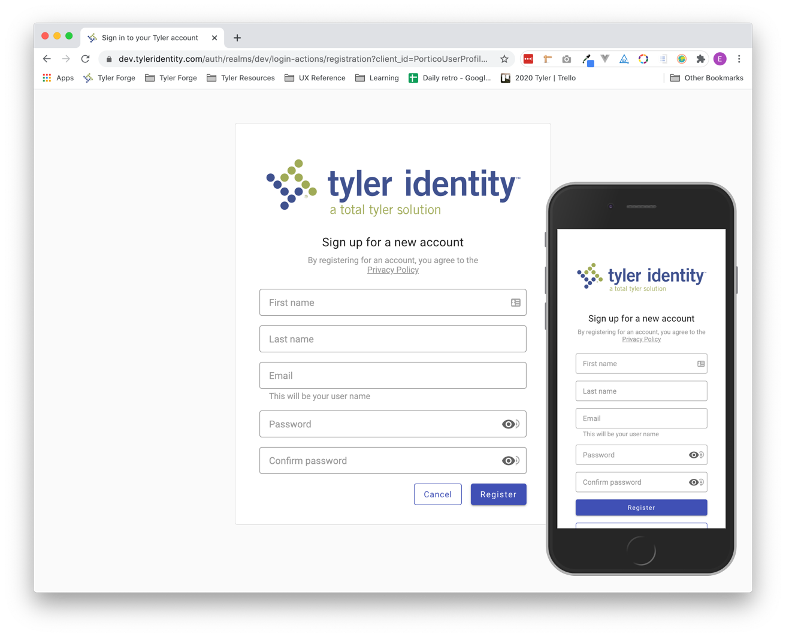
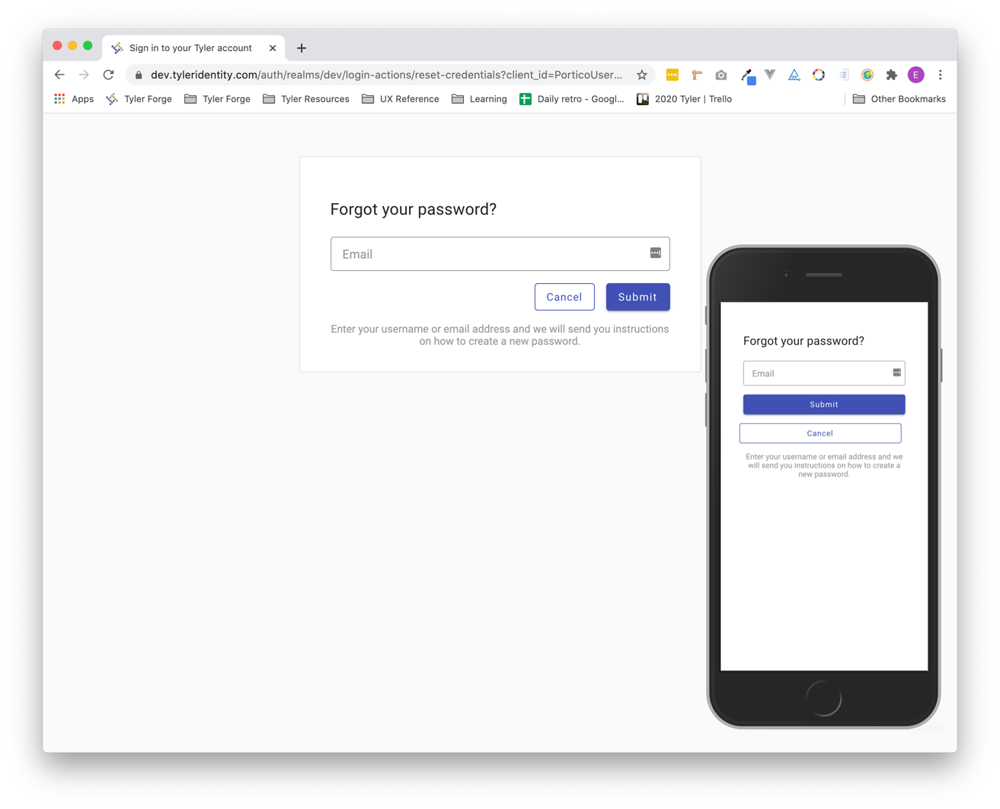
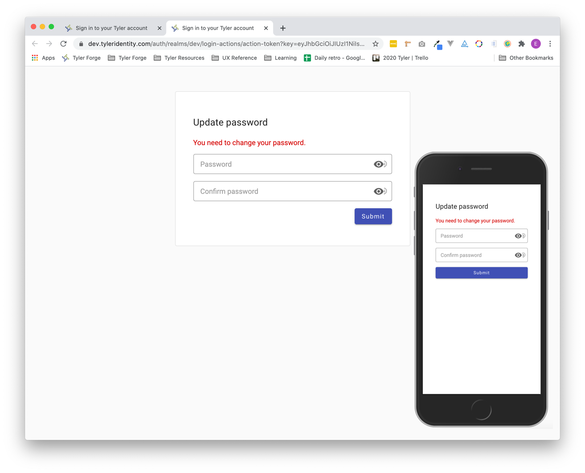

# Login & Registration

Make a good first impression! Registering and logging in to a Tyler app are the first experience most users have with Tyler apps. 

## Overview 

Login and registration for Tyler products is handled by [Tyler Identity](https://confl.tylertech.com/display/TID/Tyler+Identity) (TID).

Tyler Identity represents Tyler’s vision for a comprehensive, modern and secure identity-management solution. Tyler Identity will manage user identities and provide authentication and claims-management services using modern security protocols.

Login & registration aligns with the following user goals:

1. Registering for an account 
2. Signing into an account 
3. Retrieving a forgotten password 

---

## 1. Register

Users hit "register" from the TID login screen. They'll be sent a confirmation email to confirm their account before they can log in.

Some apps may not allow users to self register; they may need to be added as a user by a system admin. 

<ImageBlock padded={false} caption="Users register with the provided TID screen.">

</ImageBlock>

### Best practices 

<DoDontGrid>
  <DoDontTextSection>
    <DoDontText type="do">Display password & username requirements up front.</DoDontText>
    <DoDontText type="do">Display an error with instructions for how to fix the error if a user enters a username or password that doesn't meet the specified criteria.</DoDontText>
  </DoDontTextSection>
  <DoDontTextSection>
    <DoDontText type="dont">Don't clear user credentials after a missed attempt to login.</DoDontText>
  </DoDontTextSection>
</DoDontGrid>

---

## 2. Sign in 

Users are routed to a separate page to log in to Tyler apps. Sign in pages do not display the omnibar. They are not tenant branded nor do they display a background image. 

<ImageBlock padded={false} caption="Users register with the provided TID screen.">

</ImageBlock>

---

## 3. Forgotten password

Users may reset their password by hitting a link.

Some apps don't allow users to reset their own password for security reasons and instead provide that an admin must reset passwords.

<ImageBlock padded={false} caption="Users may click &#34;Forgot password?&#34; and will be prompted to enter their email address to reset their password.">

</ImageBlock>

<ImageBlock padded={false} caption="When users hit a link in their email, they'll be redirected to create a new password through TID.">

</ImageBlock>
