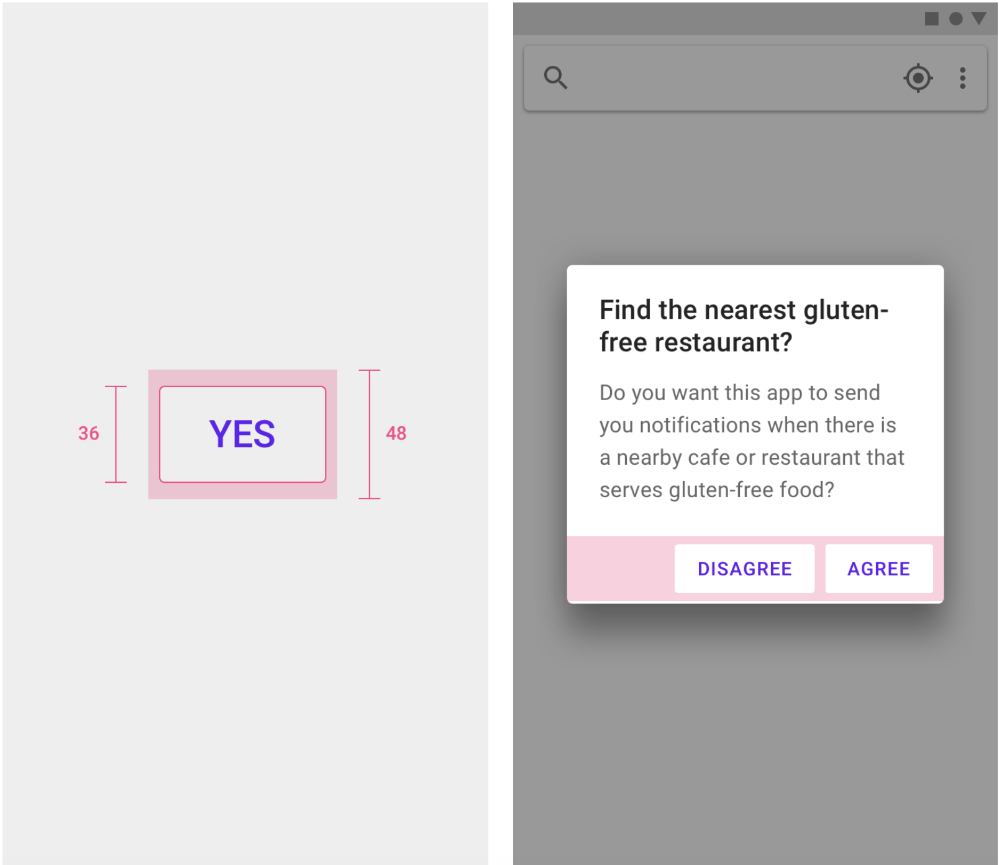
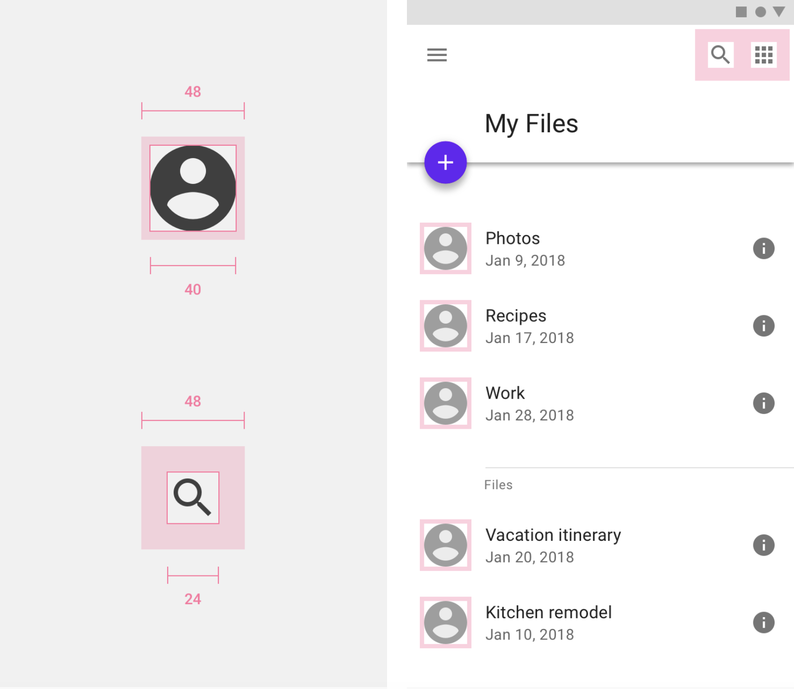

# Native mobile: Overview

Learn about basic usability requirements for native mobile apps.

## Overview 

### When to use native mobile

- When users are likely to download an app and use it frequently. 
- When push notifications are key to the app's purpose or function. 
- When native affordances such as geolocation, real time notifications, built in camera, personalized experiences, and motion sensors / accelerometers are important to the task at hand. 
- When the app is likely to be used in the field.

### When not to use native mobile

- When displaying and interacting with complex datasets. Use a web app instead. 
- When a user is likely to be interacting with an app in an office setting. Use a web app instead. 
- When a user is likely to be interacting with an app with multiple monitors. Use a web app instead. 
- When an app requires a large amount of typing input. Use a web app instead. 
- When an app requires an immersive, non interrupted experience. Use a web app instead. 

Learn more with the Forge guidance on [Adaptive design](/patterns/other/adaptive-design).

---

## Parts

Check out Material Design's <a href="https://www.material.io/design/platform-guidance/android-bars.html#status-bar" target="_blank" rel="noreferrer noopener">guidance</a> on native-specific controls, including:
Android bars
Android fingerprint
Android haptics
Android icons
Android navigating between apps
Android notifications
Android permissions
Android settings
Android slices
Android split-screen
Android swipe to refresh
Android text selection toolbar
Android widget
Cross platform adaptation

**Touch targets**

Tyler Forge’s touch target guidelines can help users who aren’t able to see the screen, or who have difficulty with small touch targets, to tap elements in your app.

Touch targets are the parts of the screen that respond to user input. They extend beyond the visual bounds of an element. For example, an icon may appear to be 24 x 24 dp, but the padding surrounding it comprises the full 48 x 48 dp touch target.

Touch targets should be at least 48 x 48 dp. A touch target of this size results in a physical size of about 9mm, regardless of screen size. The recommended target size for touchscreen elements is 7-10mm. It may be appropriate to use larger touch targets to accommodate a larger spectrum of users.

In most cases, touch targets should be separated by 8dp of space or more to ensure balanced information density and usability.

<ImageBlock maxWidth="500px" caption="1.Touch target height: 48dp, Button height: 36dp  2. Buttons have a 48dp touch target on mobile.">

</ImageBlock>

**Pointer targets**

Pointer targets are similar to touch targets, but apply to the use of motion-tracking pointer devices such as a mouse or a stylus. Pointer targets should be at least 44 x 44 dp.

<ImageBlock maxWidth="500px" caption="1. Avatar: 40dp, Icon: 40dp, Touch target on both: 48dp  2. Touch targets in context.">

</ImageBlock>
